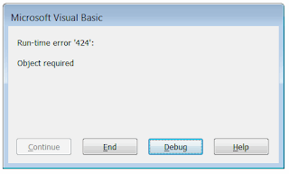
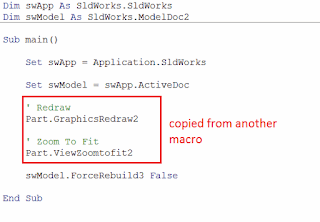

 修复运行时错误'424' - 对象必需的宏，这些宏在单独工作时正常，但在合并为一个宏时无法工作
image: error-object-required.png
labels: [宏, 故障排除]
redirect-from:
  - /2018/04/macro-troubleshooting-merged-macro-does-not-work.html
---
## 症状

SOLIDWORKS宏在单独工作时正常，但在合并为一个宏时无法工作。可能会显示错误：*运行时错误'424'：对象必需*

{ width=320 height=193 }

## 原因

* 合并的宏可能不兼容
* 源宏中可能存在未复制到目标宏的必需初始化
* 源宏和目标宏之间的变量命名可能不同

{ width=320 height=221 }

## 解决方法

* 确定哪一行出错
* 检查变量的状态。将鼠标悬停在变量上，查看工具提示中是否显示为*Nothing*。
* 确保正确的宏部分被复制
* 确保必需的初始化也被复制（如果适用）
* 确保变量命名一致