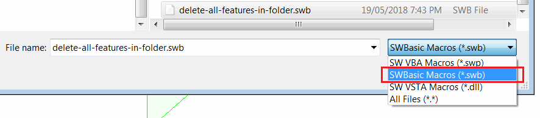
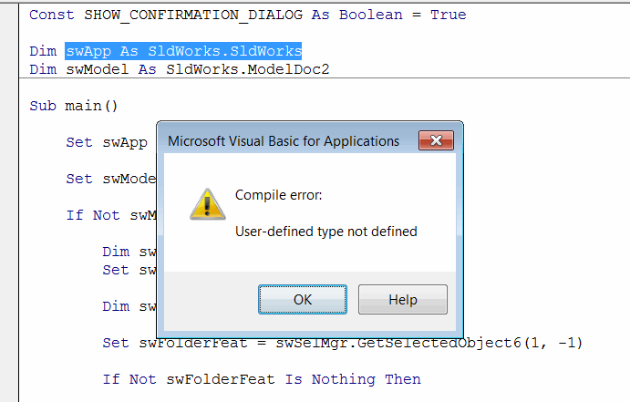
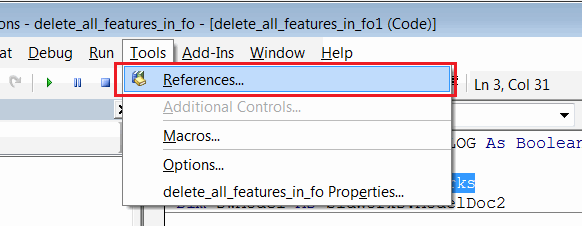
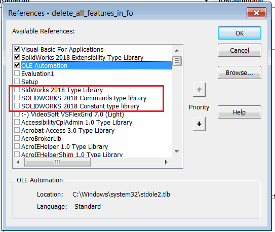

 修复在 swb 格式中运行或编辑旧版宏时的错误
image: swbasic-swb-macro-filter.png
labels: [宏, 故障排除]
---
## 症状

编辑以 *.swb 格式保存的旧版 SOLIDWORKS 宏时，会出现“编译错误：未定义的用户类型”错误。如果从“工具->宏->运行”菜单中运行，通常可以正常运行：

{ width=300 }

## 原因

SWBasic 宏是以 ASCII 格式（即纯文本）存储的脚本，无法存储任何引用信息。SOLIDWORKS 类型是在 SOLIDWORKS 类型库中定义的，这些类型库在 SWBasic 宏中默认没有引用。

## 解决方法

* 打开要编辑的宏（工具->宏->编辑）
* 导航到 *工具->引用* 菜单

{ width=300 }

* 选中所有 SOLIDWORKS 类型库

{ width=300 }

* 以 *.swp 格式保存宏