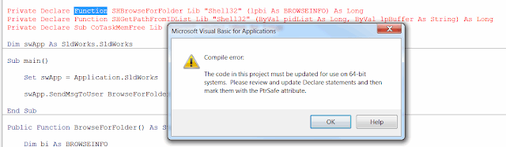

 修复编译错误 - 当宏使用 Windows API 函数时，必须更新此项目的代码以在 64 位系统上使用
image: declare-function-win-api.png
labels: [宏, 故障排除]
redirect-from:
  - /2018/04/macro-troubleshooting-incorrect-use-of-32-bit-versions-of-win-api.html
---
## 症状

系统从早于 2012 版本的 SOLIDWORKS 更新到更新版本。
或者运行某些旧版宏。
宏使用 Windows API 函数（例如具有浏览文件/文件夹对话框、连接到注册表、使用窗口句柄）通过 *Declare Function* 语句。
启动时显示 *编译错误：必须更新此项目的代码以在 64 位系统上使用*。

{ width=640 height=185 }

## 原因

SOLIDWORKS 在 2013 版本中将 Visual Basic for Application 环境从 VB6 更新为 VB7。
VB6 是 32 位应用程序，而 [VB7](https://msdn.microsoft.com/en-us/vba/language-reference-vba/articles/64-bit-visual-basic-for-applications-overview) 是 64 位应用程序。
由于 32/64 位环境中变量大小的差异，需要使用 PtrSafe 关键字来确保在 x64 系统中运行宏是安全的，并使用 LongPtr 或 LongLong 来正确解析 32 位和 64 位环境中的 Long 类型变量。

## 解决方法

* 修改所有声明并包含 PtrSafe 关键字和 LongPtr 作为 Long 类型的变量声明
* 如果需要支持旧版本的 SOLIDWORKS（2012 年之前），可以使用预编译条件语句 #IF-#Else

~~~ vb
#If VBA7 Then
    Private Type BROWSEINFO
      hOwner As LongPtr
      pidlRoot As Long
      pszDisplayName As String
      lpszTitle As String
      ulFlags As Long
      lpfnCallback As LongPtr
      lParam As LongPtr
      iImage As Long
    End Type

    Private Declare PtrSafe Function SHBrowseForFolder Lib "Shell32" (lpbi As BROWSEINFO) As Long
    Private Declare PtrSafe Function SHGetPathFromIDList Lib "Shell32" (ByVal pidList As LongPtr, ByVal lpBuffer As String) As Long
    Private Declare PtrSafe Sub CoTaskMemFree Lib "ole32" (ByVal hMem As LongPtr)
#Else
    Private Type BROWSEINFO
        hOwner As Long
        pidlRoot As Long
        pszDisplayName As Long
        lpszTitle As String
        ulFlags As Long
        lpfnCallback As Long
        lParam As Long
        iImage As Long
    End Type
    
    Private Declare Function SHBrowseForFolder Lib "Shell32" (lpbi As BROWSEINFO) As Long
    Private Declare Function SHGetPathFromIDList Lib "Shell32" (ByVal pidList As Long, ByVal lpBuffer As String) As Long
    Private Declare Sub CoTaskMemFree Lib "ole32" (ByVal hMem As Long)
#End If

Dim swApp As SldWorks.SldWorks

Sub main()

    Set swApp = Application.SldWorks
        
    swApp.SendMsgToUser "Selected folder " & BrowseForFolder
    
End Sub

Public Function BrowseForFolder() As String
  
    Dim bi As BROWSEINFO
    Dim pidl As Long
    Dim path As String
  
    bi.lpszTitle = ""
    bi.ulFlags = 0
    
    pidl = SHBrowseForFolder(bi)
    If pidl <> 0 Then
    
        path = Space$(265)
        SHGetPathFromIDList pidl, path
        path = Left$(path, InStr(path, Chr$(0)) - 1)
    
        CoTaskMemFree lngPIDL
    End If
    
    BrowseForFolder = path
    
End Function

~~~