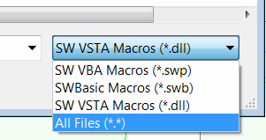
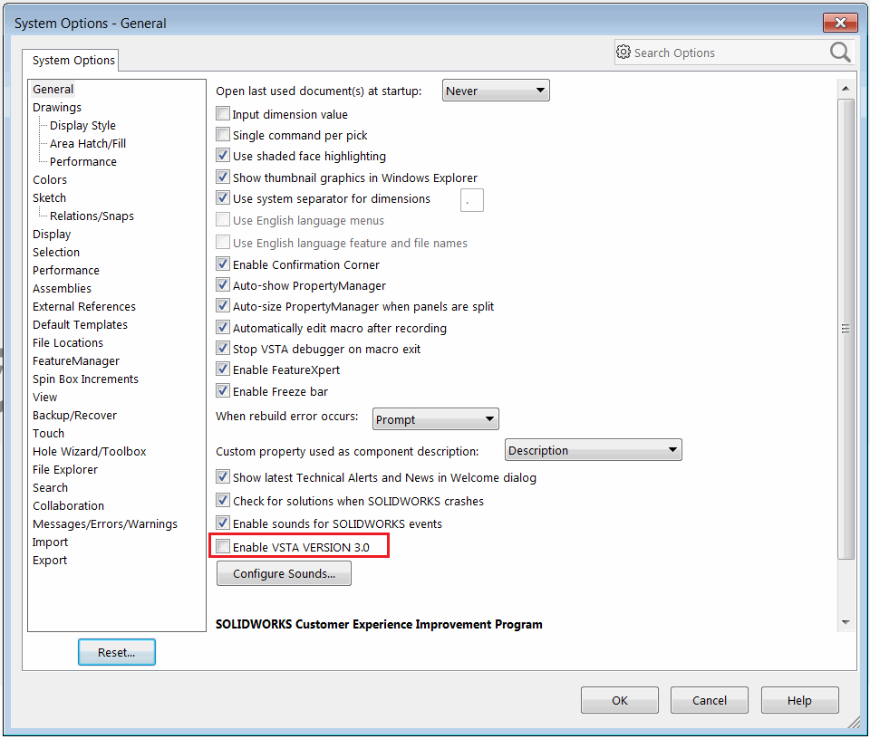

{ width=200 }

Macros can be edited directly in the built-in VBA Editor and can be executed in SOLIDWORKS using out-of-the-box engine. It is not required to install any additional software to run macros (the only exception are VSTA 3.0 macros which require the stand-alone installation of Visual Studio)

## VBA Macros (*.swp)

These probably the most popular macros. The macros are based on VBA7 (for SOLIDWORKS 2015 and newer) and VBA6 for older versions. VBA6 and VBA7 are derived languages from Visual Basic 6. So all the syntax is the same. Refer [Visual Basic Tutorials](/docs/codestack/visual-basic) for more documentation about this language.

Macros are saved in the binary format with *.swb extension and can be viewed and edited by SOLIDWORKS VBA Editor only.

## SWBasic Macros (*.swb)

Similar to *.swp macros these types of macros are based on VBA6 and VBA7 languages. The only difference that these macros are saved in plain text format with *.swp extensions.

Which makes it readable and editable outside of SOLIDWORKS environment with any text editors (such as Notepad). This is in particular useful when macro code is maintained within the control version services such as SVN or GIT.

These macros cannot reference any 3rd party type libraries (such as Excel, File System Object, etc.) and will only include references to SOLIDWORKS type libraries. If it is required to use any 3rd party type library it is possible to do so via [Late binding](/docs/codestack/visual-basic/variables/declaration/#early-binding-and-late-binding).

Those macros will only have one [module](/docs/codestack/visual-basic/modules/) and cannot use [classes](/docs/codestack/visual-basic/classes/) or [user forms](/docs/codestack/visual-basic/user-forms/).

## C# and VB.NET VSTA Macros

**V**isual **ST**udio for **A**pplication (VSTA) macros based on .NET language (C# or VB.NET) which provides more flexibility and leverages the power of .NET framework bringing the access to the big variety of libraries, 3rd party components and Object Oriented Programming (OOP) paradigms into the macros.

Unlike VBA macros VSTA macros separate the project with the source code (*.csproj, *.vbproj) for editing and binaries (*.dll) output for running the macros. So binaries can be used without the source code available.

VSTA macros are in-process applications and can be either automatically released from the memory or continue to execute after the main function finishes. 

This behaviour controlled by the following option:

{ width=350 }

If this option is unchecked macro will remain loaded into memory until **Stop** button is clicked. This is useful option when macro performs any asynchronous operations such as handling events or displaying property manager page.

VSTA macros are based on .NET Framework 2.0 and can be edited and debugged using built-in VSTA editor.

In SOLIDWORKS 2018 new VSTA Version 3.0 is introduced however older VSTA version is still supported. The target version can be controlled by the following options:

{ width=350 }

VSTA 3.0 required the stand alone installation of Visual Studio (either Professional or Community edition). The main benefit of VSTA 3.0 is an ability to use newer version of .NET Framework.
