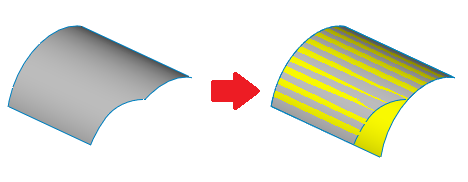

This VBA example restores the surface of the selected face by performing the untrim operation.

This command is similar to the *Untrim Surface* feature in the Feature Manager, but it performs the operation using temporary bodies instead of features.

Copied surface used in operations is infinite and needs to be trimmed in order to form a face. Required boundary is calculated by evaluating the maximum and minimum values of the UV of the input face.

{ width=450 }

Iso curves are used to extract the curve at the specified boundary UV of the face. The calculated curve is infinite and needs to be trimmed in the corners to form the closed loop before the surface can be trimmed and converted into the body.

Select any face and run the macro. The resulting surface is displayed in the graphics area and macro stops execution. Once continued - the preview is hidden.

{ width=450 }

~~~ vb
Dim swApp As SldWorks.SldWorks

Sub main()

    Set swApp = Application.SldWorks
    
    Dim swModel As SldWorks.ModelDoc2
    
    Set swModel = swApp.ActiveDoc
    
    If Not swModel Is Nothing Then
        
        Dim swFace As SldWorks.Face2
        
        Set swFace = swModel.SelectionManager.GetSelectedObject6(1, -1)
        
        If Not swFace Is Nothing Then
            
            Dim swSurf As SldWorks.Surface
            Set swSurf = swFace.GetSurface
              
            Set swSurf = swSurf.Copy
            
            Dim vUvBounds As Variant
            vUvBounds = swFace.GetUVBounds()
            
            Dim swCurves(3) As SldWorks.Curve
            
            Dim uMin As Double
            Dim uMax As Double
            Dim vMin As Double
            Dim vMax As Double
            
            uMin = CDbl(vUvBounds(0))
            uMax = CDbl(vUvBounds(1))
            vMin = CDbl(vUvBounds(2))
            vMax = CDbl(vUvBounds(3))
            
            Dim uMinvMinPt As Variant
            Dim uMinvMaxPt As Variant
            Dim uMaxvMinPt As Variant
            Dim uMaxvMaxPt As Variant
            
            uMinvMinPt = swSurf.Evaluate(uMin, vMin, 0, 0)
            uMinvMaxPt = swSurf.Evaluate(uMin, vMax, 0, 0)
            uMaxvMinPt = swSurf.Evaluate(uMax, vMin, 0, 0)
            uMaxvMaxPt = swSurf.Evaluate(uMax, vMax, 0, 0)
            
            Const V As Boolean = True
            Const U As Boolean = False
            
            Set swCurves(0) = swSurf.MakeIsoCurve2(U, uMin)
            Set swCurves(0) = swCurves(0).CreateTrimmedCurve2(uMinvMinPt(0), uMinvMinPt(1), uMinvMinPt(2), uMinvMaxPt(0), uMinvMaxPt(1), uMinvMaxPt(2))
            
            Set swCurves(1) = swSurf.MakeIsoCurve2(V, vMin)
            Set swCurves(1) = swCurves(1).CreateTrimmedCurve2(uMinvMinPt(0), uMinvMinPt(1), uMinvMinPt(2), uMaxvMinPt(0), uMaxvMinPt(1), uMaxvMinPt(2))
            
            Set swCurves(2) = swSurf.MakeIsoCurve2(U, uMax)
            Set swCurves(2) = swCurves(2).CreateTrimmedCurve2(uMaxvMinPt(0), uMaxvMinPt(1), uMaxvMinPt(2), uMaxvMaxPt(0), uMaxvMaxPt(1), uMaxvMaxPt(2))
                        
            Set swCurves(3) = swSurf.MakeIsoCurve2(V, vMax)
            Set swCurves(3) = swCurves(3).CreateTrimmedCurve2(uMinvMaxPt(0), uMinvMaxPt(1), uMinvMaxPt(2), uMaxvMaxPt(0), uMaxvMaxPt(1), uMaxvMaxPt(2))
            
            Dim swUntimSurfBody As SldWorks.Body2

            Set swUntimSurfBody = swSurf.CreateTrimmedSheet5(swCurves, False, 0.00001)
            
            swUntimSurfBody.Display3 swModel, RGB(255, 255, 0), swTempBodySelectOptions_e.swTempBodySelectOptionNone
            
            Stop
            
            Set swUntimSurfBody = Nothing
            
        Else
            Err.Raise vbError, , "Select face"
        End If
        
    Else
        Err.Raise vbError, , "Open the model"
    End If
    
End Sub

~~~

