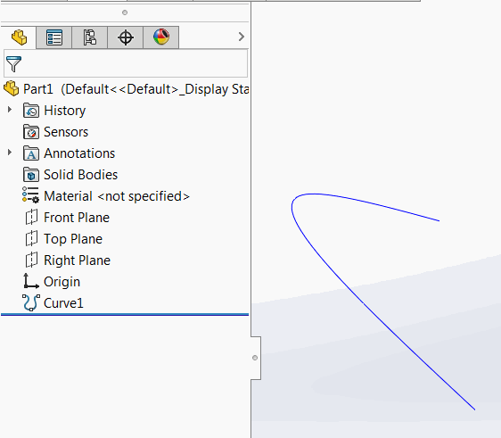
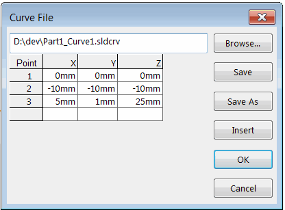

{ width=450 }

SOLIDWORKS允许通过外部文本文件中的XYZ坐标插入自由形式曲线。然而，该文件并未链接到特征本身，当外部文件更改时，曲线不会更新。

{ width=300 }

这个VBA宏可以在单击一次后自动将外部文件与坐标链接并更新所选曲线。

曲线文件示例：

~~~
0mm 0mm 0mm
10mm 10mm 10mm
5mm 1mm 25mm
~~~

曲线文本文件必须保存在与SOLIDWORKS文件相同的文件夹中，并且必须命名为[模型标题]_[特征名称].sldcrv。例如，如果曲线特征命名为*Curve1*，并且位于名为Part1.sldprt的SOLIDWORKS文件中，则曲线文本文件必须命名为*Part1_Curve1.sldcrv*。

~~~ vb
Dim swApp As SldWorks.SldWorks

Sub main()

    Set swApp = Application.SldWorks
    
    Dim swModel As SldWorks.ModelDoc2
    
    Set swModel = swApp.ActiveDoc
    
    If Not swModel Is Nothing Then
        
        Dim swFeat As SldWorks.Feature
        Set swFeat = swModel.SelectionManager.GetSelectedObject6(1, -1)
        
        If Not swFeat Is Nothing Then
            
            Dim swCurveFeatDef As SldWorks.FreePointCurveFeatureData
            Set swCurveFeatDef = swFeat.GetDefinition
            
            If Not swCurveFeatDef Is Nothing Then
                
                Dim filePath As String
                filePath = swModel.GetPathName
                filePath = Left(filePath, InStrRev(filePath, ".") - 1)
                filePath = filePath & "_" & swFeat.Name & ".sldcrv"
                
                If False = swCurveFeatDef.LoadPointsFromFile(filePath) Then
                    MsgBox "无法更新曲线"
                End If
                
                swFeat.ModifyDefinition swCurveFeatDef, swModel, Nothing
                
            Else
                MsgBox "所选特征不是XYZ点曲线"
            End If
        Else
            MsgBox "请选择曲线XYZ特征"
        End If
        
    Else
        MsgBox "请打开模型"
    End If
    
End Sub
~~~