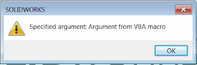

 Passing the custom string parameters to VBA macro from .NET application or another macro via clipboard
image: msg-box-macro-argument.png
labels: [argument, clipboard, example, parameter, solidworks api]
redirect-from:
  - /2018/04/pass-arguments-to-vba-macro-via-clipboard.html
---
System clipboard allows to store different types of data (that includes but not limited to text, image, html etc.). As the simplest way, the custom argument may be written to the text buffer, but this will clear all the data already in the buffer (if any). This may introduce confusion and result in bad user experience as running the macro may overwrite the text already copied into the clipboard.  

Alternative way is to write the data into the custom buffer with unique name so it is not explicitly exposed to the user and will remain accessible via code only.

Let's start with the 'target' macro which will be called from the different 'master' macro.  

~~~ vb
Dim swApp As SldWorks.SldWorks

Sub main()
        
    Set swApp = Application.SldWorks
        
     swApp.SendMsgToUser "Specified argument: " & ArgumentHelper.GetArgument()
    
End Sub
~~~

In the example above argument value passed from the 'master' macro will be extracted and displayed to the user in the message box in the 'target' macro:

{ width=400 height=132 }

The helper class reads the buffer value from the **__SwMacroArgs__** format. This is a custom name which is known to both 'master' macro (which will write the value of argument) and the 'target' macro (which will read the value). This can be renamed to any other custom name if needed.

~~~ vb
Const ARG_FORMAT = "__SwMacroArgs__"

Private Declare PtrSafe Function RegisterClipboardFormat Lib "User32" Alias "RegisterClipboardFormatA" (ByVal lpString As String) As LongPtr
Private Declare PtrSafe Function OpenClipboard Lib "User32" (ByVal hwnd As LongPtr) As Long
Private Declare PtrSafe Function GetClipboardData Lib "User32" (ByVal wFormat As LongPtr) As LongPtr
Private Declare PtrSafe Function GlobalSize Lib "kernel32" (ByVal hClipMemory As LongPtr) As Long
Private Declare PtrSafe Function GlobalLock Lib "kernel32" (ByVal hClipMemory As LongPtr) As LongPtr
Private Declare PtrSafe Sub CopyMemory Lib "kernel32" Alias "RtlMoveMemory" (lpvDest As Any, lpvSource As Any, ByVal cbCopy As LongPtr)
Private Declare PtrSafe Function GlobalUnlock Lib "kernel32" (ByVal hClipMemory As LongPtr) As Long
Private Declare PtrSafe Function CloseClipboard Lib "User32" () As Long

Public Function GetArgument() As String
    
    On Error GoTo ErrorHandler
    
    Dim hClipMemory As LongPtr
    Dim lSize As Long
    Dim lpClipMemory As LongPtr
    Dim wFormat As LongPtr
    
    wFormat = RegisterClipboardFormat(ARG_FORMAT)
    
    If OpenClipboard(0&) = 0 Then
        RaiseError "Failed to open clipboard"
    End If
            
    hClipMemory = GetClipboardData(wFormat)
        
    If hClipMemory > 0 Then
        
        lSize = GlobalSize(hClipMemory)
        
        If lSize > 0 Then
        
            lpClipMemory = GlobalLock(hClipMemory)
            
            If lpClipMemory > 0 Then
                
                Dim bData() As Byte
                ReDim bData(lSize - 1) As Byte
                
                CopyMemory bData(0), ByVal lpClipMemory, lSize
                
                GlobalUnlock hClipMemory

                GetArgument = Trim(StrConv(bData, vbUnicode))

            End If
            
        End If
    
    Else
        RaiseError "No argument specified"
    End If
    
    GoTo Finally
    
ErrorHandler:
    MsgBox "Critical Error: " & Err.Description

Finally:
    CloseClipboard 'must close the clipboard otherswise memory leak
    
End Function

Sub RaiseError(desc As String)
    
    Const SYS_ERR_OFFSET As Integer = 513
    
    Err.Raise Number:=vbObjectError + SYS_ERR_OFFSET, _
              Description:=desc
End Sub
~~~

In order to call the macro and pass the argument it is required to set the buffer value for **__SwMacroArgs__** format as the unicode string. Below are examples which demonstrate how to do this in different programming languages

VBA Macro

Argument Helper Module

~~~ vb
Const ARG_FORMAT = "__SwMacroArgs__"

Const GHND As Integer = &H42

Private Declare PtrSafe Function RegisterClipboardFormat Lib "User32" Alias "RegisterClipboardFormatA" (ByVal lpString As String) As LongPtr
Private Declare PtrSafe Function GlobalAlloc Lib "kernel32" (ByVal wFlags As LongPtr, ByVal dwBytes As LongPtr) As Long
Private Declare PtrSafe Function GlobalLock Lib "kernel32" (ByVal hMem As LongPtr) As Long
Private Declare PtrSafe Function lstrcpy Lib "kernel32" (ByVal lpString1 As Any, ByVal lpString2 As Any) As Long
Private Declare PtrSafe Function GlobalUnlock Lib "kernel32" (ByVal hMem As LongPtr) As Long
Private Declare PtrSafe Function OpenClipboard Lib "User32" (ByVal hwnd As LongPtr) As Long
Private Declare PtrSafe Function CloseClipboard Lib "User32" () As Long
Private Declare PtrSafe Function SetClipboardData Lib "User32" (ByVal wFormat As LongPtr, ByVal hMem As LongPtr) As Long

Public Sub SetArgument(arg As String)
    
    On Error GoTo ErrorHandler
        
    Dim wFormat As LongPtr
    
    wFormat = RegisterClipboardFormat(ARG_FORMAT)
    
    Dim hGlobalMemory As Long
    Dim lpGlobalMemory As Long
        
    hGlobalMemory = GlobalAlloc(GHND, Len(arg))
    lpGlobalMemory = GlobalLock(hGlobalMemory)
    lpGlobalMemory = lstrcpy(lpGlobalMemory, arg)

    If GlobalUnlock(hGlobalMemory) <> 0 Then
        RaiseError "Failed to unlock memory"
    End If

    If OpenClipboard(0&) = 0 Then
        RaiseError "Failed to open clipboard"
    End If

    SetClipboardData wFormat, hGlobalMemory
    
    GoTo Finally
    
ErrorHandler:
    MsgBox "Critical Error: " & err.Description

Finally:
    CloseClipboard
    
End Sub

Sub RaiseError(desc As String)
    
    Const SYS_ERR_OFFSET As Integer = 513
    
    err.Raise Number:=vbObjectError + SYS_ERR_OFFSET, _
              Description:=desc
End Sub
~~~

Macro

~~~ vb
Dim swApp As SldWorks.SldWorks

Sub main()
    
    Set swApp = Application.SldWorks
    
    ArgumentHelper.SetArgument "Argument from VBA macro"
    
    Dim err As Long
    
    If False = swApp.RunMacro2("D:\Macros\GetArgumentMacro.swp", _
        "Macro1", "main", swRunMacroOption_e.swRunMacroUnloadAfterRun, err) Then
        
        swApp.SendMsgToUser "Failed to run macro. Error code: " & err
        
    End If
    
End Sub
~~~

C#

~~~ cs
using SolidWorks.Interop.sldworks;
using SolidWorks.Interop.swconst;
using System.Runtime.InteropServices;
using System;
using System.Windows.Forms;
using System.Text;
using System.IO;

namespace CodeStack
{
    public partial class SolidWorksMacro
    {
        const string ARG_NAME = "__SwMacroArgs__";

        public void Main()
        {
            SetArgument("Argument from C# macro");

            int err;
            if (!swApp.RunMacro2(@"D:\Macros\GetArgumentMacro.swp",
                "Macro1", "main", (int)swRunMacroOption_e.swRunMacroUnloadAfterRun, out err))
            {
                swApp.SendMsgToUser(string.Format("Failed to run macro. Error code: {0}", err));
            }
        }

        private static void SetArgument(string arg)
        {
            using (MemoryStream stream = new MemoryStream(Encoding.UTF8.GetBytes(arg)))
            {
                Clipboard.SetData(ARG_NAME, stream);
            }
        }

        public SldWorks swApp;
    }
}

~~~

VB.NET

~~~ vb
Imports SolidWorks.Interop.sldworks
Imports SolidWorks.Interop.swconst
Imports System.Runtime.InteropServices
Imports System.IO
Imports System.Windows.Forms
Imports System.Text
Imports System

Partial Class CodeStack

    Const ARG_NAME As String = "__SwMacroArgs__"

    Public Sub Main()
        SetArgument("Argument from VB.NET macro")
        Dim err As Integer
        If Not swApp.RunMacro2("D:\Macros\GetArgumentMacro.swp", "Macro1", "main", CInt(swRunMacroOption_e.swRunMacroUnloadAfterRun), err) Then
            swApp.SendMsgToUser(String.Format("Failed to run macro. Error code: {0}", err))
        End If
    End Sub

    Private Shared Sub SetArgument(ByVal arg As String)
        Using stream As MemoryStream = New MemoryStream(Encoding.UTF8.GetBytes(arg))
            Clipboard.SetData(ARG_NAME, stream)
        End Using
    End Sub

    Public swApp As SldWorks

End Class

~~~

> NOTE: the examples above do not handle 'race conditions' (when multiple macros with different arguments may be run in parallel). Use Mutex or Semaphore objects to synchronise the access to shared resources.
