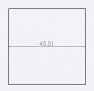

与[装配上下文](/docs/codestack/solidworks-api/document/assembly/context/)类似，绘图上下文中也存在指向底层模型上下文和绘图视图上下文的指针。

当需要在绘图视图中选择底层模型上下文中的实体（例如用于标注的目的）时，可以调用[IView::SelectEntity](https://help.solidworks.com/2018/english/api/sldworksapi/solidworks.interop.sldworks~solidworks.interop.sldworks.iview~selectentity.html) SOLIDWORKS API方法。SOLIDWORKS将自动在绘图视图中找到相应的实体指针并选择它。

此示例演示了如何使用SOLIDWORKS API在底层零件模型中的两个命名边（Edge1和Edge2）之间添加线性尺寸。可以通过以下属性对话框为实体命名：

{ width=350 }

结果是在边之间添加了尺寸。

{ width=250 }

尺寸的位置是通过在标注的边的中点之间绘制的线的中点找到的。与[在图纸上下文中绘图](/docs/codestack/solidworks-api/document/drawing/sheet-context-sketch/)不同，不需要将图纸比例尺乘以视图变换矩阵来定位尺寸。

~~~ vb
Dim swApp As SldWorks.SldWorks

Sub main()

    Set swApp = Application.SldWorks
    
    Dim swDraw As SldWorks.DrawingDoc
    
    Set swDraw = swApp.ActiveDoc
    
    If Not swDraw Is Nothing Then
        
        Dim swView As SldWorks.view
        Set swView = swDraw.SelectionManager.GetSelectedObject6(1, -1)
        
        If Not swView Is Nothing Then
            DimensionNamedEdges "Edge1", "Edge2", swDraw, swView
        Else
            MsgBox "Please select drawing view"
        End If
    Else
        MsgBox "Please open the drawing document"
    End If
    
End Sub

Function DimensionNamedEdges(firstEdgeName As String, secondEdgeName As String, draw As SldWorks.DrawingDoc, view As SldWorks.view)
    
    Dim swRefPart As SldWorks.PartDoc
    Set swRefPart = view.ReferencedDocument
    
    Dim swFirstEdge As SldWorks.edge
    Set swFirstEdge = swRefPart.GetEntityByName(firstEdgeName, swSelectType_e.swSelEDGES)
    
    Dim swSecondEdge As SldWorks.edge
    Set swSecondEdge = swRefPart.GetEntityByName(secondEdgeName, swSelectType_e.swSelEDGES)
    
    If swFirstEdge Is Nothing Or swSecondEdge Is Nothing Then
        Err.Raise vbError, "", "Failed to find edge by name"
    End If
    
    If False = view.SelectEntity(swFirstEdge, False) Or False = view.SelectEntity(swSecondEdge, True) Then
        Err.Raise vbError, "", "Failed to select edges in the drawing view"
    End If
    
    Dim swModel As SldWorks.ModelDoc2
    Set swModel = draw
    
    Dim vDimLoc As Variant
    vDimLoc = GetDimensionLocation(swFirstEdge, swSecondEdge, view)
    
    swModel.AddDimension2 vDimLoc(0), vDimLoc(1), vDimLoc(2)
    
End Function

Function GetDimensionLocation(firstEdge As SldWorks.edge, secondEdge As SldWorks.edge, view As SldWorks.view) As Variant
    
    Dim vFirstPt As Variant
    vFirstPt = GetEdgeMidPoint(firstEdge, view)
    
    Dim vSecondPt As Variant
    vSecondPt = GetEdgeMidPoint(secondEdge, view)
    
    Dim dLoc(2) As Double
    dLoc(0) = (vFirstPt(0) + vSecondPt(0)) / 2
    dLoc(1) = (vFirstPt(1) + vSecondPt(1)) / 2
    dLoc(2) = (vFirstPt(2) + vSecondPt(2)) / 2
    
    GetDimensionLocation = dLoc
    
End Function

Function GetEdgeMidPoint(edge As SldWorks.edge, view As SldWorks.view) As Variant
    
    Dim vStartPt As Variant
    vStartPt = edge.GetStartVertex().GetPoint
    
    Dim vEndPt As Variant
    vEndPt = edge.GetEndVertex().GetPoint
    
    Dim vMidPt(2) As Double
    vMidPt(0) = (vStartPt(0) + vEndPt(0)) / 2
    vMidPt(1) = (vStartPt(1) + vEndPt(1)) / 2
    vMidPt(2) = (vStartPt(2) + vEndPt(2)) / 2
    
    Dim swViewXForm As SldWorks.MathTransform
    Set swViewXForm = view.ModelToViewTransform
    
    Dim swMathUtils As SldWorks.MathUtility
    Set swMathUtils = swApp.GetMathUtility
    
    Dim swMathPt As SldWorks.MathPoint
    Set swMathPt = swMathUtils.CreatePoint(vMidPt)
    
    Set swMathPt = swMathPt.MultiplyTransform(swViewXForm)
    
    GetEdgeMidPoint = swMathPt.ArrayData
    
End Function
~~~