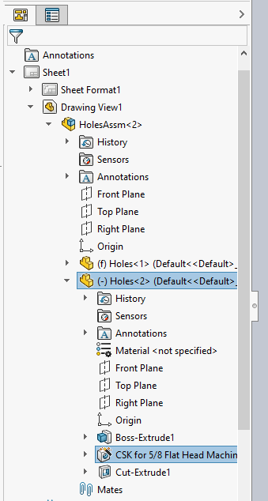

{ width=250 }

这个 VBA 宏演示了如何在绘图中的每个视图中找到模型空间中输入特征的指针并选择它。

* 打开创建绘图视图的模型（例如装配或零件）
* 选择任何特征
* 运行宏。宏会停止执行
* 激活绘图
* 继续运行宏。每个视图中的所有相应特征都会被选择

## 使用 GetCorresponding 方法

这种方法利用了 [IView::GetCorresponding](https://help.solidworks.com/2018/English/api/sldworksapi/SolidWorks.Interop.sldworks~SolidWorks.Interop.sldworks.IView~GetCorresponding.html) API 方法，通过将指针从装配上下文转换为绘图视图上下文。此 API 仅适用于 SOLIDWORKS 2018 或更新版本，如果需要替代方法，请使用 [使用 SelectById2 方法](#使用-selectbyid2-方法)。

~~~ vb
Dim swApp As SldWorks.SldWorks

Sub main()

    Set swApp = Application.SldWorks
    
    Dim swModel As SldWorks.ModelDoc2
    
    Set swModel = swApp.ActiveDoc
    
    Dim swFeat As SldWorks.Feature
    
    Dim swSelMgr As SldWorks.SelectionMgr
    
    Set swSelMgr = swModel.SelectionManager
    
    Set swFeat = swSelMgr.GetSelectedObject6(1, -1)
    
    '激活绘图
    Stop
    
    Dim swDraw As SldWorks.DrawingDoc
    
    Set swDraw = swApp.ActiveDoc
        
    Set swSelMgr = swDraw.SelectionManager
    
    Dim vViews As Variant
    
    vViews = swDraw.GetViews()(0)
    
    Dim i As Integer
    
    Dim swSelData As SldWorks.SelectData
    Set swSelData = swSelMgr.CreateSelectData
    
    swDraw.ClearSelection2 True
    
    For i = 0 To UBound(vViews)
        
        Dim swView As SldWorks.View
        
        Set swView = vViews(i)
        
        If swView.ReferencedDocument Is swModel Then
                    
            Dim swViewFeat As SldWorks.Entity
            Set swViewFeat = swFeat
            
            Set swViewFeat = swView.GetCorresponding(swFeat)
            
            swSelData.View = swView
            
            If Not swViewFeat Is Nothing Then
                Debug.Print swViewFeat.Select4(True, swSelData)
            Else
                Debug.Print "无法获取相应的特征"
            End If
            
        End If
        
    Next
    
End Sub
~~~

## 使用 SelectById2 方法

这种方法利用了 [IModelDocExtension::SelectByID2](https://help.solidworks.com/2017/english/api/sldworksapi/solidworks.interop.sldworks~solidworks.interop.sldworks.imodeldocextension~selectbyid2.html) 方法，通过组合特征名称来选择特征。

~~~ vb
Dim swApp As SldWorks.SldWorks

Sub main()

    Set swApp = Application.SldWorks
    
    Dim swRefModel As SldWorks.ModelDoc2
    
    Set swRefModel = swApp.ActiveDoc
    
    Dim swFeat As SldWorks.Feature
    
    Set swFeat = swRefModel.SelectionManager.GetSelectedObject6(1, -1)
    
    Dim swSelMgr As SldWorks.SelectionMgr
    Set swSelMgr = swRefModel.SelectionManager
    
    Dim selName As String
    Dim selType As String
    selName = swFeat.GetNameForSelection(selType)
    
    Stop
    
    Dim swDraw As SldWorks.DrawingDoc
    Set swDraw = swApp.ActiveDoc
    
    Dim swView As SldWorks.View
    Set swView = swDraw.SelectionManager.GetSelectedObject6(1, -1)
    
    Dim drwSelPrefix As String
    drwSelPrefix = swFeat.Name & "@" & swView.RootDrawingComponent.Name & "@" & swView.Name
    
    selName = Right(selName, Len(selName) - InStr(selName, "@"))
    
    If False = swDraw.Extension.SelectByID2(drwSelPrefix & "/" & selName, selType, 0, 0, 0, False, 0, Nothing, 0) Then
        Err.Raise vbError, "", "无法在绘图视图中选择相应的特征"
    End If

End Sub
~~~