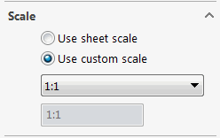
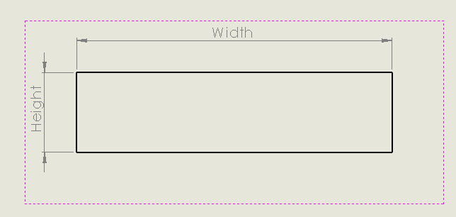
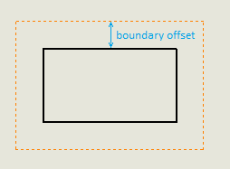

 使用VBA宏根据几何尺寸和指定的映射自动缩放当前工作表中的绘图视图
image: scale-view.svg
labels: [缩放,尺寸,边界框]
group: 绘图
---

{ width=250 }

这个VBA宏根据几何尺寸和指定的匹配映射自动缩放当前工作表中的绘图视图。

映射是一组指令，定义了以下内容：

* 几何体的最小和最大宽度。使用 * 表示匹配任何值
* 几何体的最小和最大高度。使用 * 表示匹配任何值
* 如果匹配成功，则缩放的分子和分母

几何尺寸是根据绘图视图中可见实体的边界框计算的（包括所有参考几何体、草图实体、尺寸和其他注释）：

{ width=350 }

所有绘图视图都有一个偏移边界。为了得到几何体的实际值，需要从视图尺寸中减去这个边界值。边界值是动态计算的（工作表宽度或高度的2%中较小的那个）。这不是一个文档化的值，可能会在未来由SOLIDWORKS更改，这可能会影响此宏中的计算。



## 配置

### 范围

*BASE_VIEWS_ONLY* 变量控制是否应该缩放所有视图还是仅基本视图（即没有父视图的视图）。如果将此选项设置为 *True*，则会处理所有视图，并且派生视图将与原始源视图断开连接。

~~~
Const BASE_VIEWS_ONLY As Boolean = False '处理所有视图
~~~

### 缩放映射

在宏的开头配置缩放映射。根据需要指定多个映射条目。

~~~ vba
Dim scaleMap As Variant
scaleMap = Array("0-0.1;*;1:1", "0.1-0.2;0.05-0.1;1:2", "另一个条目", ..., "最后一个条目")
~~~

每个条目必须遵循预定义的格式：

~~~
"[最小宽度]-[最大宽度];[最小高度]-[最大高度];[缩放分子]:[缩放分母]"
~~~

* 宽度和高度的所有值都以米为单位
* 使用 * 表示允许任何宽度或高度

在下面的示例中

~~~ vba
Array("0-0.1;*;1:1", "0.1-0.2;0.05-0.1;1:2")
~~~

* 所有宽度最多为100毫米且任何高度的绘图视图将设置为1:1比例
* 所有宽度在100毫米到200毫米之间且高度在50毫米到100毫米之间的绘图视图将设置为1:2比例

```vb
Const BASE_VIEWS_ONLY As Boolean = True

Dim swApp As SldWorks.SldWorks

Sub main()
    
    Dim scaleMap As Variant
    scaleMap = Array("0-0.1;*;1:1", "0.1-0.2;0.05-0.1;1:2")
    
    Set swApp = Application.SldWorks
    
    Dim swDraw As SldWorks.DrawingDoc

try:
    
    On Error GoTo catch
    
    Set swDraw = swApp.ActiveDoc
    
    If Not swDraw Is Nothing Then
        
        RescaleViews swDraw, swDraw.GetCurrentSheet(), scaleMap
        
    Else
        Err.Raise vbError, "", "请打开绘图文档"
    End If
    
    GoTo finally
    
catch:
    MsgBox Err.Description & " (" & Err.Number & ")", vbCritical
finally:

End Sub

Sub RescaleViews(draw As SldWorks.DrawingDoc, sheet As SldWorks.sheet, scaleMap As Variant)
    
    Dim vViews As Variant
    vViews = GetSheetViews(draw, sheet)
    
    Dim i As Integer
    
    For i = 0 To UBound(vViews)
        
        Dim swView As SldWorks.view
        Set swView = vViews(i)
        
        Dim width As Double
        Dim height As Double
        GetViewGeometrySize swView, width, height
        
        Debug.Print swView.Name & " : " & width & " x " & height
        
        Dim j As Integer
        
        For j = 0 To UBound(scaleMap)
            
            Dim minWidth As Double
            Dim maxWidth As Double
            Dim minHeight As Double
            Dim maxHeight As Double
            Dim viewScale As Variant
            
            ExtractParameters CStr(scaleMap(j)), minWidth, maxWidth, minHeight, maxHeight, viewScale
            
            If width >= minWidth And width <= maxWidth And height >= minHeight And height <= maxHeight Then
                Debug.Print swView.Name & " 匹配 " & CStr(scaleMap(j))
                If Not BASE_VIEWS_ONLY Or swView.GetBaseView() Is Nothing Then
                    Debug.Print "将 " & swView.Name & " 的比例设置为 " & viewScale(0) & ":" & viewScale(1)
                    swView.ScaleRatio = viewScale
                Else
                    Debug.Print "跳过 " & swView.Name & " 视图，因为它不是基本视图"
                End If
                
            Else
                Debug.Print swView.Name & " 不匹配 " & CStr(scaleMap(j))
            End If
            
        Next
        
    Next
    
    draw.EditRebuild
    
End Sub

Function GetSheetViews(draw As SldWorks.DrawingDoc, sheet As SldWorks.sheet) As Variant

    Dim vSheets As Variant
    vSheets = draw.GetViews()
    
    Dim i As Integer
    
    For i = 0 To UBound(vSheets)
    
        Dim vViews As Variant
        vViews = vSheets(i)
        
        Dim swSheetView As SldWorks.view
        Set swSheetView = vViews(0)
        
        If UCase(swSheetView.Name) = UCase(sheet.GetName()) Then
            
            If UBound(vViews) > 0 Then
                
                Dim swViews() As SldWorks.view
                
                ReDim swViews(UBound(vViews) - 1)
                
                Dim j As Integer
                
                For j = 1 To UBound(vViews)
                    Set swViews(j - 1) = vViews(j)
                Next
                
                GetSheetViews = swViews
                Exit Function
                
            End If
            
        End If
        
    Next
    
End Function

Sub GetViewGeometrySize(view As SldWorks.view, ByRef width As Double, ByRef height As Double)
    
    Dim borderWidth As Double
    borderWidth = GetViewBorderWidth(view)
    
    Dim vOutline As Variant
    vOutline = view.GetOutline()
    
    Dim viewScale As Double
    viewScale = view.ScaleRatio(1) / view.ScaleRatio(0)
    
    width = (vOutline(2) - vOutline(0) - borderWidth * 2) * viewScale
    height = (vOutline(3) - vOutline(1) - borderWidth * 2) * viewScale
    
End Sub

Function GetViewBorderWidth(view As SldWorks.view) As Double
    
    Const VIEW_BORDER_RATIO = 0.02
    
    Dim width As Double
    Dim height As Double
    
    view.sheet.GetSize width, height
    
    Dim minSize As Double
    
    If width < height Then
        minSize = width
    Else
        minSize = height
    End If
    
    GetViewBorderWidth = minSize * VIEW_BORDER_RATIO
    
End Function

Sub ExtractParameters(params As String, ByRef minWidth As Double, ByRef maxWidth As Double, ByRef minHeight As Double, ByRef maxHeight As Double, ByRef viewScale As Variant)

    Dim vParamsData As Variant
    vParamsData = Split(params, ";")
    
    ExtractSizeBounds CStr(vParamsData(0)), minWidth, maxWidth
    ExtractSizeBounds CStr(vParamsData(1)), minHeight, maxHeight
    
    Dim scaleData As Variant
    scaleData = Split(vParamsData(2), ":")
    
    Dim dViewScale(1) As Double
    dViewScale(0) = CDbl(Trim(scaleData(0)))
    dViewScale(1) = CDbl(Trim(scaleData(1)))
    
    viewScale = dViewScale
    
End Sub

Sub ExtractSizeBounds(boundParam As String, ByRef min As Double, ByRef max As Double)
    
    If Trim(boundParam) = "*" Then
        min = 0
        max = 1000000
    Else
        Dim minMax As Variant
        minMax = Split(boundParam, "-")
        min = CDbl(Trim(minMax(0)))
        max = CDbl(Trim(minMax(1)))
    End If
    
End Sub
```