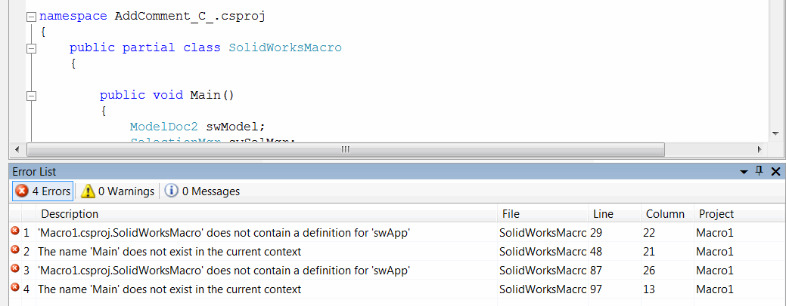
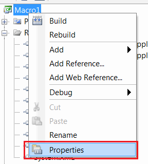
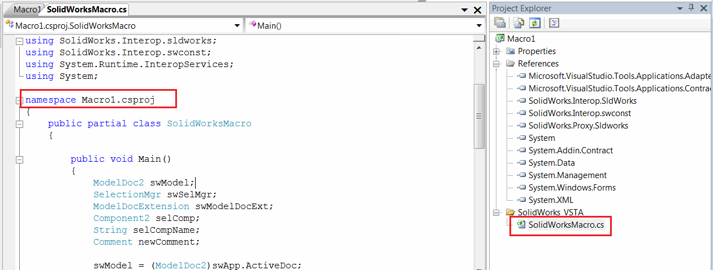

## 症状

将 SOLIDWORKS VSTA 宏（C# 或 VB.NET）的示例代码从 SOLIDWORKS API 帮助文档或其他来源复制到代码中时，会显示多个编译错误：

* MacroName.SolidWorksMacro 不包含 'SwApp' 的定义
* 当前上下文中不存在 'Main' 的名称

{ width=450 }

## 原因

VSTA 宏基于多个连接的文件，这些文件必须位于相同的命名空间中。当创建新的宏时，命名空间可能与示例源代码中使用的命名空间不相等。

~~~ cs
namespace MacroName.csproj
{
  ...
}
~~~

## 解决方法

将 *SolidWorksMacro.cs* 文件中的命名空间更改为与默认命名空间匹配

* 打开项目属性页面

{ width=250 }

* 复制 *应用程序* 选项卡中的 *默认命名空间* 字段的值

{ width=350 }

* 将命名空间重命名为复制的值

{ width=500 }

* 重新构建宏