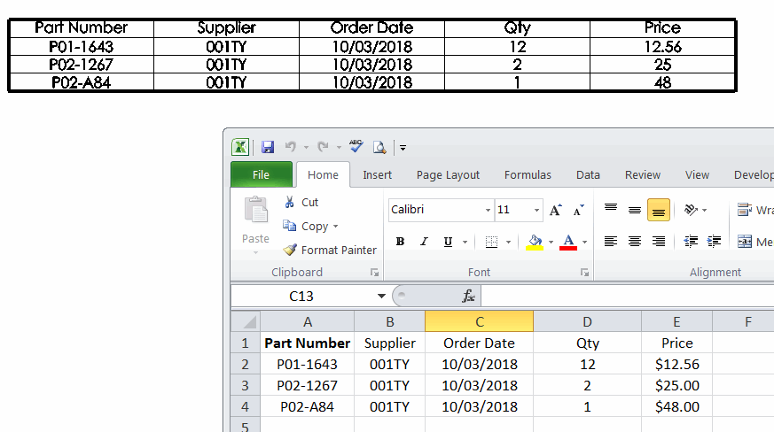

此宏将使用SOLIDWORKS API从指定的Excel电子表格中将数据写入活动文档的新创建的通用表中。

在宏的头部定义的常量中指定Excel文件的完整路径和电子表格的名称。

为了更新现有的通用表而不是创建新的表，选择图形视图中的通用表或从特征管理器树中选择通用表，然后运行宏。

此宏可以嵌入到[宏特征](/docs/codestack/solidworks-api/document/macro-feature)中，从而实现表的自动更新。有关此选项的更多信息，请参阅[将通用表链接到Excel并自动更新](/docs/codestack/solidworks-api/document/macro-feature/general-table-link-excel/)。

{ width=500 }

~~~ vb
Const FILE_PATH As String = "C:\Orders\PurchaseOrder_5281.xlsx"
Const WORKSHEET_NAME As String = "Sheet1"

Dim swApp As SldWorks.SldWorks

Sub main()

    Set swApp = Application.SldWorks
    
    Dim swModel As SldWorks.ModelDoc2
    
    Set swModel = swApp.ActiveDoc
    
    If Not swModel Is Nothing Then
    
        Dim vTableData As Variant
        vTableData = GetArrayFromExcel(FILE_PATH, WORKSHEET_NAME)
        
        Dim swTable As SldWorks.TableAnnotation
        Set swTable = TryGetSelectedTable(swModel)
        
        If Not swTable Is Nothing Then
            FillTable swTable, vTableData
        Else
            CreateTableFromArray swModel, vTableData
        End If
        
    Else
        MsgBox "请打开模型"
    End If
    
End Sub

Function GetArrayFromExcel(filePath As String, sheetName As String) As Variant
    
    Dim xlApp As Object
    
    Dim tableData() As String
    
    Set xlApp = GetObject("", "Excel.Application")
        
    Dim xlWorkbook As Object
    Dim xlWorksheet As Object

    Dim closeWorkbook As Boolean
    closeWorkbook = Not IsWorkbookOpen(xlApp, filePath)
    
    Set xlWorkbook = xlApp.Workbooks.Open(filePath)
    Set xlWorksheet = xlWorkbook.Sheets(sheetName)
    
    Dim rowIndex As Integer
    Dim columnIndex As Integer
    
    ReDim tableData(xlWorksheet.UsedRange.Rows.Count, xlWorksheet.UsedRange.Columns.Count)
    
    For rowIndex = 1 To xlWorksheet.UsedRange.Rows.Count
        For columnIndex = 1 To xlWorksheet.UsedRange.Columns.Count
            Dim cellVal As String
            cellVal = xlWorksheet.Cells(rowIndex, columnIndex).Value
            tableData(rowIndex - 1, columnIndex - 1) = cellVal
        Next
    Next
    
    GetArrayFromExcel = tableData
    
    If closeWorkbook Then
        xlWorkbook.Close SaveChanges:=False
    End If
    
End Function

Function IsWorkbookOpen(xlApp As Object, filePath As String) As Boolean
    
    Dim i As Integer
    
    For i = 1 To xlApp.Workbooks.Count
        If LCase(xlApp.Workbooks(i).FullName) = LCase(filePath) Then
            IsWorkbookOpen = True
            Exit Function
        End If
    Next
    
    IsWorkbookOpen = False
    
End Function

Function TryGetSelectedTable(model As SldWorks.ModelDoc2) As SldWorks.TableAnnotation
    
    On Error Resume Next
    
    Dim swTable As SldWorks.TableAnnotation
    Set swTable = model.SelectionManager.GetSelectedObject6(1, -1)
    
    If swTable Is Nothing Then
        
        Dim swTableFeat As SldWorks.GeneralTableFeature
        Set swTableFeat = swModel.SelectionManager.GetSelectedObject6(1, -1)
        
        If Not swTableFeat Is Nothing Then
            Set swTable = swTableFeat.GetTableAnnotations()(0)
        End If
        
    End If
    
    Set TryGetSelectedTable = swTable
    
End Function

Function CreateTableFromArray(model As SldWorks.ModelDoc2, vTableData As Variant) As SldWorks.TableAnnotation
    
    Dim swTable As SldWorks.TableAnnotation
    Set swTable = model.Extension.InsertGeneralTableAnnotation(True, 0, 0, swBOMConfigurationAnchorType_e.swBOMConfigurationAnchor_BottomLeft, "", UBound(vTableData, 1), UBound(vTableData, 2))
    
    FillTable swTable, vTableData
    
    Set CreateTableFromArray = swTable
    
End Function

Sub FillTable(table As SldWorks.TableAnnotation, vTableData As Variant)
    
    Dim rowIndex As Integer
    Dim columnIndex As Integer
    
    Dim rowsCount As Integer
    Dim colsCount As Integer
    Dim i As Integer
    
    rowsCount = UBound(vTableData, 1)
    colsCount = UBound(vTableData, 2)
    
    If table.ColumnCount > colsCount Then
        For i = colsCount To table.ColumnCount - 1
            table.DeleteColumn2 table.ColumnCount - 1, True
        Next
    ElseIf table.ColumnCount < colsCount Then
        For i = table.ColumnCount To colsCount - 1
            table.InsertColumn2 swTableItemInsertPosition_e.swTableItemInsertPosition_Last, -1, "", swInsertTableColumnWidthStyle_e.swInsertColumn_DefaultWidth
        Next
    End If
    
    If table.RowCount > rowsCount Then
        For i = rowsCount To table.RowCount - 1
            table.DeleteRow2 table.RowCount - 1, True
        Next
    ElseIf table.RowCount < rowsCount Then
        For i = table.RowCount To rowsCount - 1
            table.InsertRow swTableItemInsertPosition_e.swTableItemInsertPosition_Last, -1
        Next
    End If
    
    For rowIndex = 0 To UBound(vTableData, 1)
        For columnIndex = 0 To UBound(vTableData, 2)
            table.Text(rowIndex, columnIndex) = vTableData(rowIndex, columnIndex)
        Next
    Next
    
End Sub
~~~