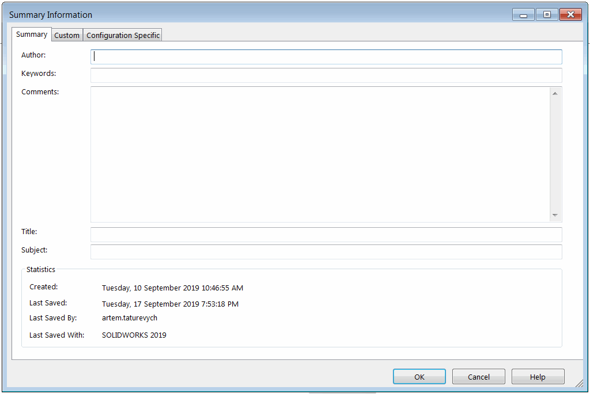

 Use a VBA macro with the SOLIDWORKS API to populate summary information (Author, Keywords, Comments, Title, Subject) for active SOLIDWORKS files.
image: summary.png
labels: [Summary Information, Writing Summary]
---
{ width=500 }

This VBA macro uses the SOLIDWORKS API to populate the *Summary Information* tab (Author, Keywords, Comments, Title, and Subject) of the active model's custom properties.

Configure the macro and specify the values to write:

```vb
Const AUTHOR As String = "CodeStack"
Const KEYWORDS As String = "sample,summary,api"
Const COMMENTS As String = "Example comments"
Const TITLE As String = "Summary API Example"
Const SUBJECT As String = "CodeStack API Examples"
```

```vb
Const AUTHOR As String = "CodeStack"
Const KEYWORDS As String = "sample,summary,api"
Const COMMENTS As String = "Example comments"
Const TITLE As String = "Summary API Example"
Const SUBJECT As String = "CodeStack API Examples"

Dim swApp As SldWorks.SldWorks

Sub main()

    Set swApp = Application.SldWorks
    
    Dim swModel As SldWorks.ModelDoc2
    
    Set swModel = swApp.ActiveDoc
    
    If Not swModel Is Nothing Then
        swModel.SummaryInfo(swSummInfoField_e.swSumInfoAuthor) = AUTHOR
        swModel.SummaryInfo(swSummInfoField_e.swSumInfoKeywords) = KEYWORDS
        swModel.SummaryInfo(swSummInfoField_e.swSumInfoComment) = COMMENTS
        swModel.SummaryInfo(swSummInfoField_e.swSumInfoTitle) = TITLE
        swModel.SummaryInfo(swSummInfoField_e.swSumInfoSubject) = SUBJECT
    Else
        MsgBox "Please open a model"
    End If
    
End Sub
```