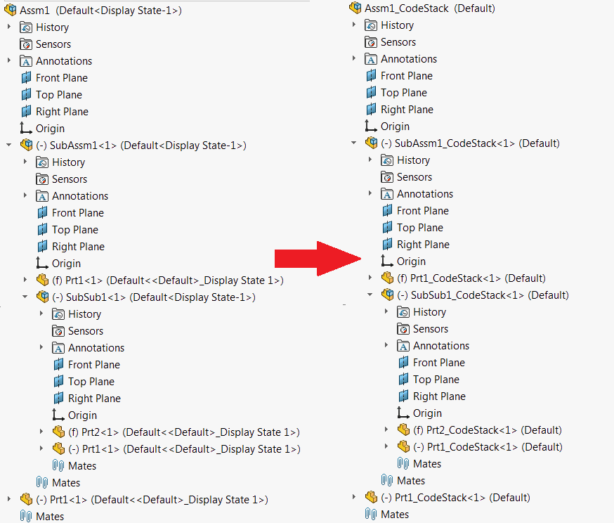

 该示例演示了如何使用SOLIDWORKS文档管理器API将装配体或图纸树复制到新位置，并通过为每个文件添加后缀来保留引用。
image: copy-tree.png
labels: [复制树, 复制文档]
---
{ width=350 }

该示例演示了如何使用SOLIDWORKS文档管理器API将装配体或图纸树复制到新位置。宏允许为树中的每个文件添加后缀。宏将在装配体的所有层级上保留并替换所有必需的引用。

在宏的开头的常量中指定要移动的输入文件、目标文件夹和后缀。

~~~ vb
Const FILE_PATH As String = "D:\Input\Assm1.SLDASM" '输入装配体或图纸的完整路径
Const DEST_FOLDER As String = "D:\Output" '目标位置。不要在文件夹路径的末尾添加反斜杠'\'
Const SUFFIX As String = "_CodeStack" '要添加到树中每个文件的后缀
~~~

使用[ISwDMApplication::CopyDocument](https://help.solidworks.com/2018/english/api/swdocmgrapi/solidworks.interop.swdocumentmgr~solidworks.interop.swdocumentmgr.iswdmapplication~copydocument.html)文档管理器API执行文件和所有引用的复制。

~~~ vb
Const FILE_PATH As String = "D:\Input\Assm1.SLDASM"
Const DEST_FOLDER As String = "D:\Output"
Const SUFFIX As String = "_CodeStack"

Const LIC_KEY As String = "YOUR LICENSE KEY"

Dim swDmApp As SwDocumentMgr.SwDMApplication4

Sub main()

    Dim swClassFact As SwDocumentMgr.swDmClassFactory
    
    Set swClassFact = New SwDocumentMgr.swDmClassFactory
    
    Set swDmApp = swClassFact.GetApplication(LIC_KEY)
    
    If Not swDmApp Is Nothing Then
                
        Dim i As Integer
        
        Dim srcChildren As Variant
        Dim destChildren() As String
        Dim destFilePath As String
        
        destFilePath = CreateDestinationPath(FILE_PATH, DEST_FOLDER, SUFFIX)
        
        srcChildren = GetReferencedDocuments(FILE_PATH)
        ReDim destChildren(UBound(srcChildren))
        
        For i = 0 To UBound(srcChildren)
            destChildren(i) = CreateDestinationPath(CStr(srcChildren(i)), DEST_FOLDER, SUFFIX)
        Next
        
        Debug.Print swDmApp.CopyDocument(FILE_PATH, destFilePath, srcChildren, destChildren, swMoveCopyOptions_e.swMoveCopyOptionsOverwriteExistingDocs, CreateSearchData())
        
    End If
    
End Sub

Function CreateDestinationPath(srcPath As String, destFolder As String, suff As String)
    
    Dim fileName As String
    Dim ext As String
    
    fileName = Mid(srcPath, InStrRev(srcPath, "\"), InStrRev(srcPath, ".") - InStrRev(srcPath, "\"))
    ext = Right(srcPath, Len(srcPath) - InStrRev(srcPath, ".") + 1)
    
    CreateDestinationPath = destFolder & fileName & suff & ext
    
End Function

Function GetReferencedDocuments(filePath As String) As Variant
    
    Dim refDocs() As String
    Dim isInit As Boolean
    isInit = False
    
    Dim swDmDoc As SwDocumentMgr.SwDMDocument19
    
    Dim searchOpts As SwDocumentMgr.SwDMSearchOption
    Set searchOpts = CreateSearchData
    
    Set swDmDoc = OpenDocument(filePath)
    
    If Not swDmDoc Is Nothing Then
        
        Dim vBrokenRefs As Variant
        Dim vVirtComps As Variant
        Dim vTimeStamps As Variant
        Dim vFilePaths As Variant
        
        vFilePaths = swDmDoc.GetAllExternalReferences4(searchOpts, vBrokenRefs, vVirtComps, vTimeStamps)
        
        If Not IsEmpty(vFilePaths) Then
            
            Dim i As Integer
            
            For i = 0 To UBound(vFilePaths)
                Dim childFilePath As String
                childFilePath = vFilePaths(i)
                
                If Not isInit Then
                    ReDim refDocs(0)
                    refDocs(0) = childFilePath
                    isInit = True
                ElseIf Not Contains(refDocs, childFilePath) Then
                    ReDim Preserve refDocs(UBound(refDocs) + 1)
                    refDocs(UBound(refDocs)) = childFilePath
                End If
                
                Dim vChildRefs As Variant
                vChildRefs = GetReferencedDocuments(childFilePath)
                
                If Not IsEmpty(vChildRefs) Then
                    Dim j As Integer
                    For j = 0 To UBound(vChildRefs)
                        If Not Contains(refDocs, CStr(vChildRefs(j))) Then
                            ReDim Preserve refDocs(UBound(refDocs) + 1)
                            refDocs(UBound(refDocs)) = vChildRefs(j)
                        End If
                    Next
                End If
                
            Next
        Else
            GetReferencedDocuments = Empty
            Exit Function
        End If
        
    Else
        err.Raise vbObjectError, "", "Failed to open document: " & filePath
    End If
    
    GetReferencedDocuments = refDocs
    
End Function

Function OpenDocument(filePath As String) As SwDocumentMgr.SwDMDocument19
    
    Dim err As SwDmDocumentOpenError
    
    Dim docType As SwDocumentMgr.SwDmDocumentType
    
    Dim ext As String
    ext = LCase(Right(filePath, 6))
    
    Select Case ext
        Case "sldprt"
            docType = swDmDocumentPart
        Case "sldasm"
            docType = swDmDocumentAssembly
        Case "slddrw"
            docType = swDmDocumentDrawing
    End Select
    
    Dim swDmDoc As SwDocumentMgr.SwDMDocument19
    
    Set swDmDoc = swDmApp.GetDocument(filePath, docType, True, err)
    
    Set OpenDocument = swDmDoc
    
End Function

Function CreateSearchData() As SwDocumentMgr.SwDMSearchOption
    
    Dim searchOpts As SwDocumentMgr.SwDMSearchOption
    
    Set searchOpts = swDmApp.GetSearchOptionObject
    searchOpts.SearchFilters = SwDmSearchFilters.SwDmSearchExternalReference + SwDmSearchFilters.SwDmSearchRootAssemblyFolder + SwDmSearchFilters.SwDmSearchSubfolders + SwDmSearchFilters.SwDmSearchInContextReference
    
    Set CreateSearchData = searchOpts
    
End Function

Function Contains(arr As Variant, item As String) As Boolean
    
    Dim i As Integer
    
    For i = 0 To UBound(arr)
        If LCase(arr(i)) = LCase(item) Then
            Contains = True
            Exit Function
        End If
    Next
    
    Contains = False
    
End Function
~~~