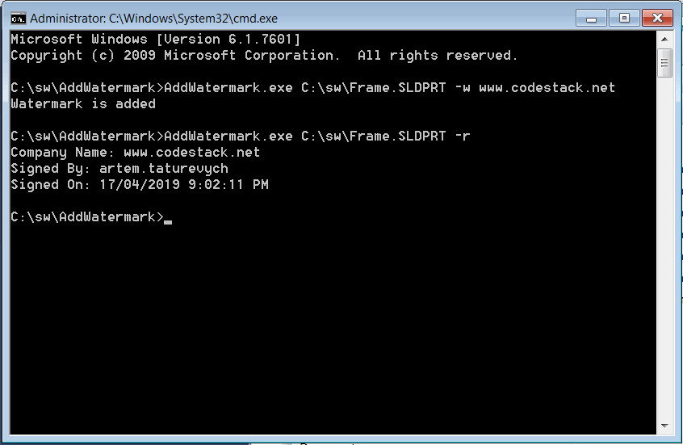

 使用SOLIDWORKS文档管理器API将数字水印添加到第三方存储（流）中的SOLIDWORKS模型（零件、装配或绘图）。
image: add-watermark-console-output.png
labels: [水印, 存储]
---

本示例演示了如何使用SOLIDWORKS文档管理器API将数字水印添加到SOLIDWORKS模型（零件、装配或绘图）中的第三方存储（流）。

此应用程序实现为命令行程序，具有以下参数。

## 添加水印

* SOLIDWORKS文件的完整路径
* -w - 表示需要添加水印的标志
* 公司名称 - 要添加到水印中的公司名称

```plaintext
AddWatermark.exe C:\MyPart.sldprt -w MyCompanyName
```

水印将包括公司名称、当前用户名和时间戳。

## 读取水印

* SOLIDWORKS文件的完整路径
* -r - 表示需要读取水印的标志

```plaintext
AddWatermark.exe C:\MyPart.sldprt -r MyCompanyName
```

结果将在控制台应用程序中显示存储的水印。

{ width=450 }

### Program.cs

包含用于读取和添加水印的控制台应用程序的路由。

```cs
using SolidWorks.Interop.swdocumentmgr;
using System;
using System.IO;
using System.Runtime.InteropServices.ComTypes;
using System.Xml.Serialization;
using ThirdPartyStorage;

namespace CodeStack
{
    public class Watermark
    {
        public string CompanyName { get; set; }
        public string SignedBy { get; set; }
        public DateTime SignedOn { get; set; }
    }

    class Program
    {
        private const string DM_LIC_KEY = "<Your DM License Key>";
        private const string STORAGE_NAME = "_CodeStackWatermark";

        static void Main(string[] args)
        {
            var filePath = args[0];

            var isWriting = args[1] == "-w";

            var docType = GetDocumentType(filePath);
            
            var dmApp = ConnectoToDm(DM_LIC_KEY);

            SwDmDocumentOpenError err;
            var doc = dmApp.GetDocument(filePath, docType, !isWriting, out err) as SwDMDocument19;

            if (doc != null)
            {
                var stream = doc.Get3rdPartyStorage(STORAGE_NAME, isWriting) as IStream;

                try
                {
                    if (isWriting)
                    {
                        AddWatermark(args[2], stream);
                    }
                    else
                    {
                        ReadWatermark(stream);
                    }
                }
                catch
                {
                    throw;
                }
                finally
                {
                    doc.Release3rdPartyStorage(STORAGE_NAME);

                    if (isWriting)
                    {
                        doc.Save();
                    }

                    doc.CloseDoc();
                }
            }
            else
            {
                throw new NullReferenceException($"Failed to open the document: {err}");
            }
        }

        private static void ReadWatermark(IStream stream)
        {
            if (stream != null)
            {
                using (var comStream = new ComStream(stream, false, false))
                {
                    var ser = new XmlSerializer(typeof(Watermark));
                    var wm = ser.Deserialize(comStream) as Watermark;

                    Console.WriteLine($"Company Name: {wm.CompanyName}");
                    Console.WriteLine($"Signed By: {wm.SignedBy}");
                    Console.WriteLine($"Signed On: {wm.SignedOn}");
                }
            }
            else
            {
                Console.WriteLine("No watermark");
            }
        }

        private static void AddWatermark(string companyName, IStream stream)
        {
            var wm = new Watermark()
            {
                CompanyName = companyName,
                SignedBy = Environment.UserName,
                SignedOn = DateTime.Now
            };

            using (var comStream = new ComStream(stream, true, false))
            {
                var ser = new XmlSerializer(wm.GetType());
                ser.Serialize(comStream, wm);
            }

            Console.WriteLine("Watermark is added");
        }

        private static SwDMApplication ConnectoToDm(string licKey)
        {
            var classFact = new SwDMClassFactory();
            var docMgr = classFact.GetApplication(licKey) as SwDMApplication;

            return docMgr;
        }

        private static SwDmDocumentType GetDocumentType(string filePath)
        {
            var docType = SwDmDocumentType.swDmDocumentUnknown;

            switch (Path.GetExtension(filePath).ToUpper())
            {
                case ".SLDPRT":
                    docType = SwDmDocumentType.swDmDocumentPart;
                    break;
                case ".SLDASM":
                    docType = SwDmDocumentType.swDmDocumentAssembly;
                    break;
                case ".SLDDRW":
                    docType = SwDmDocumentType.swDmDocumentDrawing;
                    break;
                default:
                    throw new NotSupportedException("File type not supported");

            }

            return docType;
        }
    }
}

```


### ComStream.cs

封装了[IStream](https://docs.microsoft.com/en-us/windows/desktop/api/objidl/nn-objidl-istream)接口，简化了从.NET语言访问的过程。

```cs
using System;
using System.IO;
using System.Runtime.InteropServices.ComTypes;

namespace ThirdPartyStorage
{
    public class ComStream : Stream
    {
        private readonly IStream m_ComStream;
        private readonly bool m_Commit;

        private bool m_IsWritable;

        public override bool CanRead
        {
            get
            {
                return true;
            }
        }

        public override bool CanSeek
        {
            get
            {
                return true;
            }
        }

        public override bool CanWrite
        {
            get
            {
                return m_IsWritable;
            }
        }

        public override long Length
        {
            get
            {
                const int STATSFLAG_NONAME = 1;

                STATSTG statstg;

                m_ComStream.Stat(out statstg, STATSFLAG_NONAME);

                return statstg.cbSize;
            }
        }

        public override long Position
        {
            get
            {
                return Seek(0, SeekOrigin.Current);
            }
            set
            {
                Seek(value, SeekOrigin.Begin);
            }
        }

        public ComStream(IStream comStream, bool writable, bool commit = true)
        {
            if (comStream == null)
            {
                throw new ArgumentNullException(nameof(comStream));
            }
            
            m_ComStream = comStream;
            m_Commit = commit;
            m_IsWritable = writable;
        }

        public override void Flush()
        {
            if (m_Commit)
            {
                const int STGC_DEFAULT = 0;

                m_ComStream.Commit(STGC_DEFAULT);
            }
        }

        public unsafe override int Read(byte[] buffer, int offset, int count)
        {
            if (offset != 0)
            {
                throw new NotSupportedException("Offset is not supported");
            }

            int bytesRead;

            var address = new IntPtr(&bytesRead);

            m_ComStream.Read(buffer, count, address);

            return bytesRead;
        }

        public unsafe override long Seek(long offset, SeekOrigin origin)
        {
            long position = 0;

            var address = new IntPtr(&position);

            m_ComStream.Seek(offset, (int)origin, address);

            return position;
        }

        public override void SetLength(long value)
        {
            m_ComStream.SetSize(value);
        }
        
        public override void Write(byte[] buffer, int offset, int count)
        {
            if (offset != 0)
            {
                throw new NotSupportedException("Offset is not supported");
            }

            m_ComStream.Write(buffer, count, IntPtr.Zero);
        }

        protected override void Dispose(bool disposing)
        {
            try
            {
                if (disposing)
                {
                    m_IsWritable = false;
                }
            }
            finally
            {
                base.Dispose(disposing);
            }
        }

        ~ComStream()
        {
            Dispose(false);
        }
    }
}

```