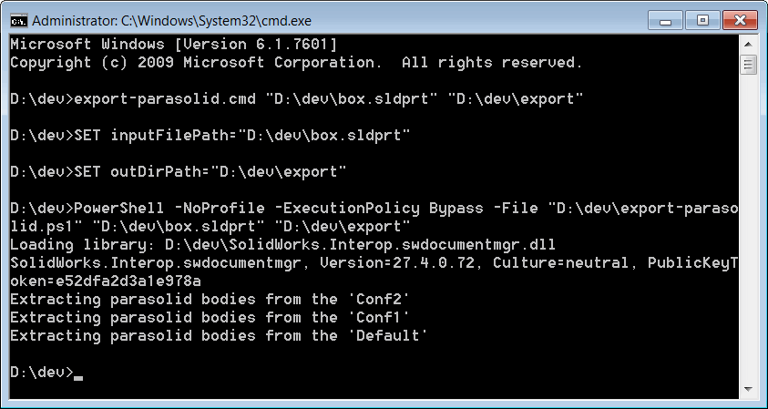

 使用 SOLIDWORKS 文档管理器 API 通过命令行将零件文件导出为 Parasolid 格式（.xmp_bin）的 PowerShell 脚本
image: export-parasolid.svg
labels: [export,parasolid]
group: Import/Export
---
此 PowerShell 脚本允许使用 SOLIDWORKS 文档管理器 API 从命令行将 SOLIDWORKS 零件文件导出为 Parasolid 格式（.xmp_bin）。

该文件可以在任何兼容的 CAD 应用程序（如 SOLIDWORKS、Solid Edge 等）中打开。

此脚本不需要安装 SOLIDWORKS，也不会消耗 SOLIDWORKS 许可证。

## 配置和使用说明

* 创建两个文件，并将下面片段中的代码粘贴到这两个文件中。

### export-parasolid.ps1

~~~ ps1
$inputFilePath=$args[0]
$outDirPath=$args[1]

$ScriptDir = Split-Path $script:MyInvocation.MyCommand.Path

$Assem = ( 
    $ScriptDir + "\SolidWorks.Interop.swdocumentmgr.dll"
    ) 
    
$Source = @"
Imports System
Imports System.IO
Imports SolidWorks.Interop.swdocumentmgr

Public Class Exporter

    Const LICENSE_KEY As String = "Your license key"

    Shared Sub New()
        AddHandler AppDomain.CurrentDomain.AssemblyResolve, AddressOf OnAssemblyResolve
    End Sub

    Public Shared Sub LoadLibrary(ParamArray libs As Object())
        For Each [lib] As String In libs
            Console.WriteLine(String.Format("Loading library: {0}", [lib]))
            Dim assm As System.Reflection.Assembly = System.Reflection.Assembly.LoadFrom([lib])
            Console.WriteLine(assm.GetName().ToString())
        Next
    End Sub

    Private Shared Function OnAssemblyResolve(ByVal sender As Object, ByVal args As ResolveEventArgs) As System.Reflection.Assembly
        For Each assm As System.Reflection.Assembly In AppDomain.CurrentDomain.GetAssemblies()

            If assm.GetName().ToString() = args.Name Then
                Return assm
            End If
        Next

        Return Nothing
    End Function
    
    Public Shared Sub ExportParasolid(filePath As String, outDirPath As String)

        Try
        
            Dim classFact As SwDMClassFactory = New SwDMClassFactory()
            Dim app As ISwDMApplication = classFact.GetApplication(LICENSE_KEY)

            Dim docType As SwDmDocumentType
            Dim doc As ISwDMDocument = OpenDocument(app, filePath, True, docType)

            If docType <> SwDmDocumentType.swDmDocumentPart Then
                Throw New InvalidCastException("Only part documents are supported")
            End If

            Dim confNames As String() = CType(doc.ConfigurationManager.GetConfigurationNames(), String())

            If confNames Is Nothing OrElse confNames.Length = 0 Then
                Throw New NullReferenceException("No configurations found")
            End If

            If Not Directory.Exists(outDirPath) Then
                Directory.CreateDirectory(outDirPath)
            End If

            For Each confName As String In confNames

                Console.WriteLine(String.Format("Extracting parasolid bodies from the '{0}'", confName))
                Dim conf As ISwDMConfiguration2 = doc.ConfigurationManager.GetConfigurationByName(confName)

                Dim outFilePath As String = Path.Combine(outDirPath, String.Format("{0}_{1}.xmp_bin", Path.GetFileNameWithoutExtension(filePath), confName))
                Dim err As SwDmBodyError = conf.GetPartitionStream(outFilePath)
                If err <> SwDmBodyError.swDmBodyErrorNone Then
                    PrintError(String.Format("Failed to export parasolid body of '{1}' in '{2}'", confName, filePath), True)
                End If

            Next
        
        Catch ex As Exception
            PrintError(ex.Message, False)
        End Try

    End Sub

    Private Shared Function OpenDocument(app As ISwDMApplication, filePath As String, [readOnly] As Boolean, Optional ByRef docType As SwDmDocumentType = SwDmDocumentType.swDmDocumentUnknown) As ISwDMDocument

        docType = SwDmDocumentType.swDmDocumentUnknown

        Select Case Path.GetExtension(filePath).ToLower()
            Case ".sldprt"
                docType = SwDmDocumentType.swDmDocumentPart
            Case ".sldasm"
                docType = SwDmDocumentType.swDmDocumentAssembly
            Case ".slddrw"
                docType = SwDmDocumentType.swDmDocumentDrawing
        End Select

        Dim err As SwDmDocumentOpenError
        Dim doc As ISwDMDocument = app.GetDocument(filePath, SwDmDocumentType.swDmDocumentPart, [readOnly], err)

        If doc Is Nothing Then
            Throw New NullReferenceException(String.Format("Failed to open document: {0}", err))
        End If

        Return doc

    End Function
    
    Private Shared Sub PrintError(msg As String, isWarning As Boolean)
        
        Dim color As ConsoleColor
        
        If isWarning Then
            color = ConsoleColor.DarkYellow
        Else
            color = ConsoleColor.DarkRed
        End If
        
        Console.WriteLine(msg)
        Console.ResetColor()
        
    End Sub

End Class
"@

Add-Type -TypeDefinition $Source -ReferencedAssemblies $Assem -Language VisualBasic

[Exporter]::LoadLibrary($Assem)
[Exporter]::ExportParasolid($inputFilePath, $outDirPath)
~~~

### export-parasolid.cmd

~~~ cmd
SET inputFilePath=%1
SET outDirPath=%2

PowerShell -NoProfile -ExecutionPolicy Bypass -File "%~dp0export-parasolid.ps1" %inputFilePath% %outDirPath%
~~~

* 将 *SolidWorks.Interop.swdocumentmgr.dll* 复制到创建上述脚本的文件夹中。PowerShell 脚本基于 .NET Framework 2.0，因此 SOLIDWORKS 文档管理器互操作必须针对此框架。该 dll 可在以下位置找到：**SOLIDWORKS 安装文件夹**\api\redist\CLR2\SolidWorks.Interop.swdocumentmgr.dll

或者，可以指定互操作的完整路径，如下所示。在这种情况下，不需要将此 dll 复制到脚本文件夹中。

~~~ ps1
$Assem = ( 
   "SolidWorks.Interop.swdocumentmgr.dll 的完整路径"
    ) 
~~~

* 启动命令行并执行以下命令

~~~ bat
> [export-parasolid.cmd 的完整路径] [输入 SOLIDWORKS 文件的完整路径] [输出目录的完整路径]
~~~

结果是将文件的所有配置的所有实体导出到指定目录（如果目录不存在，则会自动创建）。输出文件的命名方式如下：*[原始文件名]_[配置名].xmp_bin*。进程日志直接显示在控制台中：

