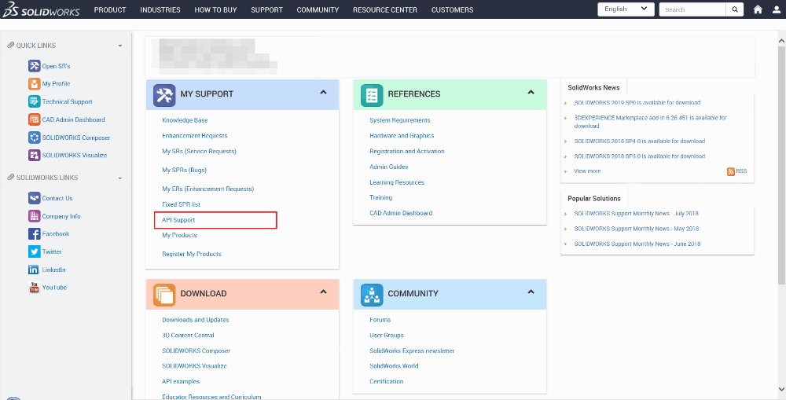
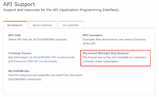
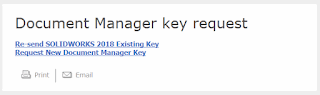
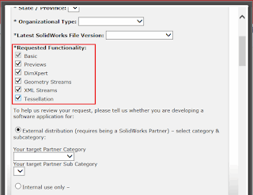

 初始化与SOLIDWORKS文档管理器库的连接的详细说明
image: dm-functionality.png
labels: [dm key, document manager, getting started, license]
---
## 激活文档管理器

文档管理器需要开发者许可证，可以通过[SOLIDWORKS客户门户](https://customerportal.solidworks.com/)申请。

按照以下步骤操作：

* 登录到客户门户
* 在“我的支持”部分下点击“API支持”链接

{ width=400 height=207 }

* 选择“文档管理器密钥请求”链接

{ width=400 height=243 }

* 选择重新发送现有密钥或生成新密钥的选项

{ width=320 height=95 }

* 填写请求表单，并选择所需的软件功能（参考[支持的功能](/docs/codestack/solidworks-document-manager-api/#supported-functionality)部分选择正确的功能）

{ width=320 height=246 }

通常需要几个工作日才能生成密钥。生成后，将通过电子邮件发送。
密钥的生成格式如下：

> **CompanyName**:swdocmgr_general-00000-{31 times},swdocmgr_previews-00000-{31 times},swdocmgr_dimxpert-00000-{31 times},swdocmgr_geometry-00000-{31 times},swdocmgr_xml-00000-{31 times},swdocmgr_tessellation-00000-{31 times}  

如果调用不属于为其生成许可证的组的API，则会引发以下异常。

> Class is not licensed for use (Exception from HRESULT: 0x80040112)

## 注册文档管理器

文档管理器会自动注册到以下应用程序中：
  * SOLIDWORKS
  * eDrawings
  * SOLIDWORKS文件资源管理器
  * SOLIDWORKS PDM
  * SOLIDWORKS文档管理器SDK

要手动注册文档管理器，请运行[regsvr32](https://en.wikipedia.org/wiki/Regsvr32)实用程序，并传递路径到*swdocumentmanager.dll*（通常安装到* C：\ Program Files \ Common Files \ SOLIDWORKS Shared \ swdocumentmgr.dll *与文档管理器SDK）。

以管理员权限运行Windows命令行，使用以下命令

> regsvr32 "C:\Program Files\Common Files\SOLIDWORKS Shared\swdocumentmgr.dll"

## 注意事项
 
* 文档管理器密钥**不得**在组织外共享
* 使用文档管理器密钥开发的软件只能以二进制格式重新分发
	* 这意味着您的软件的客户不需要从SOLIDWORKS获取许可证密钥
    * 这也意味着此密钥不能在组织外的VBA宏中使用，但可以在VSTA宏中使用（如果源代码未重新分发）
	* 文档管理器向后兼容到SOLIDWORKS 2015，但不向前兼容。
	例如，可以使用SOLIDWORKS 2015及更高版本的文档管理器密钥读取/写入旧版数据。
	* 在SOLIDWORKS 2015之前生成的文档管理器密钥向后和向前兼容旧版本的SOLIDWORKS
	* 每次发布新版本的SOLIDWORKS时，都应更新文档管理器许可证密钥以支持新版本
* **对于.NET开发人员很重要：** *swDocumentManager.dll*与添加到项目的引用的*SolidWorks.Interop.SwDocumentMgr.dll*不同。
	后者不包含任何实现 - 这只是一个访问在*swDocumentManager.dll*中实现的COM对象的互操作性

## 代码示例

### VBA

添加对swdocumentmgr.dll的引用。该dll通常可以在C：\ Program Files \ Common Files \ SOLIDWORKS Shared中找到。文档管理器许可证密钥可能太长，因此VBA编辑器将无法编译宏。有关此问题的解决方案，请参阅[过长的VBA宏行](/docs/codestack/solidworks-api/troubleshooting/macros/too-long-vba-macro-line/)故障排除文章。

~~~ vb
Const SW_DM_KEY As String = "[CompanyName]:swdocmgr_general-00000-{31 times},swdocmgr_previews-00000-{31 times},swdocmgr_dimxpert-00000-{31 times},swdocmgr_geometry-00000-{31 times},swdocmgr_xml-00000-{31 times},swdocmgr_tessellation-00000-{31 times}"

Dim swDmClassFactory As SwDocumentMgr.swDmClassFactory
Dim swDmApp As SwDocumentMgr.SwDMApplication

Sub main()

    Set swDmClassFactory = CreateObject("SwDocumentMgr.SwDMClassFactory")
    
    If Not swDmClassFactory Is Nothing Then
        Set swDmApp = swDmClassFactory.GetApplication(SW_DM_KEY)
        Debug.Print swDmApp.GetLatestSupportedFileVersion()
    Else
        MsgBox "未安装文档管理器SDK"
    End If
    
End Sub
~~~

### C#

添加对SolidWorks.Interop.swdocumentmgr.dll的引用。该dll通常可以在C：\ Program Files \ Common Files \ SOLIDWORKS Shared中找到。
在引用属性中取消选中嵌入互操作类型选项。

~~~ cs
using SolidWorks.Interop.swdocumentmgr;
using System;

namespace CodeStack
{
    class Program
    {
        const string SW_DM_KEY = "[CompanyName]:swdocmgr_general-00000-{31 times},swdocmgr_previews-00000-{31 times},swdocmgr_dimxpert-00000-{31 times},swdocmgr_geometry-00000-{31 times},swdocmgr_xml-00000-{31 times},swdocmgr_tessellation-00000-{31 times}";

        static void Main(string[] args)
        {
            SwDMClassFactory classFactory = Activator.CreateInstance(
                Type.GetTypeFromProgID("SwDocumentMgr.SwDMClassFactory")) as SwDMClassFactory;

            if (classFactory != null)
            {
                SwDMApplication dmApp = classFactory.GetApplication(SW_DM_KEY);
                Console.WriteLine(dmApp.GetLatestSupportedFileVersion());
            }
            else
            {
                throw new NullReferenceException("未安装文档管理器SDK");
            }
        }
    }
}
~~~

### VB.NET

添加对SolidWorks.Interop.swdocumentmgr.dll的引用。该dll通常可以在C：\ Program Files \ Common Files \ SOLIDWORKS Shared中找到。
在引用属性中取消选中嵌入互操作类型选项。

~~~ vb
Imports SolidWorks.Interop.swdocumentmgr
Imports System

Module CodeStack

    Const SW_DM_KEY As String = "[CompanyName]:swdocmgr_general-00000-{31 times},swdocmgr_previews-00000-{31 times},swdocmgr_dimxpert-00000-{31 times},swdocmgr_geometry-00000-{31 times},swdocmgr_xml-00000-{31 times},swdocmgr_tessellation-00000-{31 times}"

    Sub Main(ByVal args As String())

        Dim classFactory As SwDMClassFactory =
            TryCast(Activator.CreateInstance(Type.GetTypeFromProgID("SwDocumentMgr.SwDMClassFactory")), SwDMClassFactory)

        If classFactory IsNot Nothing Then
            Dim dmApp As SwDMApplication = classFactory.GetApplication(SW_DM_KEY)
            Console.WriteLine(dmApp.GetLatestSupportedFileVersion())
        Else
            Throw New NullReferenceException("未安装文档管理器SDK")
        End If

    End Sub

End Module
~~~

### C++

将swdocumentmgr.dll的路径（通常为C：\ Program Files \ Common Files \ SOLIDWORKS Shared）添加到项目属性-> C / C ++->常规->附加包含目录

~~~ cpp
#include "stdafx.h"
#import "SwDocumentMgr.dll" raw_interfaces_only
#include <iostream>

#define SW_DM_KEY L"[CompanyName]:swdocmgr_general-00000-{31 times},swdocmgr_previews-00000-{31 times},swdocmgr_dimxpert-00000-{31 times},swdocmgr_geometry-00000-{31 times},swdocmgr_xml-00000-{31 times},swdocmgr_tessellation-00000-{31 times}"

int main()
{
    CoInitialize(NULL);

    CComPtr pClassFactory;

    if (SUCCEEDED(pClassFactory.CoCreateInstance(
        __uuidof(SwDocumentMgr::SwDMClassFactory), NULL, CLSCTX_INPROC_SERVER)))
    {
        CComPtr pDmApp;

        if (SUCCEEDED(pClassFactory->GetApplication(SW_DM_KEY, &pDmApp)))
        {
            long latestVers;

            HRESULT r = pDmApp->GetLatestSupportedFileVersion(&latestVers);

            if (SUCCEEDED(r))
            {
                std::cout << latestVers;
            }
            else
            {
                std::cout << "获取版本失败";
            }
        }

        pDmApp = NULL;
        pClassFactory = NULL;
        ::CoUninitialize();
    }
    else
    {
        std::cout << "未安装文档管理器SDK";
    }
    
    std::cin.get();

    return 0;
}
~~~

## 参考资料

* 在线[文档管理器API帮助文档](https://help.solidworks.com/2017/English/api/SWHelp_List.html?id=69d4ac3ff991425e980510fe49f75719#Pg0&ProductType=&ProductName=)