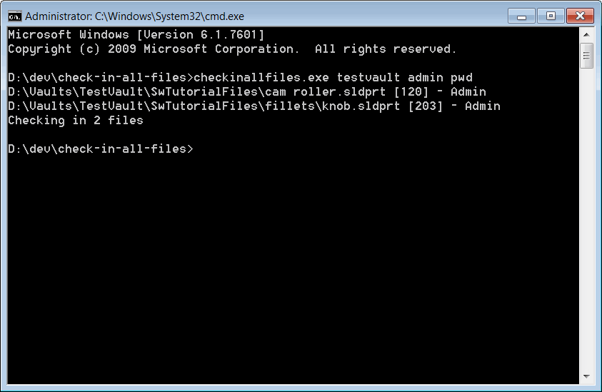

这个VB.NET命令行实用程序会搜索指定的SOLIDWORKS PDM Professional vault中的所有已签出文件，并将它们签入。

该实用程序可以从命令行调用，并可以作为自动化过程的一部分（例如Windows任务计划程序）。

实用程序需要指定3个参数：

* Vault名称
* 用户名
* 用户密码

文件列表、ID和锁定用户信息将显示在命令行中。脚本执行完成后，所有文件都会被签入。执行过程中发生的任何错误都会打印到控制台窗口中。

{ width=450 }

~~~ vb
Imports EPDM.Interop.epdm

Module Module1

    Sub Main()
        Try
            Dim vault As New EdmVault5

            Dim args As String() = Environment.GetCommandLineArgs()

            Dim vaultName As String = args(1)
            Dim login As String = args(2)
            Dim password As String = args(3)

            vault.Login(login, password, vaultName)

            If vault.IsLoggedIn Then
                CheckInAllCheckedOutFiles(vault)
            Else
                Throw New Exception("登录到vault失败")
            End If
        Catch ex As Exception
            Console.WriteLine(ex.Message)
        End Try
    End Sub

    Sub CheckInAllCheckedOutFiles(vault As EdmVault5)

        Dim checkOutFiles = GetCheckedOutFilesList(vault)

        If checkOutFiles.Any() Then

            Console.WriteLine(String.Format("正在签入{0}个文件", checkOutFiles.Length))

            Dim selItems(checkOutFiles.Length - 1) As EdmSelItem

            For i As Integer = 0 To checkOutFiles.Length - 1
                selItems(i) = New EdmSelItem()
                selItems(i).mlDocID = checkOutFiles(i)
            Next

            Dim batchUnlockUtil As IEdmBatchUnlock2 = vault.CreateUtility(EdmUtility.EdmUtil_BatchUnlock)

            batchUnlockUtil.AddSelection(vault, selItems)

            batchUnlockUtil.CreateTree(IntPtr.Zero, EdmUnlockBuildTreeFlags.Eubtf_MayUnlock + EdmUnlockBuildTreeFlags.Eubtf_MayUndoLock + EdmUnlockBuildTreeFlags.Eubtf_UndoLockDefault + EdmUnlockBuildTreeFlags.Eubtf_RefreshFileListing)

            batchUnlockUtil.GetFileList(EdmUnlockFileListFlag.Euflf_GetUnlocked + EdmUnlockFileListFlag.Euflf_GetUndoLocked + EdmUnlockFileListFlag.Euflf_GetUnprocessed)

            batchUnlockUtil.UnlockFiles(IntPtr.Zero, Nothing)
        Else
            Console.WriteLine("没有需要签入的文件")
        End If

    End Sub

    Function GetCheckedOutFilesList(vault As EdmVault5) As Integer()

        Dim fileIds As New List(Of Integer)
        Dim search As IEdmSearch6

        search = vault.CreateSearch()

        search.FindFiles = True
        search.FindFolders = False
        search.Recursive = True
        search.FindLockedFiles = True
        search.FindUnlockedFiles = False

        Dim searchRes As IEdmSearchResult5 = search.GetFirstResult

        While Not searchRes Is Nothing
            Console.WriteLine(String.Format("{0} [{1}] - {2}", searchRes.Path, searchRes.ID, searchRes.LockedByUserName))
            fileIds.Add(searchRes.ID)
            searchRes = search.GetNextResult()
        End While

        Return fileIds.ToArray()

    End Function

End Module
~~~