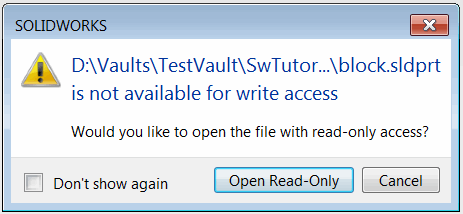

 使用 SOLIDWORKS 和 PDM API 检出在 SOLIDWORKS 中打开的活动模型（使用释放锁）从 PDM 保险库中
image: open-read-only-warning.png
labels: [检出,释放锁]
---
当在 SOLIDWORKS PDM 保险库中检入的文件在 SOLIDWORKS 中打开时，它将以只读访问方式访问

相应的状态显示在文件名旁边。

如果使用标准的 SOLIDWORKS PDM 加载项，可以自动将此文件检出以进行编辑，而无需关闭文件。然而，对于这种情况，调用 [IEdmFile5::LockFile](https://help.solidworks.com/2014/english/api/epdmapi/EPDM.Interop.epdm~EPDM.Interop.epdm.IEdmFile5~LockFile.html) SOLIDWORKS PDM API 将导致以下 COM 异常。

> -2147220981: 尝试访问由另一个应用程序独占打开的文件。

SOLIDWORKS API 提供了临时释放活动文档锁定的方法，以便其他应用程序可以对其进行更新或更改。稍后可以重新加载带有应用的更改的模型。这种技术允许在 SOLIDWORKS 中保持加载的模型信息和可视数据，同时由其他应用程序编辑文件。

以下宏将演示此技术，并在 SOLIDWORKS 应用程序中检出当前打开的已检入（只读）文件。

将 *VAULT_NAME* 变量的值修改为打开活动模型的相应保险库名称。

~~~ vb
Const VAULT_NAME As String = "TestVault"

Dim swApp As SldWorks.SldWorks
Dim swPdmVault As IEdmVault5

Sub main()

    Set swApp = Application.SldWorks
    
    Dim swModel As SldWorks.ModelDoc2
    
    Set swModel = swApp.ActiveDoc
    
    If Not swModel Is Nothing Then
    
        Set swPdmVault = New EdmVault5
        swPdmVault.LoginAuto VAULT_NAME, 0
        
        If swPdmVault.IsLoggedIn Then
            CheckOutModel swModel, swPdmVault
        Else
            MsgBox "请登录到保险库"
        End If
    
    Else
        MsgBox "请打开模型"
    End If
    
End Sub

Sub CheckOutModel(model As SldWorks.ModelDoc2, vault As IEdmVault5)

    Dim modelPath As String
    modelPath = model.GetPathName()
    
    Dim swPdmFile As IEdmFile5
    Set swPdmFile = vault.GetFileFromPath(modelPath)

    If Not swPdmFile Is Nothing Then
        
        On Error GoTo catch

        Dim res As Boolean
        
        Dim swPdmFolder As IEdmFolder5
        Set swPdmFolder = vault.GetFolderFromPath(Left(modelPath, InStrRev(modelPath, "\")))

try:
        model.ForceReleaseLocks
        swPdmFile.LockFile swPdmFolder.ID, 0
        res = True
        GoTo finally
catch:
        Debug.Print Err.Number & ": "; Err.Description
        res = False
        GoTo finally
    
finally:
        model.ReloadOrReplace Not res, modelPath, Not res

    Else
        Err.Raise vbError, "", "保险库中不存在指定的模型"
    End If
    
End Sub

~~~