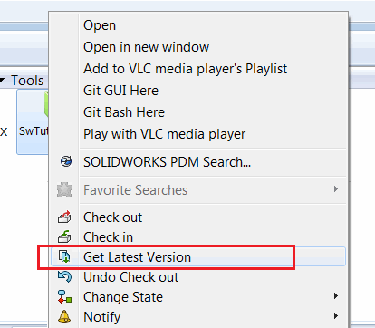
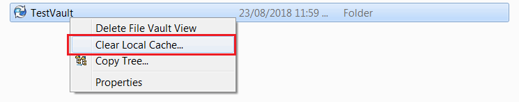

该示例演示了如何将文件及其所有依赖项缓存到本地，以供桌面应用程序使用。该宏相当于以下命令：

{ width=350 }

PDM 是一种基于服务器的应用程序，当通过 Windows 文件资源管理器在 PDM 中访问文件时，它们会被缓存在本地。文件缓存可能会被清除或过时。这意味着当桌面应用程序尝试访问 PDM 仓库中的文件时，可能会失败，如果文件在本地没有被缓存。将会出现文件未找到的错误（例如，使用 SOLIDWORKS API 打开文件或使用文件系统对象遍历文件夹结构或读取任何属性时）。

为了提高性能，该宏利用了 [IEdmBatchGet](https://help.solidworks.com/2018/english/api/epdmapi/epdm.interop.epdm~epdm.interop.epdm.iedmbatchget.html) SOLIDWORKS PDM API 接口，该接口支持批量文件处理。

要测试此场景：

- 获取 PDM 仓库中任意 SOLIDWORKS 文件的路径
- 清除仓库的缓存：

{ width=450 }

- 在以下宏的 *main* 过程中注释掉 *GetLocalCopyFromVault* 调用
- 运行该宏。注意，*swModel* 的指针为空，文件打开调用失败
- 取消对 *GetLocalCopyFromVault* 的注释，再次运行宏。现在模型成功打开，因为文件已在本地缓存。

```vb
Const FILE_PATH As String = "文件的完整路径"

Dim swApp As SldWorks.SldWorks

Sub main()

    Set swApp = Application.SldWorks
    
    GetLocalCopyFromVault FILE_PATH, "仓库名称", "用户名", "密码"
    
    Dim swOpenDocSpec As SldWorks.DocumentSpecification
    Set swOpenDocSpec = swApp.GetOpenDocSpec(FILE_PATH)
    
    Dim swModel As SldWorks.ModelDoc2
    Set swModel = swApp.OpenDoc7(swOpenDocSpec)

End Sub

Sub GetLocalCopyFromVault(path As String, vaultName As String, userName As String, password As String)
    
    Dim pdmVault As New EdmLib.EdmVault5
    pdmVault.Login userName, password, vaultName
    
    If pdmVault.IsLoggedIn Then
        GetLocalCopies pdmVault, Array(path)
    Else
        MsgBox "登录到仓库失败"
    End If
    
End Sub

Sub GetLocalCopies(vault As EdmLib.EdmVault5, vFilePaths As Variant)
    
    If Not IsEmpty(vFilePaths) Then
        
        Dim pdmBatchGetUtil As EdmLib.IEdmBatchGet
        Set pdmBatchGetUtil = vault.CreateUtility(EdmUtil_BatchGet)
        
        Dim i As Integer
        
        Dim pdmSelItems() As EdmLib.EdmSelItem
        ReDim pdmSelItems(UBound(vFilePaths))
        
        For i = 0 To UBound(vFilePaths)
            
            Dim filePath As String
            filePath = vFilePaths(i)
            
            Dim pdmFile As EdmLib.IEdmFile5
            Dim pdmFolder As EdmLib.IEdmFolder5
            
            Set pdmFile = vault.GetFileFromPath(filePath, pdmFolder)
            
            pdmSelItems(i).mlDocID = pdmFile.ID
            pdmSelItems(i).mlProjID = pdmFolder.ID
            
        Next
        
        pdmBatchGetUtil.AddSelection vault, pdmSelItems
        pdmBatchGetUtil.CreateTree 0, EdmLib.EdmGetCmdFlags.Egcf_RefreshFileListing
        pdmBatchGetUtil.GetFiles 0
        
    End If
    
End Sub
```

