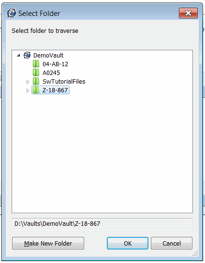
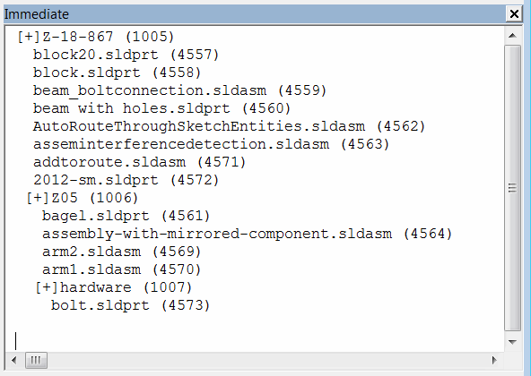

This VBA example demonstrates how to traverse files and folders in the SOLIDWORKS PDM vault using SOLIDWORKS PDM API.

Macro displays the built-in folder browse dialog for the folder to traverse:

{ width=250 }

Macro recursively traverses files and sub folders and outputs the file or folder name, id, level to the VBA Editor immediate window.

{ width=350 }

This macro can traverse the tree even if it is not [cached locally](/docs/codestack/solidworks-pdm-api/files/local-cache/)

~~~ vb
Const VAULT_NAME As String = "MyVault"

Dim pdmVault As EdmVault5

Sub main()

    Set pdmVault = New EdmVault5
    pdmVault.LoginAuto VAULT_NAME, 0
    
    If pdmVault.IsLoggedIn Then
        
        Dim pdmFolder As IEdmFolder5
        
        Set pdmFolder = pdmVault.BrowseForFolder(0, "Select folder to traverse")
        
        If Not pdmFolder Is Nothing Then
            TraverseFolder pdmFolder
        End If
        
    Else
        Err.Raise vbError, "User is not logged in to the vault"
    End If
    
End Sub

Sub TraverseFolder(folder As IEdmFolder5, Optional parentLevel As String = "")

    Debug.Print parentLevel & "[+]" & folder.Name & " (" & folder.ID & ")"
    
    Dim thisLevel As String
    thisLevel = parentLevel & " "
    
    Dim pdmFilePos As IEdmPos5
    Set pdmFilePos = folder.GetFirstFilePosition()

    While Not pdmFilePos.IsNull
        Dim pdmFile As IEdmFile5
        Set pdmFile = folder.GetNextFile(pdmFilePos)
        Debug.Print thisLevel & " " & pdmFile.Name & " (" & pdmFile.ID & ")"
    Wend
    
    Dim pdmSubFolderPos As IEdmPos5
    Set pdmSubFolderPos = folder.GetFirstSubFolderPosition()
    
    While Not pdmSubFolderPos.IsNull
        Dim pdmSubFolder As IEdmFolder5
        Set pdmSubFolder = folder.GetNextSubFolder(pdmSubFolderPos)
        TraverseFolder pdmSubFolder, thisLevel
    Wend

End Sub
~~~

