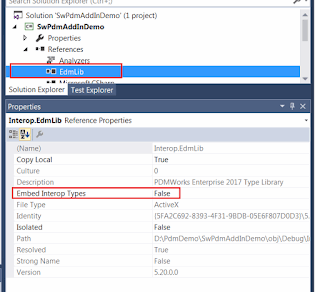
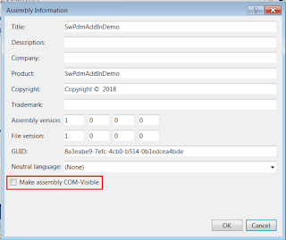
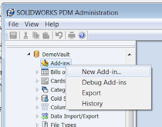
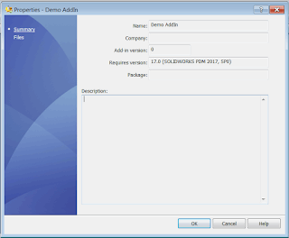
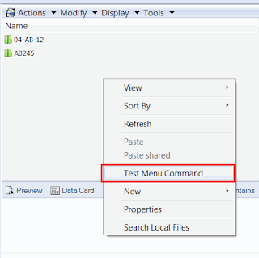
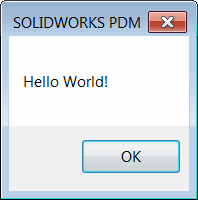
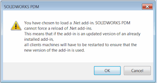

 创建SOLIDWORKS PDM Professional（以前称为EPDM）的插件的详细指南
image: new-addin.png
labels: [article, com, epdm, example, IEdmAddIn5, pdm add-in, solidworks pdm api]
redirect-from:
  - /2018/03/how-to-create-solidworks-pdm.html
---
SOLIDWORKS PDM Professional（以前称为SOLIDWORKS Enterprise PDM）提供了丰富的API库，使第三方能够为系统开发自定义扩展。通过开发应用程序作为SOLIDWORKS PDM插件，可以实现最高级别的集成。下面的详细逐步说明将指导您从头开始创建插件。

在本文中，我将在Microsoft Visual Studio中使用.NET（C#和VB.NET）创建插件。

1. 启动Visual Studio并创建新项目
2. 从项目模板中选择类库
3. 指定插件的名称
4. 必须添加对PDM Interop库的引用（针对Framework 3.5和2.0的项目使用*EdmInterface.dll*，针对Framework 4.0或更高版本的项目使用*EPDM.Interop.epdm.dll*）。库可以在SOLIDWORKS PDM安装文件夹中找到（通常是*C:\Program Files\SOLIDWORKS PDM\EPDM.Interop.epdm.dll*（针对Framework 4.0及更高版本）和*C:\Program Files\SOLIDWORKS PDM\EdmInterface.dll*（针对旧版本））。
5. 如果项目针对.NET Framework 4.0及更高版本，则需要将*Embed Interop Types*选项设置为*False*，否则插件可能会出现问题。

{ width=320 height=291 }

为了创建PDM插件的类，需要执行3个强制步骤：

1. 实现[IEdmAddIn5](https://help.solidworks.com/2014/english/api/epdmapi/epdm.interop.epdm~epdm.interop.epdm.iedmaddin5.html)接口。
2. 将类标记为Com Visible。
3. 在[GetAddInInfo](https://help.solidworks.com/2014/english/api/epdmapi/EPDM.Interop.epdm~EPDM.Interop.epdm.IEdmAddIn5~GetAddInInfo.html)中通过设置[EdmAddInInfo.mlRequiredVersionMajor](https://help.solidworks.com/2014/english/api/epdmapi/epdm.interop.epdm~epdm.interop.epdm.edmaddininfo~mlrequiredversionmajor.html)属性来指定插件支持的最低主要版本。

~~~cs
using EdmLib;
using System;
using System.Runtime.InteropServices;

namespace CodeStack
{
    [ComVisible(true)]
    [Guid("3A601AFC-7007-46A7-9E71-D3BD41B5E2E2")]
    public class PdmAddInSample : IEdmAddIn5
    {
        const int TEST_CMD_ID = 1;

        public void GetAddInInfo(ref EdmAddInInfo poInfo, IEdmVault5 poVault, IEdmCmdMgr5 poCmdMgr)
        {
            poInfo.mbsAddInName = "Demo AddIn";
            poInfo.mlRequiredVersionMajor = 17; //SOLIDWORKS PDM 2017 SP0

            poCmdMgr.AddCmd(TEST_CMD_ID, "Test Menu Command");
        }

        public void OnCmd(ref EdmCmd poCmd, ref Array ppoData)
        {
            if (poCmd.meCmdType == EdmCmdType.EdmCmd_Menu)
            {
                if (poCmd.mlCmdID == TEST_CMD_ID)
                {
                    (poCmd.mpoVault as IEdmVault10).MsgBox(0, "Hello World!");
                }
            }
        }
    }
}
~~~

## 注意事项

* 建议**不要**勾选“使程序集COM可见”选项，而是对所有需要COM可见的类（例如插件的主类）使用[ComVisible](https://msdn.microsoft.com/zh-cn/library/system.runtime.interopservices.comvisibleattribute(v=vs.110).aspx)属性。否则，这可能会显著增加插件的加载时间。

{ width=320 height=269 }

* 与注册SOLIDWORKS插件不同，**不需要**实际注册PDM插件DLL作为COM对象（即运行RegAsm实用程序或在项目属性中选中“为COM互操作注册程序集”选项）。
* 建议使用[Guid](https://msdn.microsoft.com/zh-cn/library/system.runtime.interopservices.guidattribute(v=vs.110).aspx)属性装饰插件的类，因为这将允许更好地跟踪客户端机器上的插件（例如调试或清除插件缓存）。

为了将PDM插件加载到库中，请按照以下步骤操作：

* 启动*SOLIDWORKS PDM Administration*控制台（可以在Windows开始菜单中找到）
* 导航到PDM库
* 选择*Add-Ins*节点，然后选择*New Add-In...*命令

{ width=320 height=250 }

* 从项目的*bin*目录中选择所有文件。您不需要添加像(*.pdb*或*.xml*)这样的临时文件。
* 一旦插件加载完成，其摘要将显示

{ width=320 height=263 }

导航到库视图，并从上下文菜单中选择*Test Menu Command*。

{ width=320 height=318 }

将显示消息框：

{ width=198 height=200 }

SOLIDWORKS PDM是一个客户端-服务器架构系统，这意味着每当插件加载到库中时，它将分发到所有客户端。当客户端登录到库时，PDM将本地下载插件DLL到*%localappdata%\SolidWorks\SOLIDWORKS PDM\Plugins\**VaultName**\**AddIn Guid**Index*文件夹中。

插件DLL将在首次登录到PDM库时加载到多个进程中（包括*explorer.exe*）。由于.NET Framework的限制，无法从应用程序域中卸载.NET库。这就是为什么PDM在添加插件到库时显示“'You have chosen to load a .NET add-in. SOLIDWORKS PDM cannot force a reload of .NET add-ins'”的原因。

{ width=320 height=169 }

这个消息意味着缓存（之前的）版本的PDM插件将在使用中，直到DLL被解锁。不需要重新启动机器，可以使用以下命令行脚本一次性释放插件：

~~~ cmd
TASKKILL /F /IM explorer.exe
TASKKILL /F /IM EdmServer.exe
TASKKILL /F /IM ConisioAdmin.exe
TASKKILL /F /IM AddInSrv.exe

START explorer.exe

~~~

SOLIDWORKS PDM提供了方便的功能，简化了PDM插件的调试。请阅读以下文章：[调试SOLIDWORKS PDM插件 - 最佳实践](../debugging-best-practices)

下面是从头开始创建SOLIDWORKS PDM插件的视频演示：

