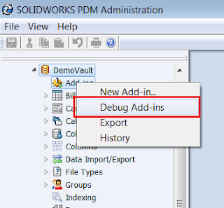
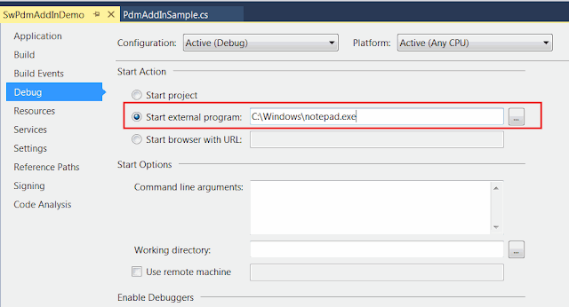

When it comes to debugging of SOLIDWORKS PDM add-ins a lot of developers find this process cumbersome and complicated. This especially applies if you have been developing desktop or SOLIDWORKS applications before and now need to develop PDM add-in.

The main complexity comes from the fact that SOLIDWORKS PDM is a server-client system fully integrated into the Windows explorer process on the client machines. That means that the add-ins (as in-process extensions) are loaded into explorer.exe process. It is important to understand that explorer.exe is not only the process for Windows File Explorer, rather it also manages the start menu, taskbar, desktop, etc. So it is not enough to simply close the Windows File Explorer to unlock the add-in dlls.

SOLIDWORKS PDM provides a handy framework for developers which greatly simplify the development process. You can find the *Debug Add-ins* menu under the Add-ins node in the vault tree of the *SOLIDWORKS PDM Administration* console.

{ width=320 height=297 }

You need to select single dll with your add-in to load it into the debugger.

{ width=640 height=246 }

Once selected the entry of your add-in appears in the list and will remain there until removed. So it is not required to open this console every time the project is rebuilt.

As I have previously pointed SOLIDWORKS PDM is a client-server architecture system and all the add-ins are hosted on a server and redistributed to clients machines. When the add-in is added as debug add-in - this will not load the add-in dlls to the server. The add-in will be debugged locally from directly from the *bin* folder. This also means that another users of the vault won't see the add-in in their systems.

Traditionally SOLIDWORKS PDM add-ins are debugged via Notepad process by selecting the path to notepad.exe in the *Start external program* action in the Debug settings of the project:

{ width=640 height=344 }

This allows to start the debugging process by simply running the solution (F5) and this will bring Notepad. In order to start actual debugging it is required to:

1. Select File->Open menu command in the Notepad
1. Navigate to the local vault folder
1. Change the filter to *All Files (*.*)* to see all files in the vault

{ width=400 height=271 }

The benefit of this approach - stopping the Visual Studio debugging session (by clicking Stop button in Visual Studio or by closing the Notepad) will release the dlls from the memory so it is not required to restart explorer.exe process to compile new version of the add-in.  

The limitations are:

* Not possible to have multi-select for files or folders
* Too many steps required to be performed each time new debug session is started (i.e. click Open menu, navigate to vault, change filter). This may approximately take 5-10 seconds for each debug session.

Much better approach is to use the [PDM Vault Browser ](https://github.com/codestackdev/pdm-vault-browser/releases/tag/initial)tool. Source code is available on [GitHub](https://github.com/codestackdev/pdm-vault-browser). Source code is provided below (must be compiled in .NET Framework 4.0 otherwise the debug symbols will not be loaded):

~~~ cs
using System;
using System.Linq;
using System.Windows.Forms;

namespace SwPdmVaultBrowser
{
    class Program
    {
        [STAThread]
        static void Main(string[] args)
        {
            var path = "";

            if (args.Any())
            {
                path = args.First();
            }

            var dlg = new OpenFileDialog()
            {
                InitialDirectory = path,
                Multiselect = true 
            };

            dlg.ShowDialog();
        }
    }
}

~~~

This tool is a simple File Browse Dialog with multi-selection option enabled. The tool also takes a command line argument with the full path to the folder in the PDM vault. So when started it will automatically browse to the specified folder:

{ width=640 height=328 }

Now when starting the debugger it will automatically bring you to the specified folder in the vault without the need to specify the filter.  

Video Demonstration:



Examples of PDM add-ins. Please read the [How To Create SOLIDWORKS PDM Professional Add-In](/docs/codestack/solidworks-pdm-api/getting-started/add-ins/create/) article to learn how to build PDM add-in from scratch.

C# Example

~~~ cs
using EdmLib;
using System;
using System.Linq;
using System.Runtime.InteropServices;

namespace CodeStack
{
    [ComVisible(true)]
    [Guid("8219E7E8-1765-4699-B509-E9DD84B337B4")]
    public class PdmAddInSample : IEdmAddIn5
    {
        private enum Commands_e
        {
            GetIds
        }
        
        public void GetAddInInfo(ref EdmAddInInfo poInfo, IEdmVault5 poVault, IEdmCmdMgr5 poCmdMgr)
        {
            poInfo.mbsAddInName = "SW PDM Helper";
            poInfo.mbsDescription = "Utility functions for SOLIDWORKS PDM";
            poInfo.mlAddInVersion = 1;
            poInfo.mlRequiredVersionMajor = 17; //SOLIDWORKS PDM 2017 SP0

            poCmdMgr.AddCmd((int)Commands_e.GetIds, "Get ID");
        }

        public void OnCmd(ref EdmCmd poCmd, ref Array ppoData)
        {
            if (poCmd.meCmdType == EdmCmdType.EdmCmd_Menu)
            {
                if (poCmd.mlCmdID == (int)Commands_e.GetIds)
                {
                    Func<EdmCmdData, int> getIdFunc = (d) => 
                    {
                        var isFile = d.mlObjectID1 != 0;

                        if (isFile)
                        {
                            return d.mlObjectID1;
                        }
                        else
                        {
                            return d.mlObjectID2;
                        }
                    };

                    var msg = string.Join(Environment.NewLine,
                        (ppoData as EdmCmdData[]).Select(
                            d => $"{d.mbsStrData1} - {getIdFunc(d)}").ToArray());

                    (poCmd.mpoVault as IEdmVault10).MsgBox(0, msg);
                }
            }
        }
    }
}

~~~

VB.NET Example

~~~ vb
Imports EdmLib
Imports System.Runtime.InteropServices
Imports System.Text

Namespace CodeStack

    <ComVisible(True)>
    <Guid("B761142B-BEEB-4E4D-8332-6B9E9D646B16")>
    Public Class PdmAddInSample
        Implements IEdmAddIn5

        Private Enum Commands_e
            GetIds
        End Enum

        Public Sub GetAddInInfo(ByRef poInfo As EdmAddInInfo, ByVal poVault As IEdmVault5, ByVal poCmdMgr As IEdmCmdMgr5) Implements IEdmAddIn5.GetAddInInfo

            poInfo.mbsAddInName = "SW PDM Helper"
            poInfo.mbsDescription = "Utility functions for SOLIDWORKS PDM"
            poInfo.mlAddInVersion = 1
            poInfo.mlRequiredVersionMajor = 17
            poCmdMgr.AddCmd(CInt(Commands_e.GetIds), "Get ID1")

        End Sub

        Public Sub OnCmd(ByRef poCmd As EdmCmd, ByRef ppoData As Array) Implements IEdmAddIn5.OnCmd

            If poCmd.meCmdType = EdmCmdType.EdmCmd_Menu Then

                If poCmd.mlCmdID = Commands_e.GetIds Then

                    Dim msg As New StringBuilder()

                    For Each data As EdmCmdData In ppoData
                        msg.AppendLine($"{data.mbsStrData1} - {GetId(data)}")
                    Next

                    TryCast(poCmd.mpoVault, IEdmVault10).MsgBox(0, msg.ToString())

                End If
            End If
        End Sub

        Private Function GetId(data As EdmCmdData) As Integer

            Dim isFile = data.mlObjectID1 <> 0

            If isFile Then
                Return data.mlObjectID1
            Else
                Return data.mlObjectID2
            End If

        End Function

    End Class

End Namespace

~~~

