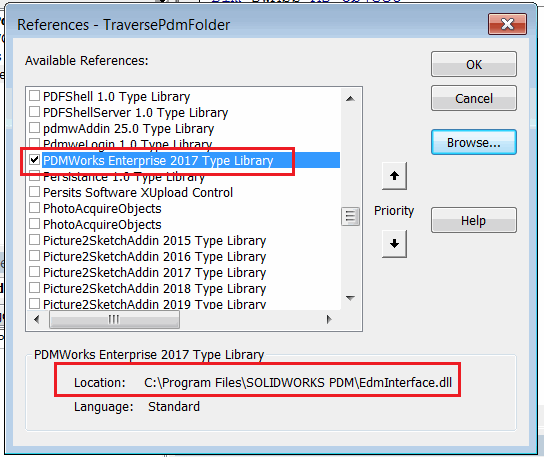

在某些情况下，直接从 SOLIDWORKS VBA 或 VSTA 宏中使用 SOLIDWORKS PDM API 可能会很有益。在这种情况下，您可以将 [SOLIDWORKS API](/docs/codestack/solidworks-api/) 和 [SOLIDWORKS PDM API](/docs/codestack/solidworks-pdm-api/) 函数结合在一个宏中使用。

## 在 VBA 宏中连接到 SOLIDWORKS PDM

宏应该像为 SOLIDWORKS 创建任何其他 VBA 宏一样创建。如果需要，您还可以将 PDM API 代码添加到现有的 SOLIDWORKS 宏中。

### 提前绑定

要启用对 SOLIDWORKS PDM API 的提前绑定（推荐的方法），需要在 VBA 编辑器的“工具”->“引用”窗口中添加 SOLIDWORKS 类型库。

在搜索框中搜索 *PDMWorks Enterprise [Year] Type Library*。如果此引用在列表中不可用，请使用“浏览”按钮在安装目录中查找文件，如下图所示：

{ width=450 }

下面是一个连接到 vault 的典型初始化例程。如果需要登录，则此示例将显示标准的 PDM 登录窗口。

``` vb
Dim pdmVault As EdmVault5

Sub main()

    Set pdmVault = New EdmVault5
    pdmVault.LoginAuto "MyVault", 0
    
    If pdmVault.IsLoggedIn Then
        'TODO: 实现例程            
    Else
        Err.Raise vbError, "用户未登录到 vault"
    End If
    
End Sub
```

或者，也可以通过提供登录名和密码进行静默登录。

``` vb
pdmVault.Login "admin", "mypassword", "MyVault"
```

### 后期绑定

与 SOLIDWORKS 宏不同，SOLIDWORKS PDM 库不是引用列表中的默认选择。当您创建新的宏时，此库未被选中，可能无法从库列表中使用。当需要在不同的机器上共享宏时，这可能会带来额外的挑战。

在这种情况下，可以使用[后期绑定](/docs/codestack/visual-basic/variables/declaration/#early-binding-and-late-binding)来连接到 vault 并调用 PDM API。在这种情况下，不需要在 VBA 编辑器中添加对宏的引用。所有的 PDM 对象都必须声明为 [Object](/docs/codestack/visual-basic/variables/standard-types#object)。函数仍然可以以相同的方式调用，但是将无法使用智能感知。

``` vb
Dim pdmVault As Object

Sub main()

    Set pdmVault = CreateObject("ConisioLib.EdmVault")

    pdmVault.LoginAuto "MyVault", 0
    
    If pdmVault.IsLoggedIn Then
        'TODO: 实现例程            
    Else
        Err.Raise vbError, "用户未登录到 vault"
    End If
    
End Sub
```