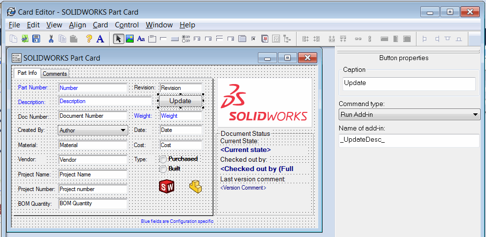
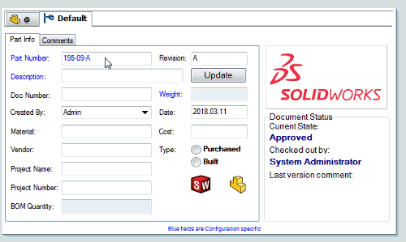

This example demonstrates how to handle the button click on data card using SOLIDWORKS PDM API and set the value of description variable based on concatenation of values of revision and number variables in PDM add-in.

* Add button to data card in PDM administration console
* Set the *Command type* option to *Run Add-in*
* Specify the name of the add-in as shown on the picture below. This option allows to specify the unique tag which can be retrieved by the add-in when button is clicked to properly identify the button.

{ width=500 }

This option should be equal to the value specified in the *BUTTON_TAG* constant in the add-in

~~~ cs
private const string BUTTON_TAG = "_UpdateDesc_";
~~~

* Make sure that the *Number*, *Revision* and *Description* variables are present on the data card or modify the add-in code accordingly:

When button clicked the *Description* variable is updated by concatenation of values in *Number* and *Revision* variables.

{ width=450 }

~~~ cs
using EPDM.Interop.epdm;
using System;
using System.Linq;
using System.Runtime.InteropServices;

namespace PdmCardVariableUpdate
{
    [ComVisible(true)]
    [Guid("9AD5B02B-5027-4751-BBC3-6EF4AE6E3206")]
    public class ButtonPdmAddIn : IEdmAddIn5
    {
        private const string BUTTON_TAG = "_UpdateDesc_";

        public void GetAddInInfo(ref EdmAddInInfo poInfo, IEdmVault5 poVault, IEdmCmdMgr5 poCmdMgr)
        {
            poInfo.mbsAddInName = "ButtonPdmAddIn";
            poInfo.mlAddInVersion = 1;
            poInfo.mlRequiredVersionMajor = 16;

            poCmdMgr.AddHook(EdmCmdType.EdmCmd_CardButton);
        }

        public void OnCmd(ref EdmCmd poCmd, ref EdmCmdData[] ppoData)
        {
            switch (poCmd.meCmdType)
            {
                case EdmCmdType.EdmCmd_CardButton:
                    var addInTagName = poCmd.mbsComment;
                    if (addInTagName == BUTTON_TAG)
                    {
                        var confName = ppoData.First().mbsStrData1;
                        var enumVar = poCmd.mpoExtra as IEdmEnumeratorVariable5;

                        object varVal;
                        enumVar.GetVar("Number", confName, out varVal);

                        var number = varVal?.ToString();
                        enumVar.GetVar("Revision", confName, out varVal);

                        var revision = varVal?.ToString();

                        var desc = (object)$"{number} ({revision})";
                        enumVar.SetVar("Description", confName, ref desc);
                    }
                    break;
            }
        }
    }
}
~~~

