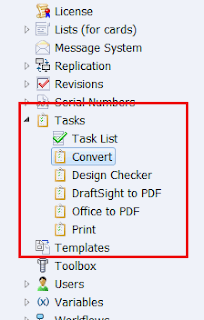
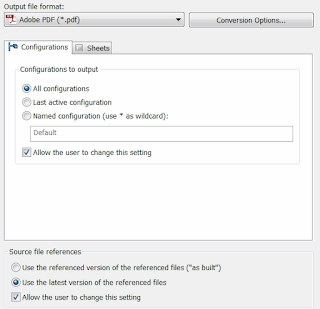
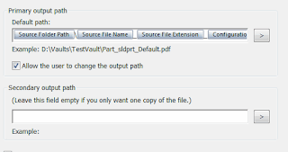
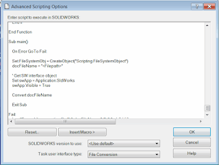
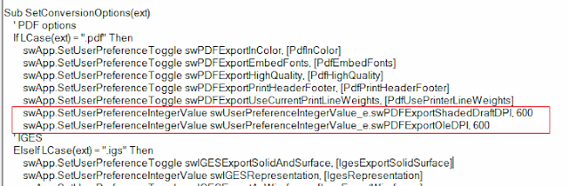
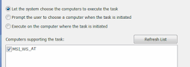

 更改标准任务的脚本指南。自定义实用程序简化PDM任务的调试
image: pdm-convert-task-script.png
labels: [转换任务, 调试, solidworks pd, 任务]
redirect-from:
  - /2018/03/customizing-solidworks-pdm-convert-task.html
---
SOLIDWORKS PDM任务是一个强大的内置功能，允许直接从PDM库的上下文菜单或工作流状态更改触发器中运行自定义功能。实际工作可以在本地计算机上或委派的远程任务服务器上执行。

SOLIDWORKS PDM提供了几个开箱即用的任务

{ width=203 height=320 }

这些任务可以通过任务设置进行高度自定义。例如，可以从设置页面更改[转换任务](https://help.solidworks.com/2017/english/enterprisepdm/admin/t_configure_convert.htm)的转换设置。

{ width=320 height=308 }

还可以指定输出名称和文件夹，并能够使用占位符（例如文件名、文件夹、变量值、配置名称等）。

{ width=320 height=168 }

任务提供了开源可编辑的脚本，使API开发人员和PDM管理员能够进一步自定义任务的逻辑。

{ width=320 height=241 }

脚本利用SOLIDWORKS API编写，使用Visual Basic语言（与.swp宏中使用的语言相同）。脚本的主要职责包括：

* 验证处理文件扩展名是否受支持
* 打开SOLIDWORKS文件（适用于本地或外部文件格式）
* 通过替换所有占位符来组成输出文件名
* 处理指定的输出选项（如质量和格式）
* 遍历配置或图纸页（根据选项指定）
* 记录任何错误
* 将文件保存到指定的输出文件夹
* 关闭文件

例如，要为输出文件设置PDF输出的DPI设置，需要将以下行添加到*SetConversionOptions*函数中，如下所示：

~~~ vb
swApp.SetUserPreferenceIntegerValue swUserPreferenceIntegerValue_e.swPDFExportShadedDraftDPI, 600
swApp.SetUserPreferenceIntegerValue swUserPreferenceIntegerValue_e.swPDFExportOleDPI, 600
~~~

{ width=640 height=210 }

请注意，SOLIDWORKS的启动和关闭以及输出文件的签入和[粘贴为引用](https://help.solidworks.com/2012/english/enterprisepdm/fileexplorer/t_Creating_a_Topic_Reference.htm)（如果指定）是在脚本范围之外执行的。

为了拦截任务执行以进行调试，需要在代码中的任何位置添加*Debug.Assert False*语句，并确保将专用任务主机设置为本地计算机。

{ width=320 height=113 }

一旦启动任务，该宏将在VBA编辑器中可用于调试。这种方法有一些限制：

* 一些调试功能被锁定。只能逐步调试。
* 如果宏包含编译错误，则调试将无法工作。
为了解决这个限制，我开发了一个控制台实用程序，用于拦截调试宏并将其复制到指定位置以供后续故障排除。

当启动任务时，SOLIDWORKS将执行以下步骤：

1. 启动SOLIDWORKS
1. 在临时位置创建新的文本文件
1. 将脚本内容复制到文件中
1. 替换所有占位符（例如文件名、变量值等）
1. 将文件重命名为*.swb
1. 运行宏
1. 删除宏

如果步骤5中的宏包含编译错误，则步骤6将失败，宏将无法启动调试。无论步骤6是否失败，步骤7都将执行。因此，在这种情况下，无法检查宏是否存在编译错误。

*CopyTaskScript*实用程序将拦截步骤6，并在删除之前将文件复制到指定的文件夹，以便在SOLIDWORKS中打开并进行故障排除。

我已将该实用程序发布到[GitHub](https://github.com/codestackdev/pdm-copy-task-script)。

请观看以下视频演示：

  <iframe allow="autoplay; encrypted-media" allowfullscreen="" frameborder="0"
    width="560" height="315" src="https://www.youtube.com/embed/kNRbmTDAyBA">
  </iframe>

