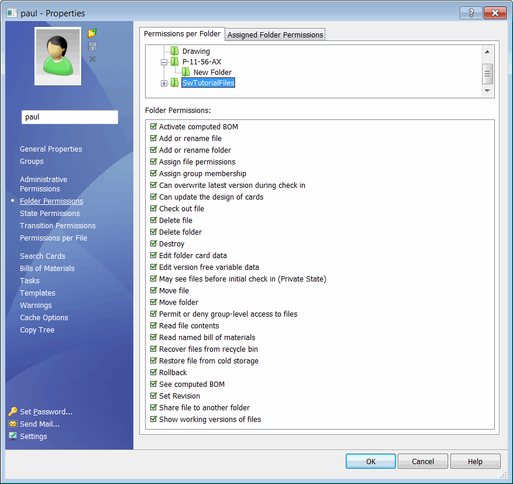

{ width=450 }

This Power shell script allows to set the specified folder permissions for the specified user using SOLIDWORKS PDM API.

To use script create PowerShell file and command line file as shown below.

It is required to place the SOLIDWORKS PDM interop into the same folder as script files. Refer [Interops in .NET for Framework 2.0](/docs/codestack/solidworks-pdm-api/getting-started#framework-20-or-older) article for more information about generating the interop.

Scrip arguments:

1. *vaultName* - name of the vault to perform the operation
1. *userName* - user name who performs the operation (should have a permission to assign permissions)
1. *password* - password for the user name above
1. *folderName* - full path to folder to change permission for
1. *targetUserName* - user name to change permissions for
1. *permissions* - permissions to assign. Integer number which represents a single permissions or a group of permissions. Permissions numbers defined in [EdmRightFlags](https://help.solidworks.com/2018/english/api/epdmapi/EPDM.Interop.epdm~EPDM.Interop.epdm.EdmRightFlags.html). Sum the values of required permissions to assign multiple values (e.g. set 1 for read files permission and 15 for read, check out, delete and add files [1 + 2 + 4 + 8])

~~~
> set-permissions.cmd MyVault admin pwd "D:\My Vaults\Vault1\Folder1" user1 15
~~~

## set-permissions.ps1

~~~ ps1
$vaultName=$args[0]
$userName=$args[1]
$password=$args[2]
$folderName=$args[3]
$targetUserName=$args[4]
$permissions=$args[5]

$ScriptDir = Split-Path $script:MyInvocation.MyCommand.Path

$Assem = ( 
    $ScriptDir + "\Interop.EdmLib.dll"
    ) 
    
$Source = @"
Imports System
Imports System.IO
Imports EdmLib

Public Class SwPdmTools

    Shared Sub New()
        AddHandler AppDomain.CurrentDomain.AssemblyResolve, AddressOf OnAssemblyResolve
    End Sub

    Public Shared Sub LoadLibrary(ParamArray libs As Object())
        For Each [lib] As String In libs
            Console.WriteLine(String.Format("Loading library: {0}", [lib]))
            Dim assm As System.Reflection.Assembly = System.Reflection.Assembly.LoadFrom([lib])
            Console.WriteLine(assm.GetName().ToString())
        Next
    End Sub

    Private Shared Function OnAssemblyResolve(ByVal sender As Object, ByVal args As ResolveEventArgs) As System.Reflection.Assembly
        For Each assm As System.Reflection.Assembly In AppDomain.CurrentDomain.GetAssemblies()

            If assm.GetName().ToString() = args.Name Then
                Return assm
            End If
        Next

        Return Nothing
    End Function
    
    Public Shared Sub SetFolderPermissions(vaultName As String, userName As String, password As String, folderName As String, targetUserName As String, permissions As Integer)

        Try
            Dim vault As IEdmVault7 = New EdmVault5
            vault.Login(userName, password, vaultName)

            If vault.IsLoggedIn Then

                Dim folder As IEdmFolder7 = vault.GetFolderFromPath(folderName)

                If Not folder Is Nothing Then

                    Dim userMgr As IEdmUserMgr7
                    userMgr = vault.CreateUtility(EdmUtility.EdmUtil_UserMgr)

                    Dim targetUser As IEdmUser5 = userMgr.GetUser(targetUserName)

                    If Not targetUser Is Nothing Then

                        Dim perm As EdmFolderPermission = New EdmFolderPermission()
                        perm.meOwnerType = EdmObjectType.EdmObject_User
                        perm.mlOwnerID = targetUser.ID
                        perm.mlEdmRightFlag = permissions
                        perm.mlFolderID = folder.ID
                        userMgr.SetFolderPermissions(New EdmFolderPermission() {perm})

                    Else
                        Throw New NullReferenceException("Failed to find a user")
                    End If

                Else
                    Throw New NullReferenceException("Failed to find a folder")
                End If
            Else
                Throw New NullReferenceException("Failed to login to vault")
            End If

        Catch ex As Exception
            Console.ForegroundColor = ConsoleColor.DarkRed
            Console.WriteLine(ex.Message)
            Console.ResetColor()
        End Try

    End Sub

End Class
"@

Add-Type -TypeDefinition $Source -ReferencedAssemblies $Assem -Language VisualBasic

[SwPdmTools]::LoadLibrary($Assem)
[SwPdmTools]::SetFolderPermissions($vaultName, $userName, $password, $folderName, $targetUserName, $permissions)
~~~

## set-permissions.cmd

~~~ cmd
SET vaultName=%1
SET userName=%2
SET password=%3
SET folderName=%4
SET targetUserName=%5
SET permissions=%6

PowerShell -NoProfile -ExecutionPolicy Bypass -File "%~dp0set-permissions.ps1" %vaultName% %userName% %password% %folderName% %targetUserName% %permissions%
~~~

