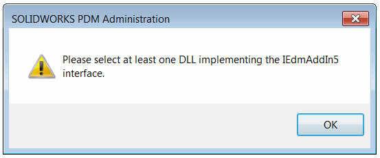

## 症状

在使用SOLIDWORKS PDM管理工具添加插件时，会显示以下错误信息：*请选择至少一个实现IEdmAddIn5接口的DLL*

{ width=450 }

## 原因

当SOLIDWORKS PDM无法找到实现[IEdmAddIn5](https://help.solidworks.com/2019/English/api/epdmapi/EPDM.Interop.epdm~EPDM.Interop.epdm.IEdmAddIn5.html)接口的类时，就会发生错误。

为了使SOLIDWORKS PDM能够看到插件类，该类必须是公共的并且可用于COM。

以下是插件声明不正确的示例：

### 类没有标记为COM可见

~~~cs
public class PdmAddIn : IEdmAddIn5
{
}
~~~

### 类没有访问修饰符（默认为私有）

~~~cs
[ComVisible(true)]
class PdmAddIn : IEdmAddIn5
{
}
~~~

### 类标记为internal

~~~cs
[ComVisible(true)]
internal class PdmAddIn : IEdmAddIn5
{
}
~~~

## 解决方法

确保插件类是公共的，并且使用[ComVisible](https://docs.microsoft.com/en-us/dotnet/api/system.runtime.interopservices.comvisibleattribute)属性进行修饰，值设置为*True*

~~~cs
[ComVisible(true)]
public class PdmAddIn : IEdmAddIn5
{
}
~~~