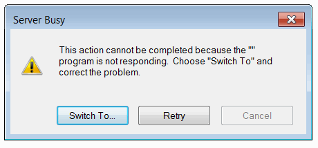
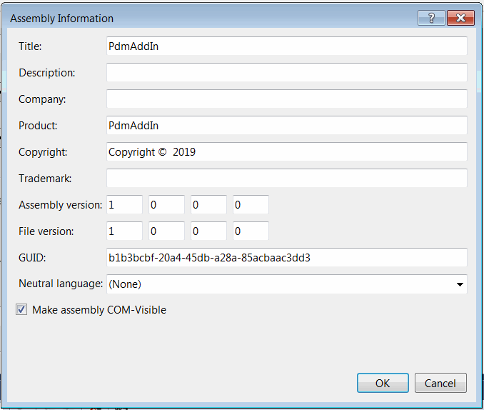
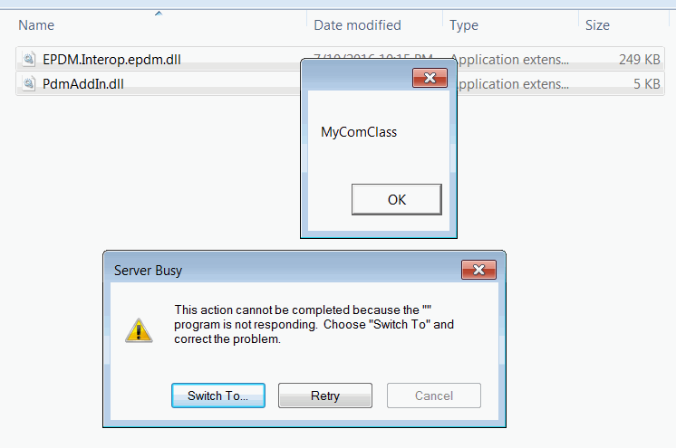

 解决在SOLIDWORKS PDM管理工具中注册插件时的性能问题。
image: server-busy.png
labels: [pdm插件, 错误]
---
## 症状

使用SOLIDWORKS PDM管理工具在SOLIDWORKS PDM vault中注册插件需要很长时间。有时在添加插件时会多次显示“此操作无法完成，因为''程序未响应。选择“切换到”并解决问题”消息。

在某些情况下，会执行意外的代码或出现随机错误。

## 原因

插件dll中存在太多的COM可见类。

当通过SOLIDWORKS PDM Administration工具将插件添加到vault时，SOLIDWORKS PDM将探测所有dll中的所有公共COM可见类。这意味着将创建所有类的实例，而不管该类是否是插件，是否被使用。

在大多数情况下，如果在项目属性中选中了**使程序集对COM可见**选项，就会出现此问题。

{ width=450 }

这将使所有公共类自动对COM可见。

### 示例

* 创建新的PDM插件并添加新的类（例如MyComClass），并在其构造函数中显示消息框

~~~cs
public class MyComClass
{
    public MyComClass()
    {
        MessageBox.Show("MyComClass");
    }
}

public class PdmAddIn : IEdmAddIn5
{
    ...
}
~~~

* 在项目设置中选中**使程序集对COM可见**选项
* 编译插件并使用SOLIDWORKS PDM Administration工具将其添加到vault中。

结果会花费更多时间，并显示以下消息，指示在将插件添加到vault时创建了**MyComClass**的实例。

{ width=450 }

## 解决方法

除非明确需要，否则不要使用**使程序集对COM可见**选项。

只对主要的插件类使用[ComVisible](https://docs.microsoft.com/en-us/dotnet/api/system.runtime.interopservices.comvisibleattribute)属性，将其值设置为*True*。

~~~cs
[ComVisible(true)]
public class PdmAddIn : IEdmAddIn5
{
}
~~~