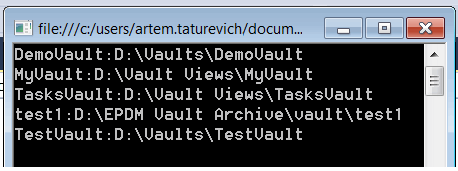

 该示例演示了如何使用SOLIDWORKS PDM API列出所有可用的存储库视图及其路径。
image: pdm-vaults-list.png
labels: [vault, view]
---
{ width=250 }

该示例演示了如何列出所有可用的存储库视图及其路径，并将信息打印到控制台窗口。

[IEdmVault8::GetVaultViews](https://help.solidworks.com/2018/english/api/epdmapi/epdm.interop.epdm~epdm.interop.epdm.iedmvault8~getvaultviews.html) SOLIDWORKS PDM API用于列出所有可用的PDM存储库的信息。或者，可以从注册表中检索此信息。

~~~ cs
using EPDM.Interop.epdm;
using System;

namespace CodeStack.ListPdmVaults
{
    class Program
    {
        static void Main(string[] args)
        {
            var vault = new EdmVault5Class();
            EdmViewInfo[] views;
            vault.GetVaultViews(out views, false);

            foreach (var view in views)
            {
                Console.WriteLine($"{view.mbsVaultName}:{view.mbsPath}");
            }
        }
    }
}

~~~