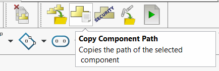

# SOLIDWORKS Macro Library for Automation


[Request a Macro](https://github.com/xarial/codestack/issues/new?labels=macro-request){ target="_blank" class="download-button" }

{ width=400 }

This page contains a collection of useful macros, utilities, and scripts for use by SOLIDWORKS engineers. The macros are grouped by categories such as part assembly, drawing, performance, and more.

Refer to the [SOLIDWORKS API Programming VBA and VSTA Macros](/docs/codestack/solidworks-api/getting-started/macros/) section for a guide on using and creating macros in SOLIDWORKS.

Can't find a macro that suits your needs? Submit a [macro request](https://github.com/xarial/codestack/issues/new?labels=macro-request) form and our team will review your request and do our best to add the macro to the library.

## Best Practices for Organizing Macro Libraries

[Toolbar+](https://cadplus.xarial.com/toolbar/) is a free and open-source [SOLIDWORKS CAD+ Toolset](https://cadplus.xarial.com/) plugin that allows you to organize your macro library with custom toolbars within the SOLIDWORKS environment. The plugin also enables managing multi-user environments by storing configurations in a centralized location.

{ width=450 }

Alternatively, you can create macro buttons in the SOLIDWORKS toolbar using native functionality. Read [Creating Macro Buttons in the SOLIDWORKS Toolbar](/docs/codestack/solidworks-api/getting-started/macros/macro-buttons/) for more information.

Browse this section to find productivity and automation tools that suit your needs.

For other productivity plugins, visit the [SOLIDWORKS Labs](/docs/codestack/labs/solidworks/) page.

## Batch Running

In some cases, you may need to run macros on multiple SOLIDWORKS files in a batch. Try using [Batch+](https://cadplus.xarial.com/batch/), a free standalone application that is part of the [SOLIDWORKS CAD+ Toolset](https://cadplus.xarial.com/).

---
