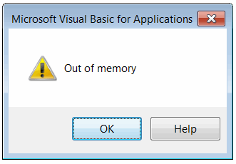
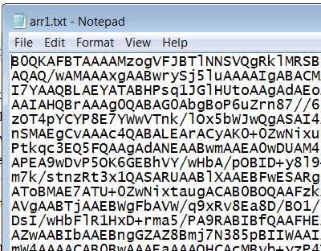
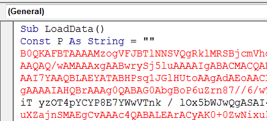
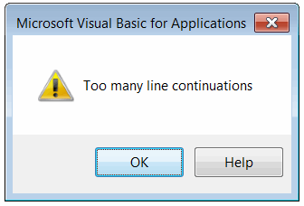
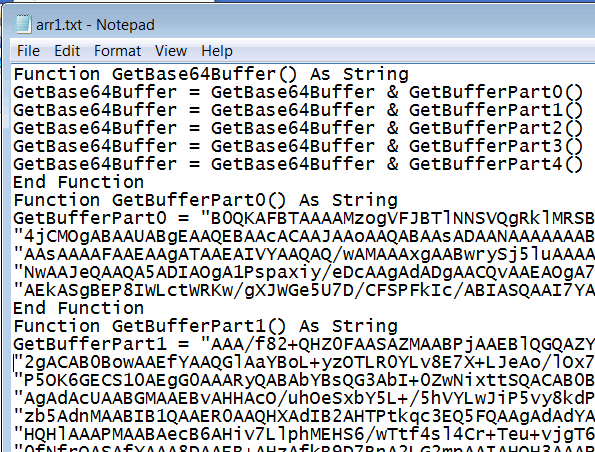

在某些情况下，可能需要直接将文件或数据嵌入到 Visual Basic 6 项目或 VBA 宏中。Visual Basic 不支持资源。下面的函数演示了如何将二进制数组嵌入到宏中，而无需重新分发数据文件。

## 编写数组声明

此选项允许将数组声明输出为文本格式，可以将其复制粘贴到宏中作为变量声明。

```vb
Dim buff(5) As Byte
buff(0) = 1: buff(1) = 2: buff(2) = 3
buff(3) = 4: buff(4) = 5: buff(5) = 6

WriteArrayDeclarationToFile buff, "D:\arr.txt", "arr", "Byte", 2
```

只需复制生成文件的内容并粘贴到宏模块中即可嵌入数据。


```vb
Sub WriteArrayDeclarationToFile(buffer As Variant, filePath As String, varName As String, typeName As String, Optional elemsPerRow As Integer = 10)
    
    Dim fileNo As Integer
    fileNo = FreeFile
    
    Open filePath For Output As #fileNo
    
    Print #fileNo, "Dim " & varName & "(" & UBound(buffer) & ") As " & typeName
    
    Dim i As Long
    
    For i = 0 To UBound(buffer) Step elemsPerRow
        
        Dim j As Long
        Dim last As Long
        
        If i + elemsPerRow > UBound(buffer) Then
            last = UBound(buffer)
        Else
            last = i + elemsPerRow - 1
        End If
        
        Dim line As String
        line = ""
        
        For j = i To last
            Dim val As String
            val = buffer(j)
            If LCase(typeName) = "string" Then
                val = """" & val & """"
            End If
            line = IIf(line <> "", line & ": ", "") + varName & "(" & j & ")=" & val
        Next
        
        Print #fileNo, line
        
    Next
    
    Close #fileNo
    
End Sub
```

然而，这种方法有一个限制，即文件的大小会比数组的大小大得多（例如，大小为 500 KB 的数组将生成约 10 MB 的文件）。这会导致 Visual Basic 出现“内存不足”错误。



## 编写 base64 编码的数组

作为解决方法，可以将数组嵌入为 Base64 字符串。请参考以下文章中的代码示例，了解如何将字节数组编码为 Base64 字符串：[将字节数组编码为 Base64 字符串](/docs/codestack/visual-basic/algorithms/data/encoding/base64#encode)

```vb
Dim buff(100) As Byte
...
WriteByteArrayDeclarationToFileAsBase64 buff, "D:\arr1.txt"
```

这将创建以下文件：

{ width=350 }

声明字符串常量并将值从此文件粘贴过来。[解码](/docs/codestack/visual-basic/algorithms/data/encoding/base64#decode)此字符串以获取字节数组。

这种解决方案也可能遇到每行的最大字符数限制。



要解决此问题，请使用 *WriteByteArrayDeclarationToFileAsBase64* 方法的第三个参数，该参数允许设置最大符号数并自动使用行继续符号拆分行：

```vb
WriteByteArrayDeclarationToFileAsBase64 buff, "D:\arr1.txt", 100
```

该函数提供了解决每行继续数限制（等于 24 个“太多的行继续”）并将数据拆分为不同函数的方法。



结果，数据以以下格式写入文件：

{ width=350 }

要使用此方法，请将内容复制到模块中，并从代码中调用 *GetBase64Buffer* 函数，该函数将返回可以[解码](/docs/codestack/visual-basic/algorithms/data/encoding/base64#decode)的 Base64 编码数组。

```vb
Sub WriteByteArrayDeclarationToFileAsBase64(buffer As Variant, filePath As String, Optional lineMaxLength As Integer = -1)
    
    Const FUNC_NAME = "GetBufferPart"
    
    Dim fileNo As Integer
    fileNo = FreeFile
    
    Open filePath For Output As #fileNo
        
    Dim data As String
    data = ConvertToBase64String(buffer)
    data = Replace(data, vbLf, "")
    
    If lineMaxLength > 1 Then
            
        Const MAX_LINE_CONTINUATIONS As Integer = 24
        
        Dim curLineIndex As Integer
        Dim curCont As Integer
        curLineIndex = 0
        
        Dim i As Long
        
        Dim funcsCount As Integer
        funcsCount = Round((Len(data) - 1) / lineMaxLength / MAX_LINE_CONTINUATIONS) - 1
        
        Print #fileNo, "Function GetBase64Buffer() As String"
                
        For i = 0 To funcsCount
            Print #fileNo, "GetBase64Buffer = GetBase64Buffer & " & FUNC_NAME & i & "()"
        Next
        
        Print #fileNo, "End Function"
        
        Dim funcName As String
        
        For i = 1 To Len(data) Step lineMaxLength
            
            If curCont = MAX_LINE_CONTINUATIONS Then
                curCont = 0
                curLineIndex = curLineIndex + 1
            End If
            
            Dim length As Integer
        
            Dim isLast As Boolean
            isLast = False
            
            If i + lineMaxLength > Len(data) Then
                length = Len(data) - i + 1
                isLast = True
            Else
                length = lineMaxLength
            End If
            
            curCont = curCont + 1
            
            If curCont = 1 Then
                funcName = FUNC_NAME & curLineIndex
                Print #fileNo, "Function " & funcName & "() As String"
            End If
            
            isLast = isLast Or curCont >= MAX_LINE_CONTINUATIONS
            
            Dim lineConc As String
            lineConc = ""
            If Not isLast Then
                lineConc = " & _"
            End If
            
            Print #fileNo, IIf(curCont = 1, funcName & " = ", ""); """" & Mid(data, i, length) & """" & lineConc
            
            If isLast Then
                Print #fileNo, "End Function"
            End If
            
        Next
        
    Else
        Print #fileNo, data
    End If
    
    Close #fileNo
    
End Sub

Function ConvertToBase64String(vArr As Variant) As String
    
    Dim xmlDoc As Object
    Dim xmlNode As Object
    
    Set xmlDoc = CreateObject("MSXML2.DOMDocument")
    
    Set xmlNode = xmlDoc.createElement("b64")
    
    xmlNode.DataType = "bin.base64"
    xmlNode.nodeTypedValue = vArr
    
    ConvertToBase64String = xmlNode.Text
    
End Function
```