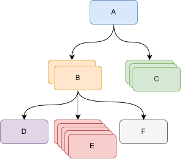

 解释递归并在Visual Basic中使用它来输出物料清单（BOM）的结构
---

在某些情况下，可能需要解析分层数据。这是一种树形结构的数据，其中包含一组节点，每个节点可能包含子节点的集合，每个子节点又可以有自己的子节点集合，依此类推。分层数据的示例是包含可能具有子节点的节点的XML文件。

可以使用[循环](/docs/codestack/visual-basic/loops/)来解析这些数据，但这个任务会变得复杂，并且代码的可读性会受到影响。更简单的解决方案是使用递归技术。

这个函数将解析单个节点（或单个层级上的节点），然后递归调用自身来处理所有子节点。

例如，以下物料清单（BOM）结构表示一个产品。

{ width=350 }

在Visual Basic中，可以使用以下类来描述这个结构，其中**Children**变量可能包含子装配节点。

## BomItem类

~~~ vb
Public Name As String
Public Qty As Integer
Public Children As Variant
~~~

为了输出结构，可以编写以下函数

```vb
Sub main()
    
    Dim bom As New BomItem
    bom.Name = "A"
    bom.Qty = 1
    
    Dim bomChildren(1) As BomItem
        
    Set bomChildren(0) = New BomItem
    bomChildren(0).Name = "B"
    bomChildren(0).Qty = 2
    
    Set bomChildren(1) = New BomItem
    bomChildren(1).Name = "C"
    bomChildren(1).Qty = 3
    
    bom.Children = bomChildren
    
    Dim bomSubChildren(2) As BomItem
        
    Set bomSubChildren(0) = New BomItem
    bomSubChildren(0).Name = "D"
    bomSubChildren(0).Qty = 1
    
    Set bomSubChildren(1) = New BomItem
    bomSubChildren(1).Name = "E"
    bomSubChildren(1).Qty = 5
    
    Set bomSubChildren(2) = New BomItem
    bomSubChildren(2).Name = "F"
    bomSubChildren(2).Qty = 1
    
    bomChildren(0).Children = bomSubChildren
    
    PrintBom bom
    
End Sub

Sub PrintBom(bom As BomItem, Optional level As Integer = 0)
    
    Dim offset As String
    offset = String(level, "-")
    
    Debug.Print offset & bom.Name & " (" & bom.Qty & ")"
    
    If Not IsEmpty(bom.Children) Then
        Dim i As Integer
        For i = 0 To UBound(bom.Children)
            Dim child As BomItem
            Set child = bom.Children(i)
            PrintBom child, level + 1
        Next
    End If
    
End Sub
```

结果将输出以下信息到VBA编辑器的即时窗口。

```
A (1)
-B (2)
--D (1)
--E (5)
--F (1)
-C (3)
```