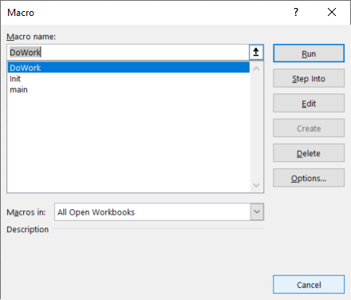
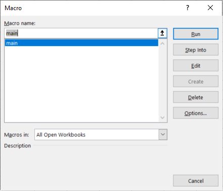
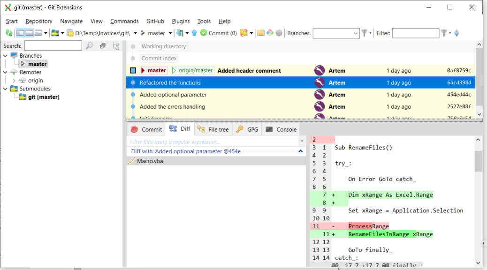

如今，Visual Basic主要以VBA宏的格式使用，只有少数遗留应用程序例外。

尽管VBA宏通常是小型应用程序，但它们仍然在全球数百万个组织中发挥着重要作用。由于宏是应用程序，因此在开发宏时，仍然应遵循编写可靠、可维护和稳定应用程序的所有实践方法。

以下是改进宏质量的准则列表。这些准则适用于任何类型的宏，例如MS Word、MS Excel、SOLIDWORKS、Autodesk Inventor等。

访问[5个使您的VBA宏变得出色的最佳实践](https://blog.xarial.com/vba-macro-best-practices/)博客文章，了解下面准则的实际应用的视频演示。

## 描述性名称

在开发任何应用程序（VBA也不例外）时，尽量使用尽可能描述性的变量、函数、过程、模块、类和事件名称。

优先使用描述性名称而不是注释

使用

``` vb
Dim dayOfTheWeek As String
dayOfTheWeek = "Monday"
```

而不是

``` vb
'day of the week
Dim x As String
x = "Monday"
```

不要用注释过多地堆砌代码。下面的代码片段中的注释是多余的

``` vb
Function GetCircleArea(radius As Double)
    const PI As Double = 3.14

    'Finding the area of the circle
    Dim area As Double
    area = PI * radius ^ 2
    GetCircleArea = area
End Function
```

## 避免使用魔法字符串和数字

避免使用未命名的字符串和数字（[魔法数字](https://en.wikipedia.org/wiki/Magic_number_(programming))），而是使用具有[描述性名称](#描述性名称)的常量声明。

``` vb
Const PI As Double = 3.14
Dim circArea As Double
cirArea = PI * rad ^ 2
```

``` vb
Const OUT_FOLDER_PATH As String = "D:\out"
Export OUT_FOLDER_PATH
```

## 错误处理

在开发代码时，避免“隐藏问题”，因为这可能会导致比应用程序崩溃更严重的问题。

例如，下面的代码片段检查*swModel*对象是否不为空，并执行重要操作。但是，*swModel*等于Nothing是可能的情况，如果在此模型上跳过导出而不通知用户，问题将不会被注意到，用户将无法理解为什么在此模型上未执行*DoSomeImportantWorkWithModel*。

``` vb
Dim swModel As SldWorks.ModelDoc2
Set swModel = swComp.GetModelDoc2()
If Not swModel Is Nothing Then
    DoSomeImportantWorkWithModel swModel
End If
```

### 错误处理

应谨慎使用“On Error Resume Next”指令。努力处理代码中的所有异常。我建议在集中处理所有错误的地方（通常是入口函数）处理所有错误。

下面的格式不是处理错误的常规VBA格式，它试图模拟其他语言（如C＃、VB.NET、C ++、JavaScript等）中的try-catch-finally语法，但它可以使代码更易读和易于理解：

* DoWork()是执行所有操作的主要函数
* 如果在任何时候引发异常，代码将被重定向到*catch_*块，在该块中可以处理错误（例如记录或显示消息框）
* 否则，代码将被重定向到*finally_*块，并在完成*DoWork*例程后退出宏

``` vb
Sub main()

try_:
    On Error GoTo catch_
    
    DoWork()

    GoTo finally_:
catch_:
    MsgBox Err.Description
finally_:

End Sub
```

### “快速失败”方法

为了解决上述问题，我们可以采用“快速失败”方法，即立即终止执行，并通知调用者出现了问题：

``` vb
If Not swModel Is Nothing Then
    DoSomeImportantWorkWithModel swModel
Else
    Err.Raise vbError, "", "Model of the component is null. Execution terminated"
End If
```

由调用函数决定如何处理此情况。根据要求，应用程序可以继续并将其视为安全错误，或者可以记录错误或向用户显示消息。

## 入口点

大多数支持VBA宏的应用程序，例如MS Word、MS Excel、SOLIDWORKS、Autodesk Inventor，将任何无参数函数视为宏的潜在入口点。

下面的代码有3个无参数函数

* main - 实际预期的入口函数。运行此函数将产生预期的结果
* Init - 初始化要进行工作所需的数据的函数。此函数本身不执行工作。直接运行此函数不会导致错误，但也不会产生任何结果
* DoWork - 执行工作的函数，但它需要初始化InitData。直接运行此函数很可能会导致“运行时错误91：对象变量或With块变量未设置”

``` vb
Dim InitData As Object

Sub main()
    Init
    DoWork
End Sub

Sub Init()
    '初始化InitData
End Sub

Sub DoWork()
    '使用InitData执行工作
End Sub
```

在运行宏时，可以选择上述3个函数中的任何一个作为入口点。



为了防止潜在问题，只将无参数函数用作入口点。为了使函数具有参数，而不影响现有代码，可以使用可选参数：

``` vb
Dim InitData As Object

Sub main()
    Init
    DoWork
End Sub

Sub Init(Optional dummy As Variant = Empty)
    '初始化InitData
End Sub

Sub DoWork(Optional dummy As Variant = Empty)
    '使用InitData执行工作
End Sub
```

使用上述设置，只有一个函数可供运行：



## 独立的函数和模块

尽量使函数和模块尽可能独立于其他函数、模块级变量和环境。这将使函数的使用更可预测，并且函数可以重复使用。

### 对成员的依赖

在下面的代码片段中，*swModel*变量在模块级别声明，这使得它可以从*ProcessDocument*函数内部访问。变量在*main*函数中初始化。这意味着*ProcessDocument*依赖于*swModel*，并且只能处理活动文档（或分配给*swModel*的文档）。此函数无法用于其他目的，例如处理装配中组件的模型。

``` vb
Dim swModel As SldWorks.ModelDoc2

Sub main()
    Set swModel = ActiveDoc
    ProcessDocument
End Sub

Sub ProcessDocument()
    '使用swModel进行工作
End Sub
```

相反，可以将上述代码重写为以下代码。可以将模型级变量定义为函数的参数，从而消除依赖关系。现在，*ProcessDocument*函数可以与任何指向*SldWorks.ModelDoc2*的指针一起使用。

``` vb
Sub main()
    ProcessDocument ActiveDoc
End Sub

Sub ProcessDocument(model As SldWorks.ModelDoc2)
    '使用model进行工作
End Sub
```

### 对环境的依赖

另一个例子是对环境的依赖。下面的函数将Excel单元格中的值保存到文本文件中。它接受单元格和文件路径的2个参数。但是，此函数除了调用单元格上的*Value*属性提取文本之外，不执行任何特定于Excel的功能。但是，由于这个原因，*CreateTextFile*函数依赖于Excel环境，无法在其他场景和应用程序（如MS Word或Autodesk Inventor）中重复使用。

``` vb
Sub CreateTextFile(cell As Excel.Range, fileName As String)
    Dim text As String
    text = cell.Value
    '将文本写入fileName
End Sub
```

相反，可以将函数更改为以下代码，其中调用方负责准备要写入的文本。然后，如果需要，可以将此函数复制到其他宏中以执行类似的功能。

``` vb
Sub CreateTextFile(text As String, fileName As String)
    '将文本写入fileName
End Sub
```

## 文档

为您的应用程序编写文档的功能对于软件的用户和项目的其他协作者非常有用。文档可以是简单的文本文件、Word或PDF文档，也可以是完整的多页技术站点。

对于VBA宏，简单的标题在宏的顶部可能就足够了。指定宏的作者、许可证、联系方式和简要描述。

``` vb jagged-bottom
' -------------------------------------------------
' Created By Artem Taturevych (info@codestack.net)
' License: https://www.codestack.net/license/
' Macro will display the callouts with the diameter values of all selected circular edges in the 3D model
' -------------------------------------------------

Sub main()
```

## 引用第三方类型库

当只使用第三方类型库的少数对象或函数（例如Microsoft Scripting Runtime、Microsoft Excel等）且这不是自动化的主要目标时，考虑使用[后期绑定](/docs/codestack/visual-basic/variables/declaration#late-binding)而不是[早期绑定](/docs/codestack/visual-basic/variables/declaration#early-binding)。

例如，Excel VBA宏需要创建一个[字典](/docs/codestack/visual-basic/data-sets/dictionary/)对象来保存键值对。而不是引用*Microsoft Scripting Runtime*引用并使用以下代码

``` vb
Dim dict As Scripting.Dictionary
Set dict = New Scripting.Dictionary
```

可以避免添加*Microsoft Scripting Runtime*引用，而使用

``` vb
Dim dict As Object
Set dict = CreateObject("Scripting.Dictionary")
```

另一个例子是SOLIDWORKS VBA宏，它主要自动化SOLIDWORKS，但可能需要一些Excel API调用。在这种情况下，可以将Excel作为后期绑定对象创建，而不需要向宏添加对Excel库的引用。

这种方法可以简化不同版本库之间的兼容性，并避免[缺少引用问题](/docs/codestack/solidworks-api/troubleshooting/macros/missing-solidworks-type-library-references/)

> 后期绑定有局限性，某些方法无法使用后期绑定调用，此时早期绑定是唯一的选择

## 使用断言

*Debug.Assert*是一种在条件不满足时显示断言的机制。断言是面向开发人员（而不是用户）的消息，旨在用于验证与应用程序的使用或误用无关的条件。断言应指示代码逻辑错误，而不是软件使用错误。

例如，下面的SOLIDWORKS宏应该对活动文档执行操作。但是，当没有打开文档时（用户可以这样做），这是一个有效的场景，ActiveDoc可能返回*Nothing*。因此，断言在此处不适用于指示错误，而是异常更适合。

``` vb
Dim swModel As SldWorks.ModelDoc2
Set swModel = swApp.ActiveDoc
If Not swModel Is Nothing Then
    '执行工作
Else
    Err.Raise vbError, "", "No active document found"
End If
```

另一方面，下面的*GetTitle*函数运行自定义代码以查找文档的标题。假设无论在任何情况下，标题都不可能是空字符串，因此从*GetTitle*返回的空字符串表示逻辑错误。如果条件为假（标题为""），则会引发断言。

``` vb
Dim title As String
title = GetTitle(model);
Debug.Assert title <> ""
```

## 使用单元测试

Visual Basic不是为单元测试而设计的，但是有几个第三方解决方案可用于实现单元测试。

作为解决方法，可以在宏中实现一个简单的验证函数来模拟单元测试。此测试函数应手动运行。

下面的代码中有两个函数，它们是宏逻辑的一部分：

* SortArray - 对输入数组按升序或降序排序并返回结果
* CountWords - 计算指定文本中的单词数

这些函数可以作为单元（单元测试）独立测试。

*UnitTests*函数定义和验证了几个测试用例。

``` vb
Sub main()
    '应用程序的主要逻辑，利用SortArray和CountWords
End Sub

Sub UnitTests(Optional dummy As Variant = Empty)
    
    'test1
    res1 = SortArray(Array("C", "B", "A"), True)
    Debug.Assert res1(0) = "A" And res1(1) = "B" And res1(2) = "C"
    
    'test2
    res2 = SortArray(Array("C", "B", "A"), False)
    Debug.Assert res2(0) = "C" And res2(1) = "B" And res2(2) = "A"
    
    'test3
    Dim res3 As Integer
    res3 = CountWords("Hello World")
    Debug.Assert res3 = 2
    
End Sub

Function SortArray(arr As Variant, asc As Boolean) As Variant
    '对数组进行排序并返回结果
End Function

Function CountWords(text As String) As Integer
    '计算文本中的单词数
End Function
```

例如，*test1*运行*SortArray*函数并提供一个数组[C, B, A]，请求按升序排序。预期结果是数组[A, B, C]，在*Debug.Assert*调用中进行了验证。如果条件为假，将引发断言，指示测试失败。

``` vb jagged
'test1
res1 = SortArray(Array("C", "B", "A"), True)
Debug.Assert res1(0) = "A" And res1(1) = "B" And res1(2) = "C"
```

## 版本控制

源代码的版本控制系统（CVS）提供了对纯文本格式的代码的集中管理。这些系统包括但不限于Git、SVN、Mercurial。

各种应用程序（如MS Word、MS Excel、SOLIDWORKS、Autodesk Inventor）中的大多数VBA宏引擎实现将宏文件存储为嵌入到文件中或以二进制格式存储，这使得它们无法与版本控制服务一起使用。

然而，仍然有益且建议提取宏代码的文本副本并将其添加到版本控制中。



## 保持在范围内

尽量使您的应用程序在技术和编程语言的能力范围内。对于简单的应用程序，脚本和VBA宏可能足够，但对于需要数据库连接、Web服务调用、数据处理和分析等更复杂功能的情况，请考虑切换到更复杂的环境（插件、独立应用程序、Web服务）和面向对象的语言，如VB.NET、C#、C++、Java等。