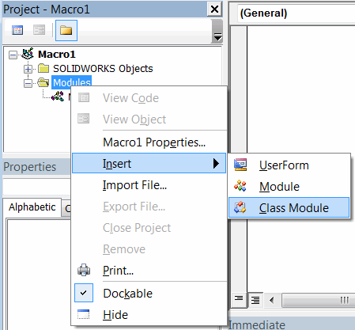
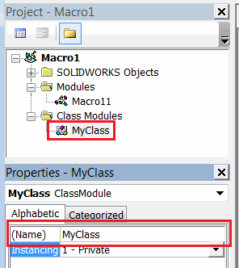

 解释了在Visual Basic中使用类的用法。介绍面向对象编程（OOP）
caption: 类
image: insert-class-module.png
sidebar_position: 0
---
类是面向对象编程（OOP）的基本概念。类可以被视为存储类级别变量的存储库，并提供函数、属性和公开事件。

类是在类模块中创建的

{ width=300 }

类必须具有一个在Visual Basic编辑器中定义的唯一名称

## MyClass 类模块
~~~vb
Public Var1 As String
Public Var2 As Double

Public Sub Foo()
End Sub
~~~

## Macro11 模块
~~~ vb
Dim cl1 As MyClass
Dim cl2 As MyClass

Set cl1 = New MyClass
Set cl2 = New MyClass

cl1.Var1 = "A"
cl2.Var1 = "B"

cl1.Var2 = 1
cl2.Var2 = 2
~~~

类与[模块](/docs/codestack/visual-basic/modules/)类似，但有几个区别：

* 必须使用**new**关键字创建类的实例
* 与该类关联的所有数据将存储在其实例中，这意味着相同类的不同实例可能具有不同的数据。
* 类允许处理和公开事件