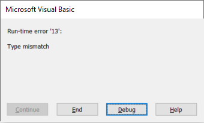

 解释逻辑条件、if-else、select case 语句和布尔运算的文章
sidebar_position: 0
---
条件是任何应用程序的重要部分，通常是驱动应用程序逻辑的部分。

在 Visual Basic 中，有多种选项可以根据条件执行特定的代码。

## If 语句

这是决定是否执行 **If** 语句体内代码的最常见方式。If 语句简单地将表达式评估为布尔值 **True** 或 **False**，并在表达式为 **True** 时执行代码。这意味着所有表达式都必须产生 **True** 或 **False** 值。

~~~ vb jagged
If True Then
    Debug.Print "始终打印"
End If
~~~

然而，以下代码将导致运行时异常，因为字符串值无法转换为布尔值。

~~~ vb jagged
If "A" Then
End If
~~~

而以下代码片段是有效的，因为比较两个字符串值会产生布尔值。

~~~ vb jagged
If "A" = "A" Then
End If
~~~

### 回退值

可以为语句指定回退值，即在主条件为 **False** 时应执行的代码块。

~~~vba
Sub main()

    Dim myVar As Integer
    myVar = 25
    
    If myVar > 10 Then
        Debug.Print "myVar 变量的值大于 10"
    Else
        Debug.Print "myVar 变量的值小于 10"
    End If
~~~

### 多个条件

可以指定多个条件，并使用[逻辑运算符](#逻辑运算符)组合表达式。

~~~vba
Sub main()

    Dim myVar As Integer
    myVar = 25
    
    If myVar < 0 Then
        Debug.Print "myVar 具有负值"
    ElseIf myVar = 0 Then
        Debug.Print "myVar 等于 0"
    ElseIf myVar > 0 And myVar < 10 Then
        Debug.Print "myVar 的值在 0 到 10 之间（不包括 10）"
    Else
        Debug.Print "myVar 的值为 10 或更大"
    End If
    
End Sub
~~~

条件会逐个执行，直到找到 **True** 条件为止。

## Select Case

如果需要针对多个常量值执行检查，而不是使用 **If-ElseIf**，可以使用 **Select Case**。虽然 **Select Case** 可以被认为是对 **If-ElseIf** 的冗余，但它被广泛使用，因为它可以创建简单、更易读的代码。**Select Case** 语句还支持使用 **Case Else** 语句的回退值。

以下代码将一周中的某一天的位置转换为其文本表示。如果指定的值超出 1-7 范围，它会抛出错误，因为这将是无效的输入。

~~~
Sub main2()

    Dim dayOfTheWeek As Integer
    dayOfTheWeek = 3
    
    Select Case dayOfTheWeek
        Case 1
            Debug.Print "星期一"
        Case 2
            Debug.Print "星期二"
        Case 3
            Debug.Print "星期三"
        Case 4
            Debug.Print "星期四"
        Case 5
            Debug.Print "星期五"
        Case 6
            Debug.Print "星期六"
        Case 7
            Debug.Print "星期日"
        Case Else
            Err.Raise vbError, "", "值超出 1...7 范围"
    End Select

End Sub
~~~

## 逻辑运算符

Visual Basic 支持 3 个逻辑运算符：**And**、**Or** 和 **Not**

* **And** 运算符的结果将在其所有参数都等于 **True** 时等于 **True**
* **Or** 运算符的结果将在其至少有一个参数等于 **True** 时等于 **True**
* **Not** 运算符将值反转

运算符可以使用括号分组，以定义操作的顺序。

~~~vba
Sub main3()
    
    Dim varA, varB, varC, varD As Boolean
        
    varA = True
    varB = False
    varC = True
    varD = False
    
    Debug.Print varA And varB 'False
    Debug.Print Not (varA And varB) 'True
    Debug.Print varA And varC 'True
    Debug.Print varA Or varC 'True
    Debug.Print varA Or varB 'True
    Debug.Print varB Or varD 'False
    Debug.Print (varA Or varB) And varD 'False
    Debug.Print varA Or (varB And varD) 'True
    
End Sub
~~~

下表演示了基于值和运算符的结果。

| Value1 | Value2 | Operator | Result |
|--------|--------|----------|--------|
| True   | True   | And      | True   |
| True   | False  | And      | False  |
| False  | True   | And      | False  |
| False  | False  | And      | False  |
| True   | True   | Or       | True   |
| True   | False  | Or       | True   |
| False  | True   | Or       | True   |
| False  | False  | Or       | False  |
| True   | N/A    | Not      | False  |
| False  | N/A    | Not      | True   |