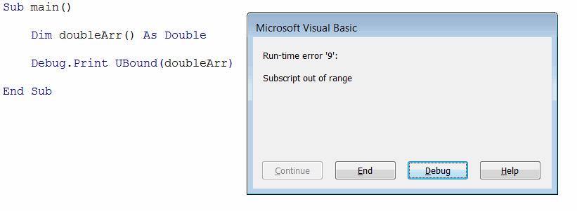
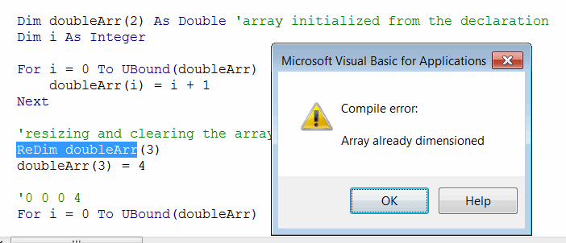

 解释了 Visual Basic 中的数组 - 一组存储在单个变量中并可以通过索引访问的元素
image: two-dimensional-array.png
sidebar_position: 0
---
Visual Basic 数组是一组存储在单个变量中并可以通过索引访问的元素。

要声明数组，需要在变量名后面添加括号 () 符号；

``` vb
Dim arr() As Double '声明双精度数组
```

可以通过索引访问数组元素

``` vb
Dim arr(2) As String
Dim elem As String
elem = arr(0) '获取第一个元素
```

## 在 Visual Basic 中初始化数组

数组是一组固定大小的元素。可以在声明时分配大小。

``` vb
Dim arr(2) As Double '声明 3 个双精度数组（从 0 到 1）
```

> 括号中的单个数字表示数组的上界。默认情况下，数组是基于 0 的。因此，指定 (5) 作为数组大小意味着数组中将有 6 个元素。

可以显式指定数组的上界和下界

``` vb
Dim arr(1 To 5) As Double '声明 5 个双精度数组（从 1 到 5）
```

> 建议使用基于 0 的数组，因为这是不同编程语言中的常见做法。

可以通过索引访问和更改数组元素。如果指定的索引超出了数组的边界，则会引发运行时错误。

在某些情况下，数组的大小在编译时无法确定，并且将在运行时确定。在这种情况下，可以在不指定大小（即未初始化）的情况下声明数组。然后可以使用 **ReDim** 关键字动态调整数组的大小。

``` vb
Dim arr() As Double
ReDim arr(2) '初始化数组的大小
```

要检索数组的上界和下界，可以分别使用 **UBound** 和 **LBound**。

> 不能使用 UBound 函数来确定数组是否已初始化，因为在未初始化的数组上使用它会引发异常。请使用下面示例中的 **IsArrayInitialized** 函数来安全地确定数组的状态。

{ width=350 }

``` vb
Sub InitializeArray()
    
    Dim doubleArr() As Double '未初始化的数组
    
    'Array is initialized = False
    Debug.Print "Array is initialized = " & IsArrayInitialized(doubleArr)
    
    ReDim doubleArr(2) '调整数组大小以容纳 3 个双精度数
    
    'Array is initialized = True of size 3
    Debug.Print "Array is initialized = " & IsArrayInitialized(doubleArr) & " of size " & GetArraySize(doubleArr)
    
    Dim textArr(4) As String '在声明时初始化
    'Array is initialized = True of size 5
    Debug.Print "Array is initialized = " & IsArrayInitialized(textArr) & " of size " & GetArraySize(textArr)
    
    '使用自定义边界进行初始化
    Dim intArr(1 To 5) As Integer
    'Array is initialized = True of size 5 (1 to 5)
    Debug.Print "Array is initialized = " & IsArrayInitialized(intArr) & " of size " & GetArraySize(intArr) & " (" & LBound(intArr) & " to " & UBound(intArr) & ")"
    
    'Debug.Print intArr(0) '运行时错误 9：下标超出范围
    
End Sub

Function IsArrayInitialized(vArr As Variant) As Boolean

    If IsArray(vArr) Then
        
        On Error GoTo End_
        
        If UBound(vArr) >= 0 Then
            IsArrayInitialized = True
            Exit Function
        End If
        
    End If

End_:

    IsArrayInitialized = False
    
End Function

Function GetArraySize(vArr As Variant) As Integer
    
    If IsArrayInitialized(vArr) Then
        GetArraySize = UBound(vArr) - LBound(vArr) + 1
    Else
        GetArraySize = 0
    End If
    
End Function
```


## 用数据填充数组

数组元素可以被视为单独的变量，读取和编辑数据的规则与任何其他变量的规则相同。有关更多信息，请参阅 [变量](/docs/codestack/visual-basic/variables) 文章。

``` vb
Dim arr(2) As Double
arr(<INDEX>) = 10 '更改 <INDEX> 处变量的值
Debug.Print arr(<INDEX>) '读取 <INDEX> 处变量的值
```

``` vb
Sub FillArray()
    
    Dim doubleArr(2) As Double '从声明中初始化的数组
    Dim i As Integer
    
    For i = 0 To UBound(doubleArr)
        doubleArr(i) = i + 1
    Next
    
    '1 2 3
    For i = 0 To UBound(doubleArr)
        Debug.Print doubleArr(i)
    Next

    Dim vArr As Variant
    vArr = Array("A", "B", "C", "D") '在初始化时填充变体数组
    
    'A B C D
    For i = 0 To UBound(vArr)
        Debug.Print vArr(i)
    Next
    
End Sub
```


## 调整数组大小

数组大小可以在运行时更改。但只能对在声明时未显式指定大小的数组进行更改。

``` vb
Dim arrCanResize() As Integer '可以调整大小的数组
Dim arrCannotResize(3) As Integer '无法调整大小的数组
```

尝试调整已经定义维度的数组将导致编译错误：

{ width=350 }

### 清除现有值

**ReDim** 关键字允许调整数组的大小。在这种情况下，所有现有值都将被清除。

``` vb
Sub ResizeAndClearArray()
    
    Dim doubleArr() As Double
    Dim i As Integer
    
    ReDim doubleArr(2)
    
    For i = 0 To UBound(doubleArr)
        doubleArr(i) = i + 1
    Next
    
    '调整大小并清除数组
    ReDim doubleArr(3)
    doubleArr(3) = 4
    
    '0 0 0 4
    For i = 0 To UBound(doubleArr)
        Debug.Print doubleArr(i)
    Next

End Sub
```


### 保留现有值

为了保留数组的现有值，需要使用 **ReDim Preserve** 关键字。

``` vb
Sub ResizeAndPreserveArray()

    Dim doubleArr() As Double '从声明中初始化的数组
    Dim i As Integer

    ReDim doubleArr(3)
    
    For i = 0 To UBound(doubleArr)
        doubleArr(i) = i + 1
    Next
    
    '调整数组大小并保留值
    ReDim Preserve doubleArr(4)
    doubleArr(4) = 5
    
    '1 2 3 4 5
    For i = 0 To UBound(doubleArr)
        Debug.Print doubleArr(i)
    Next

End Sub
```


### 动态调整数组大小

在某些情况下，事先不知道数组的大小或第一个项目（如果有的话）何时添加。

在这种情况下，只有在需要时才初始化数组是有益的。可以使用以下语句来确定数组是否未初始化 `(Not array) = -1`，并在需要时初始化第一个项目或动态调整大小以保留现有值。

``` vb
Dim evenNumbersArr() As Integer

Dim i As Integer

For i = 0 To 100
    If i Mod 2 = 0 Then
                
        If (Not evenNumbersArr) = -1 Then
            ReDim evenNumbersArr(0)
        Else
            ReDim Preserve evenNumbersArr(UBound(evenNumbersArr) + 1)
        End If
        
        evenNumbersArr(UBound(evenNumbersArr)) = i
    End If
Next
```


## 二维数组

二维数组允许存储表格数据，并可以使用以下格式声明

``` vb
Dim table(<行数>, <列数>) As String
```

> 二维数组可以调整大小，但如果需要保留值，则只能调整第二个（列）维度的大小。

``` vb
Sub TwoDimensionalArrays()
    
    '3 行 4 列
    Dim matrixArr() As String
    ReDim matrixArr(2, 3)
        
    Dim i As Integer
    Dim j As Integer
    
    For i = 0 To UBound(matrixArr, 1)
        For j = 0 To UBound(matrixArr, 2)
        matrixArr(i, j) = (i + 1) & "." & (j + 1)
        Next
    Next
    
    '第一维无法调整大小
    'ReDim Preserve matrixArr(5, 5) '运行时错误 9：下标超出范围
    
    '第二维可以调整大小并保留数据
    ReDim Preserve matrixArr(2, 4)
    
    ReDim matrixArr(5, 5) '清除时可以更改数组的维度
    
End Sub
```


