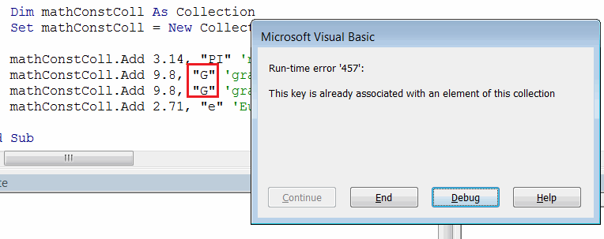

Visual Basic 集合是一种类似于 [数组](/docs/codestack/visual-basic/data-sets/array) 的数据集，用于存储动态变化的数据。与数组不同，集合不需要调整大小来添加或删除值。

集合是一种引用类型，需要使用 **new** 关键字来初始化集合。

```vb
Dim coll As New Collection
```

### 添加项目

要在 Visual Basic 中向集合添加新项目，需要使用 **Collection** 对象的 **Add** 方法。该方法有 4 个参数：

* *item* - 要添加到集合中的元素。元素可以是任何类型。
* *(可选)key* - 与元素关联的字符串键值。[参考](#通过键索引项目)
* *(可选)before* - 要在集合中的哪个元素之前插入此元素的基于 1 的索引位置。[参考](#在指定位置插入项目)
* *(可选)after* - 要在集合中的哪个元素之后插入此元素的基于 1 的索引位置。[参考](#在指定位置插入项目)

#### 推送项目

```vb
Dim coll As New Collection
coll.Add "New Value"
```

调用 **Collection** 对象的 **Add** 方法将在集合末尾推送元素，即新元素将被插入为最后一个元素。

#### 在指定位置插入项目

调用 **Collection** 对象的 **Add** 方法，并在第三个或第四个参数中指定整数值，将在指定位置插入元素。

```vb
Dim coll As New Collection
coll.Add "A", , <在此索引之前插入元素>
coll.Add "B", , , , <在此索引之后插入元素>
```

#### 访问项目

与数组类似，可以通过索引访问集合中的元素。

> 与数组的默认行为不同，集合元素的索引是基于 1 的，即第一个元素的索引为 1。

可以使用 () 符号从变量直接访问元素，也可以通过 **Item** 方法访问元素。

```vb
Debug.Print coll.Item(<元素的索引>)
Debug.Print coll(<元素的索引>)
```

```vb
Sub AddInsertItems()

    Dim coll As Collection
    Set coll = New Collection
    
    coll.Add "A"
    coll.Add "D"
    coll.Add "B", , , 1 '在第一个元素之后插入
    coll.Add "C", , 3 '在第三个元素之前插入
    
    Dim i As Integer
    
    'A B C D
    For i = 1 To coll.Count() '集合的索引是基于 1 的
        Debug.Print coll.Item(i)
    Next
    
End Sub
```

### 通过键索引项目

插入到集合中的元素可以与唯一的字符串键关联。

```vb
Dim coll As New Collection
coll.Add "A", "key1"
coll.Add "B", "key2"
```

与元素不同，键必须在集合中是唯一的，否则将显示错误。

{ width=350 }

可以通过键访问集合中的元素（类似于通过索引访问元素的方式）。

```vb
Debug.Print coll.Item("<键名>")
```

```vb
Sub AddItemsWithKeys()

    Dim mathConstColl As Collection
    Set mathConstColl = New Collection
    
    mathConstColl.Add 3.14, "PI" 'π
    mathConstColl.Add 9.8, "G" '重力常数
    mathConstColl.Add 2.71, "e" '自然对数的底数
    
    Dim i As Integer
    
    '遍历所有元素
    For i = 1 To mathConstColl.Count()
        Debug.Print mathConstColl(i) '可以直接访问项目，无需使用 Item 属性
    Next
    
    '通过键访问值
    Debug.Print mathConstColl("PI")
    Debug.Print mathConstColl("G")
    Debug.Print mathConstColl("e")
    
    mathConstColl.Remove 1
    mathConstColl.Remove "e"

End Sub
```

### 删除项目

可以使用 **Remove** 方法动态从集合中删除项目。可以使用索引或键来指定要删除的项目。

```vb
coll.Remove(<元素的索引>)
coll.Remove("<元素的键>")
```

```vb
Sub RemoveItems()
    
    Dim coll As Collection
    Set coll = New Collection
    
    '项目存储为 Variant，因此数据类型可以混合
    coll.Add "A"
    coll.Add 1, "IntegerItem"
    coll.Add 10.5
    coll.Add True, "BoolItem"
    
    coll.Remove 1 '通过索引删除第一个项目
    coll.Remove "BoolItem" '通过键删除项目
    
    Dim i As Integer
    
    '1 10.5
    For i = 1 To coll.Count()
        Debug.Print coll(i)
    Next
    
End Sub
```