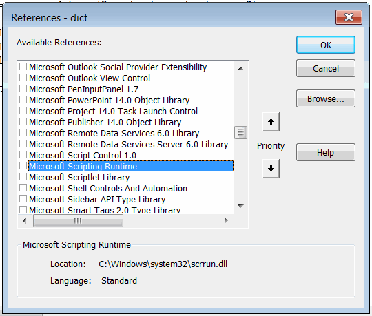

Visual Basic dictionary object is a collection of unique keys and associated values. It is also possible to
[index items with keys in collection](/docs/codestack/visual-basic/data-sets/collection#indexing-items-by-keys), but in this case it is only possible to have keys of String types. While it is possible to create keys of any type in Dictionary.

Unlike collections dictionaries are COM objects and require reference to *Microsoft Scripting Runtime* library in order to use early binding.

{ width=350 }

~~~ vb
Dim dict As Dictionary 'early binding
Set dict = New Dictionary
~~~

It is also possible to use late binding, so it is not required to add the *Microsoft Scripting Runtime* library to the project.

~~~ vb
Dim dict As Object 'late binding
Set dict = CreateObject("Scripting.Dictionary")
~~~

Refer [Early Binding and Late Binding](/docs/codestack/visual-basic/variables/declaration#early-binding-and-late-binding) article for more information about these approaches.

## Add, edit and traverse elements

In order to add new key-value pair it is required to use **Add** method of **Dictionary** object

~~~ vb
dic.Add <Key>, <Value>
~~~

Keys must be unique otherwise the error will be displayed.

{ width=350 }

Elements of the dictionary can be accessed by key or 0-based index either by using () symbol directly on the variable or via **Item** property

~~~ vb
Debug.Print dict.Item(<Key>)
Debug.Print dict(<Key>)
~~~

All keys from the dictionary can be retrieved using the **Keys** property.

All values from the dictionary can be retrieved using the **Values** property.

~~~ vb
Sub AddEditAndTraverse()

    Dim dict As Dictionary
    'Set dict = CreateObject("Scripting.Dictionary")
    Set dict = New Dictionary
    
    dict.Add 10, "Ten"
    dict.Add 100, "Hundred"
    dict.Add 1000, "Thousand"
    
    '10 = Ten
    '100 = Hundred
    '1000 = Thousand
    For Each nmbKey In dict.Keys
        Debug.Print nmbKey & " = " & dict.item(nmbKey)
    Next
    
    dict(100) = "One Hundred" 'value modified
    
    'One Hundred
    Debug.Print dict(100) 'item accessed without the the Item property
    
    'Empty
    Debug.Print dict(10000) 'not existing item

End Sub
~~~

## Key compare mode

By default the compare mode for keys is set to **Binary** comparison. This means if dictionary has keys of type String the keys are case-sensitive, i.e. it is acceptable to have both *A* and *a* as the key.

**Exists** method provides a safe way to check if the key already registered in the dictionary.

**CompareMode** property allows to set the mode which should be used when comparing the entries.

* BinaryCompare (default). String keys are case-sensitive
* TextCompare. String keys are case-insensitive

Mode can only be changed for an empty dictionary (without values), otherwise the error will be displayed.

{ width=400 }

~~~ vb
Sub ExistsCompareMode()
    
    Dim dict As Dictionary
    
    Set dict = New Dictionary
    
    dict.Add "A", 1
    dict.Add "B", 2
    dict.Add "C", 3
    dict.Add "D", 4
    
    'False
    Debug.Print dict.Exists("a")
    
    dict.Add "d", 5 'allows to add the element as the default comparison is binary
    
    'dict.CompareMode = TextCompare 'Run-time error 5: Invalid procedure call or argument
    
    Dim dict1 As New Dictionary
    dict1.CompareMode = TextCompare 'case-insensitive comparison
    
    dict1.Add "A", 1
    dict1.Add "B", 2
    dict1.Add "a", 3 'Run-time error 457: This key is already associated with an element of this collection
    
    'True
    Debug.Print dict1.Exists("a")
    
End Sub
~~~

## Remove elements

Any element can be removed from the dictionary either by key or by 0-based index using **Remove** method.

>Attempt on removing the item which is not present in the dictionary will throw an exception

{ width=250 }

**RemoveAll** method allows to clear the dictionary and remove all items.

~~~ vb
Sub Remove()
    
    Dim dict As Dictionary
    
    Set dict = New Dictionary
    
    dict.Add "A", 1
    dict.Add "B", 2
    dict.Add "C", 3
    dict.Add "D", 4
    
    dict.Remove "A"
    
    'dict.Remove "Not Existing Item" 'Run-time error 32811: Method Remove of object IDictionary failed
    
    Dim i As Integer
    
    '2 3 4
    For i = 1 To dict.Count
        Dim item As Integer
        item = dict.Items(i - 1) '0-based index
        Debug.Print item
    Next
    
    dict.RemoveAll
    
    '0
    Debug.Print dict.Count
    
End Sub
~~~

