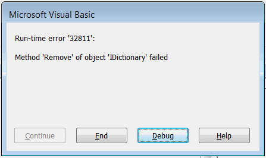

Visual Basic 字典对象是一组唯一键和关联值的集合。在集合中可以使用键进行索引项，但在这种情况下，只能使用字符串类型的键。而在字典中可以创建任何类型的键。

与集合不同，字典是 COM 对象，需要引用 *Microsoft Scripting Runtime* 库才能使用早期绑定。

{ width=350 }

~~~ vb
Dim dict As Dictionary '早期绑定
Set dict = New Dictionary
~~~

也可以使用晚期绑定，因此不需要将 *Microsoft Scripting Runtime* 库添加到项目中。

~~~ vb
Dim dict As Object '晚期绑定
Set dict = CreateObject("Scripting.Dictionary")
~~~

有关这些方法的更多信息，请参阅 [早期绑定和晚期绑定](/docs/codestack/visual-basic/variables/declaration#early-binding-and-late-binding) 文章。

## 添加、编辑和遍历元素

要添加新的键值对，需要使用 **Dictionary** 对象的 **Add** 方法

~~~ vb
dic.Add <Key>, <Value>
~~~

键必须是唯一的，否则将显示错误。

{ width=350 }

可以通过键或基于 0 的索引访问字典的元素，可以直接在变量上使用 () 符号，也可以通过 **Item** 属性访问。

~~~ vb
Debug.Print dict.Item(<Key>)
Debug.Print dict(<Key>)
~~~

可以使用 **Keys** 属性检索字典中的所有键。

可以使用 **Values** 属性检索字典中的所有值。

~~~ vb
Sub AddEditAndTraverse()

    Dim dict As Dictionary
    'Set dict = CreateObject("Scripting.Dictionary")
    Set dict = New Dictionary
    
    dict.Add 10, "Ten"
    dict.Add 100, "Hundred"
    dict.Add 1000, "Thousand"
    
    '10 = Ten
    '100 = Hundred
    '1000 = Thousand
    For Each nmbKey In dict.Keys
        Debug.Print nmbKey & " = " & dict.item(nmbKey)
    Next
    
    dict(100) = "One Hundred" '修改值
    
    'One Hundred
    Debug.Print dict(100) '无需使用 Item 属性访问项
    
    'Empty
    Debug.Print dict(10000) '不存在的项

End Sub
~~~

## 键比较模式

默认情况下，键的比较模式设置为**二进制**比较。这意味着如果字典的键是字符串类型，则键是区分大小写的，即可以同时拥有 *A* 和 *a* 作为键。

**Exists** 方法提供了一种安全的方式来检查键是否已在字典中注册。

**CompareMode** 属性允许设置比较条目时应使用的模式。

* BinaryCompare（默认）。字符串键区分大小写
* TextCompare。字符串键不区分大小写

只能在空字典（没有值）中更改模式，否则将显示错误。

{ width=400 }

~~~ vb
Sub ExistsCompareMode()
    
    Dim dict As Dictionary
    
    Set dict = New Dictionary
    
    dict.Add "A", 1
    dict.Add "B", 2
    dict.Add "C", 3
    dict.Add "D", 4
    
    'False
    Debug.Print dict.Exists("a")
    
    dict.Add "d", 5 '允许添加元素，因为默认比较是二进制的
    
    'dict.CompareMode = TextCompare '运行时错误 5：无效的过程调用或参数
    
    Dim dict1 As New Dictionary
    dict1.CompareMode = TextCompare '不区分大小写比较
    
    dict1.Add "A", 1
    dict1.Add "B", 2
    dict1.Add "a", 3 '运行时错误 457：此键已与此集合的元素关联
    
    'True
    Debug.Print dict1.Exists("a")
    
End Sub
~~~

## 删除元素

可以通过键或基于 0 的索引从字典中删除任何元素，使用 **Remove** 方法。

>尝试删除字典中不存在的项将引发异常

{ width=250 }

**RemoveAll** 方法允许清除字典并删除所有项。

~~~ vb
Sub Remove()
    
    Dim dict As Dictionary
    
    Set dict = New Dictionary
    
    dict.Add "A", 1
    dict.Add "B", 2
    dict.Add "C", 3
    dict.Add "D", 4
    
    dict.Remove "A"
    
    'dict.Remove "Not Existing Item" '运行时错误 32811：对象 IDictionary 的 Remove 方法失败
    
    Dim i As Integer
    
    '2 3 4
    For i = 1 To dict.Count
        Dim item As Integer
        item = dict.Items(i - 1) '基于 0 的索引
        Debug.Print item
    Next
    
    dict.RemoveAll
    
    '0
    Debug.Print dict.Count
    
End Sub
~~~