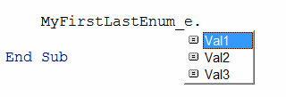

{ width=350 }

An enumeration is a collection of named constants of type [Long](/docs/codestack/visual-basic/variables/standard-types#long).

The main advantage of enumerations over constants is the ability to group constants under a single data type and allow for automatic incrementing values.

Enumerations are commonly used to declare different options or actions (such as add, delete, move, copy, etc.).

## Declaring and Assigning Enumerations

Enumerations can be declared using the **Enum - End Enum** code block, with each constant declared on a new line.

~~~ vb
Enum SampleEnum_e
    Val1
    Val2
    Val3
End Enum
~~~

The values of the constants can be assigned explicitly or implicitly (automatically). The first automatic value is 0, and each subsequent item increments by 1.

Enumerations are value types and can be assigned to variables. The enumeration value can be used directly or by using the enumeration name.

~~~ vb
Dim enumVal As SampleEnum_e
enumVal = SampleEnum_e.Val1 'using the enumeration name
enumVal = Val1
~~~

>It is recommended to use the enumeration name explicitly. This makes the code more readable and resolves any ambiguity that may arise if another enumeration or variable has the same name.

~~~ vb
Enum MyEnum_e
    Val1 'automatically assigned value 0
    Val2 = 5 'explicitly assigned value 5
    Val3 'next automatically assigned number 6
End Enum

Enum MyIncrementEnum_e
    Val1 '0
    Val2 = Val1 + 3 '3
    Val3 = Val2 + 4 '7
End Enum

Sub main()
    
    '0 5 6
    Debug.Print MyEnum_e.Val1 & " " & MyEnum_e.Val2 & " " & MyEnum_e.Val3
    
    '0 3 7
    Debug.Print MyIncrementEnum_e.Val1 & " " & MyIncrementEnum_e.Val2 & " " & MyIncrementEnum_e.Val3
    
    'assigning values to a variable
    Dim val As MyEnum_e
    val = MyEnum_e.Val2
    
End Sub
~~~

## Iterating through Enumerated Values

Since enumerations are long integer constants, all items can be iterated through by knowing the first and last constant.

Visual Basic allows for the declaration of special enumeration values that are not visible in IntelliSense but are still valid values. To make an item invisible, the underscore _ symbol needs to be used before the name. For example, adding [_First] and [_Last] elements at the beginning and end of an enumeration allows for defining the boundaries of the enumeration values for iteration.

{ width=250 }

~~~ vb
Enum MyFirstLastEnum_e
    [_First]
    Val1
    Val2
    Val3
    [_Last]
End Enum

Sub TraversingEnumValues()
    
    Debug.Print MyFirstLastEnum_e.[_First] '0
    Debug.Print MyFirstLastEnum_e.[_Last] '4
        
    'iterating through all enumeration values
    '1 2 3
    For enumVal = MyFirstLastEnum_e.[_First] + 1 To MyFirstLastEnum_e.[_Last] - 1
        Debug.Print enumVal
    Next
    
End Sub
~~~

## Flag Enumerations (Multiple Options)

Enumerations are useful for saving multiple options using bit masks.

This technique allows for combining multiple options into a single variable using the plus + symbol, and the **And** bitwise operator can be used to determine if a specific option is set.

~~~ vb
Enum MyOptionEnum_e
    Option1 = 1 '2 ^ 0
    Option2 = 2 '2 ^ 1
    Option3 = 4 '2 ^ 2
    Option4 = 8 '2 ^ 3
    Option5 = 16 '2 ^ 4
End Enum

Enum MyOptionExpEnum_e
    Option1 = 2 ^ 0 '1
    Option2 = 2 ^ 1 '2
    Option3 = 2 ^ 2 '4
    Option4 = 2 ^ 3 '8
    Option5 = 2 ^ 4 '16
End Enum

Sub FlagEnums()

    Dim opts As MyOptionEnum_e
    
    '1 2 4 8 16
    Debug.Print MyOptionExpEnum_e.Option1 & " " & MyOptionExpEnum_e.Option2 & " " & MyOptionExpEnum_e.Option3 & " " & MyOptionExpEnum_e.Option4 & " " & MyOptionExpEnum_e.Option5
    
    opts = MyOptionEnum_e.Option1 + MyOptionEnum_e.Option3 + MyOptionEnum_e.Option4

    Debug.Print IsFlagSet(opts, MyOptionEnum_e.Option1)  'True
    Debug.Print IsFlagSet(opts, MyOptionEnum_e.Option2)  'False
    Debug.Print IsFlagSet(opts, MyOptionEnum_e.Option3)  'True
    Debug.Print IsFlagSet(opts, MyOptionEnum_e.Option4)  'True
    Debug.Print IsFlagSet(opts, MyOptionEnum_e.Option5)  'False
    
End Sub

Function IsFlagSet(options As MyOptionEnum_e, value As MyOptionEnum_e) As Boolean
    IsFlagSet = options And value
End Function
~~~