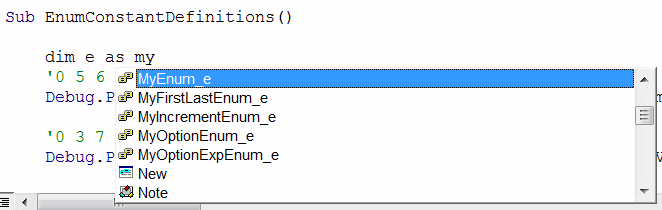

 Visual Basic 中枚举数据类型（预定义长整型常量的集合）的介绍
image: enum-icon-intellisense.png
---
{ width=350 }

枚举是一组以 [Long](/docs/codestack/visual-basic/variables/standard-types#long) 类型命名的常量。

与常量相比，枚举的主要优势是能够将常量分组到单个数据类型下，并允许自动递增值。

枚举通常用于声明不同的选项或操作（例如添加、删除、移动、复制等）。

## 声明和赋值枚举

可以使用 **Enum - End Enum** 代码块声明枚举，每个常量在新行上声明。

~~~ vb
Enum SampleEnum_e
    Val1
    Val2
    Val3
End Enum
~~~

常量的值可以显式或隐式（自动）赋值。第一个自动值为 0，并且每个下一个项目都会递增 1。

枚举是值类型，可以赋值给变量。可以直接使用枚举值或通过枚举名称使用枚举值。

~~~ vb
Dim enumVal As SampleEnum_e
enumVal = SampleEnum_e.Val1 '使用枚举名称
enumVal = Val1
~~~

>建议显式使用枚举的名称。这样可以使代码更易读，并解决如果另一个枚举或变量具有相同名称时可能出现的歧义。

~~~ vb
Enum MyEnum_e
    Val1 '自动分配值 0
    Val2 = 5 '显式分配值 5
    Val3 '下一个自动分配的数字 6
End Enum

Enum MyIncrementEnum_e
    Val1 '0
    Val2 = Val1 + 3 '3
    Val3 = Val2 + 4 '7
End Enum

Sub main()
    
    '0 5 6
    Debug.Print MyEnum_e.Val1 & " " & MyEnum_e.Val2 & " " & MyEnum_e.Val3
    
    '0 3 7
    Debug.Print MyIncrementEnum_e.Val1 & " " & MyIncrementEnum_e.Val2 & " " & MyIncrementEnum_e.Val3
    
    '将值分配给变量
    Dim val As MyEnum_e
    val = MyEnum_e.Val2
    
End Sub
~~~

## 遍历枚举值

由于枚举是长整型常量，因此可以通过知道第一个和最后一个常量来遍历所有项。

Visual Basic 允许声明特殊的枚举值，这些值在 IntelliSense 中不可见，但仍然是有效的值。为了使项目不可见，需要在名称前使用下划线 _ 符号。例如，在枚举的开头和结尾添加 [_First] 和 [_Last] 元素将允许定义枚举值的边界以进行遍历。

{ width=250 }

~~~ vb
Enum MyFirstLastEnum_e
    [_First]
    Val1
    Val2
    Val3
    [_Last]
End Enum

Sub TraversingEnumValues()
    
    Debug.Print MyFirstLastEnum_e.[_First] '0
    Debug.Print MyFirstLastEnum_e.[_Last] '4
        
    '遍历所有枚举值
    '1 2 3
    For enumVal = MyFirstLastEnum_e.[_First] + 1 To MyFirstLastEnum_e.[_Last] - 1
        Debug.Print enumVal
    Next
    
End Sub
~~~

## 标志枚举（多个选项）

枚举对于使用位掩码保存多个选项非常有用。

这种技术允许使用加号 + 符号将多个选项组合到一个变量中，可以使用 **And** 位运算符来确定是否设置了特定选项。

~~~ vb
Enum MyOptionEnum_e
    Option1 = 1 '2 ^ 0
    Option2 = 2 '2 ^ 1
    Option3 = 4 '2 ^ 2
    Option4 = 8 '2 ^ 3
    Option5 = 16 '2 ^ 4
End Enum

Enum MyOptionExpEnum_e
    Option1 = 2 ^ 0 '1
    Option2 = 2 ^ 1 '2
    Option3 = 2 ^ 2 '4
    Option4 = 2 ^ 3 '8
    Option5 = 2 ^ 4 '16
End Enum

Sub FlagEnums()

    Dim opts As MyOptionEnum_e
    
    '1 2 4 8 16
    Debug.Print MyOptionExpEnum_e.Option1 & " " & MyOptionExpEnum_e.Option2 & " " & MyOptionExpEnum_e.Option3 & " " & MyOptionExpEnum_e.Option4 & " " & MyOptionExpEnum_e.Option5
    
    opts = MyOptionEnum_e.Option1 + MyOptionEnum_e.Option3 + MyOptionEnum_e.Option4

    Debug.Print IsFlagSet(opts, MyOptionEnum_e.Option1)  'True
    Debug.Print IsFlagSet(opts, MyOptionEnum_e.Option2)  'False
    Debug.Print IsFlagSet(opts, MyOptionEnum_e.Option3)  'True
    Debug.Print IsFlagSet(opts, MyOptionEnum_e.Option4)  'True
    Debug.Print IsFlagSet(opts, MyOptionEnum_e.Option5)  'False
    
End Sub

Function IsFlagSet(options As MyOptionEnum_e, value As MyOptionEnum_e) As Boolean
    IsFlagSet = options And value
End Function
~~~