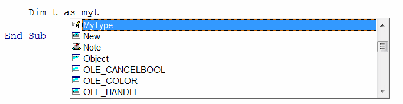

{ width=350 }

In Visual Basic complex data structure (group) of variables can be defined using the **Type - End Type** code block.

~~~ vb
Type MyType
    Var1 As Double
    Var2 As String
End Type
~~~

This enables developers to create easy to understand and use data structures.

Variables of any type can be defined inside the type code block.

Properties declared in type are public and browsable within the intelli-sense:

{ width=250 }

It is not possible to set the access modifiers or add any functions or procedures within the type:

{ width=350 }

~~~ vb
Type MyType
    IntValue As Integer
    DoubleValue As Double
    StringValue As String
End Type

Sub main()

    Dim val1 As MyType
    val1.DoubleValue = 10.5
    val1.IntValue = 5
    val1.StringValue = "Hello World"
    
    Dim val2 As MyType
    val2 = val1 'all values are copied
    
    val2.DoubleValue = 2.5
    val2.StringValue = "Modified Hello World"
    val2.IntValue = 1
    
    '10.5, 5, Hello World
    Debug.Print val1.DoubleValue & ", " & val1.IntValue & ", " & val1.StringValue
    
    '2.5, 1, Modified Hello World
    Debug.Print val2.DoubleValue & ", " & val2.IntValue & ", " & val2.StringValue
    
End Sub
~~~

