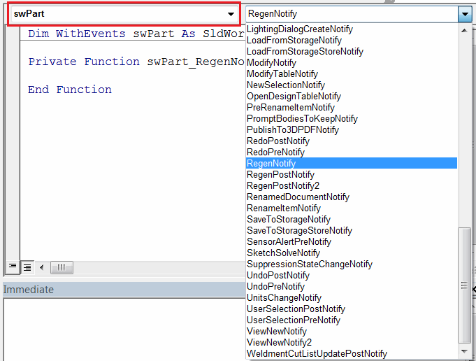
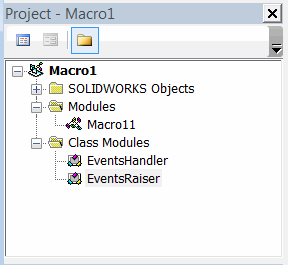

事件是一种在发生某些操作时向外部监听器提供通知的机制。例如，您的对象可能需要告诉其监听器它已加载、更新或删除。在Microsoft Office应用程序中，事件的示例包括：打开文档、在MS Word中输入文本、在Excel中重新计算单元格的值等。

在开发自动化软件时，处理事件可以调用自定义功能，例如在Excel中更改单元格值时添加日志条目。

可以消耗（处理）现有对象的事件，也可以在自定义类中声明和触发自己的事件。

## 处理事件

如果对象公开了事件，需要将该对象声明为[class](/docs/codestack/visual-basic/classes/)变量，并使用**WithEvents**关键字。

~~~ vb
Dim WithEvents myObj As CustomObjectWithEvents
~~~

Visual Basic编辑器将在下拉列表中显示所有可用的事件，如下图所示，可以从列表中选择所需的事件以订阅通知。

{ width=450 }

事件处理程序函数的名称应为*{变量名称}_{事件名称}*，并与事件的签名匹配。

~~~ vb
Function myObj_SomeEvent(someParam As String) As Integer '处理'myObj'变量的'SomeEvent'
    myObj_SomeEvent = 0
End Function
~~~

## 声明事件

可以使用**Event**关键字在[class](/docs/codestack/visual-basic/classes/)中声明事件。必须通过在括号中提供参数名称和类型来指定事件的签名。

以下示例演示了如何引发和处理事件。

项目树如下所示：

### EventsRaiser 类模块

此类使用字符串参数*timeStamp*引发名为*Completed*的事件。当调用*DoWork*方法时，会引发事件。

~~~vb
Public Event Completed(timeStamp As String)

Public Sub DoWork()
    '进行工作
    RaiseEvent Completed(Now)
End Sub
~~~

## EventsHandler 类模块

此类处理事件并显示消息框。

~~~vb
Dim WithEvents myEventRaiser As EventsRaiser

Private Sub Class_Initialize()
    Set myEventRaiser = New EventsRaiser
    myEventRaiser.DoWork
End Sub

Private Sub myEventRaiser_Completed(timeStamp As String)
    MsgBox "已完成: " & timeStamp
End Sub
~~~

## Macro11 模块

此模块是一个入口点，它实例化一个事件处理程序的实例并将其保存在内存中。

~~~vb
Dim swEventsHandler As EventsHandler

Sub main()
    
    Set swEventsHandler = New EventsHandler

End Sub
~~~