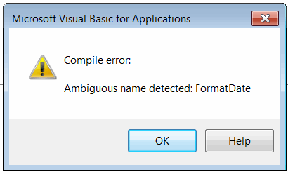

Functions are used to define the reusable procedures (group of code statements) which can be called from another functions. Functions in Visual Basic are synchronous which means that the caller must wait for the function to return the control before proceeding to the next statement.

Function can return values or be void (this function is called **subroutine** or **sub**).

Functions can expect or return parameters (**ByRef** parameters) or be parameterless.

Function which is invoking itself called **recursive function**

## Declaring function

Function is declared within the **Function**-**End Function** block

~~~ vb
Function <Name>(<Optional Parameters>) As <Type>
<Code Statements>
End Function
~~~

Type of the function should be defined after the **As** keyword. If type is not explicitly specified than it is considered to be [Variant](/docs/codestack/visual-basic/variables/standard-types#variant)

Subroutine is declared within the **Sub**-**End Sub** block

~~~ vb
Sub <Name>(<Optional Parameters>)
<Code Statements>
End Sub
~~~

Functions and procedures must have unique name within module or class. Functions are not overloadable in Visual Basic. Even if functions have different parameters they cannot have the same names otherwise *Ambiguous name detected* compile error is thrown.

{ width=300 }

## Calling functions and subroutines

Function and subroutines can be called by specifying its name. If the function resides in different module than function name should be preceded by module name and . symbol

~~~ vb
Func1
Module1.Func1
~~~

If result of the function is assigned to the variable than parenthesis symbol () should be used. () should be also used if *Call* operator is used to invoke the function.

~~~ vb
val = Func1() 'using () to retrieve the value
Call Func1()  'using () while calling using Call operator
~~~

> **Rule:** no equal (or call operator) - no parenthesis.

## Returning values

In order to return the value from function is is required to consider its name as variable and follow the same rules as while [assigning the variables values](/docs/codestack/visual-basic/variables/)

~~~ vb
Function GetDouble() As Double
    GetDouble = 10
End Sub

Function GetObject() As Object
    Set GetObject = <Reference To Object>
End Sub
~~~

## Passing parameters

Parameters must be passed to the function or subroutine in the order they declared in the function

Parameters can be either passed as variable or be defined 'on-a-fly'

~~~ vb
Func par1, par2, "value2" 'calling function Func with 3 parameters
~~~

*Argument not optional* compile error is thrown when calling function without passing the required parameters.

{ width=300 }

### Reference parameters

Function or subroutine can return additional parameters. It is required to use **ByRef** keyword to declare parameter as out parameter.

~~~ vb
Function Func(par1 As Double, ByRef outPar1 As Integer) As Double 'function expects par1 as input and returns double value and another integer value as reference parameter
End Function
~~~

### Optional parameters

Function or subroutine can declare optional parameters with the default values. In this case it is not required to explicitly set the value for the parameter when function is called.

~~~ vb
Call Proc() 'no need to specify value for parameter explicitly. In this case the default value (i.e. 0.5) is used

Sub Proc(Optional par1 As Double = 0.5) 'optional parameter with default value 0.5
End Sub
~~~

Optional parameters can be set selectively by name (*param name*:=*param value*). This allows to set the parameters in a different order they declared in the function signature

~~~ vb
Call Func(param1:=1, param3:="Test") 'only 2 parameters (1st and 3rd) are used

Function Func (Optional param1 As Integer = 0, Optional param2 As Double = 0.0, Optional param3 As String = "")
End Function
~~~

Example below demonstrates cases where the optional parameters can be used.

~~~ vb
Sub main()
    
    Debug.Print Pow(2) '4
    Debug.Print Pow(2, 3) '8

    PrintAddress state:="NSW", postcode:=2000 'Australia NSW 2000
    
End Sub

Function Pow(number As Double, Optional power As Double = 2) As Double
    
    Pow = number ^ power
    
End Function

Sub PrintAddress(Optional country As String = "Australia", Optional state As String = "", Optional suburb As String = "", Optional postcode As Integer = 0, Optional streetName As String = "", Optional buildingNumber As Integer = 0, Optional unitNumber As Integer = 0)

    If country <> "" Then
        Debug.Print country
    End If
    
    If state <> "" Then
        Debug.Print state
    End If
    
    If suburb <> "" Then
        Debug.Print suburb
    End If
    
    If postcode > 0 Then
        Debug.Print postcode
    End If
    
    If streetName <> "" Then
        Debug.Print streetName
    End If
    
    If buildingNumber > 0 Then
        Debug.Print buildingNumber
    End If
    
    If unitNumber > 0 Then
        Debug.Print "Unit: " & unitNumber
    End If
    
End Sub
~~~

## Terminating function and subroutine

Function and subroutine can be terminated and control returned to the caller at any stage using the **Exit Function** and **Exit Sub** respectively.

Example below demonstrates different cases of using functions and subroutines.

~~~ vb
Sub main()
    
    'prints ProcedureWithoutParameters twice
    ProcedureWithoutParameters
    ProcedureWithoutParameters
    
    'Compile error: Argument not optional
    'SayHello
    
    'Hello, Test
    SayHello "Test"
    
    Dim formDate As String
    FormatDate "dd-MM-yyyy", formDate
    
    '20-06-2018
    Debug.Print formDate
    
    '20-06-2018
    Debug.Print GetFormattedDate("dd-MM-yyyy")
    
End Sub

Sub ProcedureWithoutParameters()
    
    Debug.Print "ProcedureWithoutParameters"

End Sub

Sub SayHello(name As String)
    
    Debug.Print "Hello, " & name

End Sub

Sub FormatDate(dateFormat As String, ByRef formattedDate As String)
    
    Dim curDate As Date
    curDate = Now
    
    formattedDate = format(curDate, dateFormat)
    
End Sub

Function GetFormattedDate(dateFormat As String) As String
    
    Dim curDate As Date
    curDate = Now
    
    GetFormattedDate = format(curDate, dateFormat)
    
End Function
~~~

