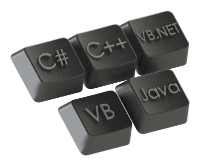

 包含使用Visual Basic编程语言的教程和示例的集合
image: visual-basic.png
sidebar_position: 0
---
{ width=300 }

这个面向初学者的友好教程旨在介绍Visual Basic编程语言的主要特性。

## 什么是Visual Basic

Visual Basic是一种基于组件对象模型（COM）的编程语言和开发环境（IDE），由微软开发。

尽管Visual Basic现在已经过时并被宣布为遗留语言，但它的派生语言Visual Basic for Application（VBA）、VBScript和VB.NET仍广泛用于数百万个应用程序和脚本。

Visual Basic的主要特点包括：

* 学习曲线简单
* 支持COM对象，可以访问Windows API
* 支持智能感知（代码自动完成）
* 可视化拖放环境，用于创建图形用户界面（GUI）
* 能够创建可执行文件（*.exe）、ActiveX组件和dll
* 使用引用计数的自动内存管理，可以避免内存泄漏

## Visual Basic的历史

* 1991年 - Visual Basic 1.0
* 1992年 - Visual Basic 2.0
* 1993年 - Visual Basic 3.0
* 1995年 - Visual Basic 4.0
* 1997年 - Visual Basic 5.0
* 1998年 - Visual Basic 6.0
* 2008年 - 宣布为遗留语言
* 2010年 - VBA 7.0（基于Visual Basic）支持x64

## Visual Basic的版本

[Visual Basic for Applications（VBA）](vba) - 集成环境，用于创建和执行在许多应用程序中使用的宏，如MS Office、SOLIDWORKS、AutoCAD等。

VBScript - 用于Windows脚本和客户端网页脚本的Active Server Pages语言。

VB.NET - 基于.NET Framework的面向对象的Visual Basic继任者。