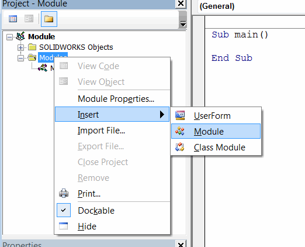
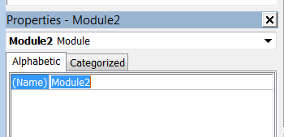
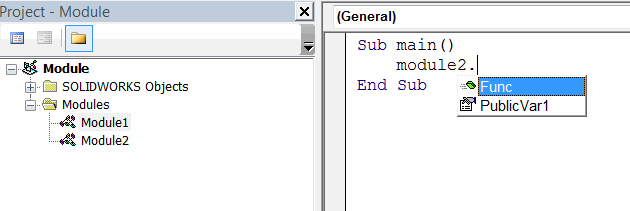

A module is a container used to organize code in Visual Basic and is used to define custom functions, procedures, or variables.

A module that contains an entry point subroutine (main) is an entry module. At least one module is defined in a Visual Basic macro.

To add a new module, right-click on the "Modules" folder and select the "Insert->Module" command.

{ width=250 }

Modules must have a unique name defined by the developer.

Functions defined in a module are public. Members (variables) declared using the **Dim** keyword are only visible within the module and not visible to other modules, while members declared using the **Public** keyword are visible to both this module and other modules. For more information, see the [Variable Scope](/docs/codestack/visual-basic/variables/scope) article.

After typing the module name, module members are available in IntelliSense.

