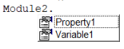
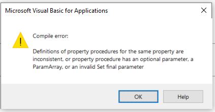

属性在使用上与[变量](/docs/codestack/visual-basic/variables/declaration/)非常相似，当涉及到属性的使用时。

```vb jagged
Set myObj = Property1 '将属性的引用值分配给变量
myInt = Property2 '将属性的整数值分配给变量
Property3 = 0.1 '将双精度值分配给属性
Set Property4 = CreateObject("ComClass") '将COM类的实例分配给属性
```

如果将Property1、Property2、Property3和Property4声明为变量，上述代码将完全相同，并且在使用上没有任何区别。它们还将具有相同的智能感知图标。



然而，属性声明更类似于[函数](/docs/codestack/visual-basic/functions/)。

## 属性的类型

有三种类型的属性：

### 只读属性

这些属性只能返回值。这些属性的行为类似于函数：

```vba
Sub Macro1()
    Debug.Print Prop1
    Debug.Print Prop2 Is Nothing
    'Prop1.Value = "New Value" - 不可行
End Sub

Property Get Prop1() As String
    Prop1 = "Prop1 Value"
End Property

Property Get Prop2() As Object
    Set Prop2 = CreateObject("Scripting.Dictionary")
End Property
```

尝试将值分配给只读属性会导致*无效限定符*编译错误。


### 只写属性

与只读属性相反，只写属性可用于分配值。这些属性的行为类似于子过程。

```vba
Sub Macro2()
    Prop3 = "Val1"
    Set Prop4 = CreateObject("Scripting.Dictionary")
End Sub

Property Let Prop3(val As String)
    Debug.Print val
End Property

Property Set Prop4(val As Object)
    Debug.Print val Is Nothing
End Property
```

有*Let*和*Set*两种写属性。*Let*应该用于简单类型，如*String*、*Integer*、*Double*，而*Set*属性应该用于引用类型，如*Object*或自定义类的实例。

> 注意，仍然可以将Let属性用于引用类型，在这种情况下，不需要使用Set关键字将值分配给属性。然而，这不是推荐的做法，因为这会使代码不够可读，并且与函数和变量不一致，其中Set关键字始终与引用类型一起使用。

### 读写属性

读写属性是在单个属性中结合了读取和写入功能。

```vba
Sub Macro3()
    Prop5 = "Val1"
    Debug.Print Prop5
End Sub

Property Get Prop5() As String
    Prop5 = "Prop5 Value"
End Property

Property Let Prop5(val As String)
    Debug.Print val
End Property
```

读取和写入属性的声明必须具有相同的名称并且具有相同的类型，即写入属性中的参数类型必须与读取属性中的返回值类型匹配，否则将引发*属性过程的定义不一致，或属性过程具有可选参数、ParamArray或无效的Set最终参数*编译时错误。

```vb
Property Get Prop1() As Integer
    Prop1 = Prop1
End Property

Property Let Prop1(val As String)
    Debug.Print val
End Property

Property Get Prop2()
    Prop2 = "Prop2 Value"
End Property

Property Let Prop2(val As String) '无效，因为隐式分配的类型是Variant
    Debug.Print val
End Property
```



请注意，当未显式声明属性的类型时，它将被视为Variant类型。

## 带参数的属性

虽然很少使用，但属性可以具有额外的参数。

```vba
Sub Macro4()
    Prop6("p1") = 20
    Debug.Print Prop6("p2")
End Sub

Property Get Prop6(param1 As String) As Double
    Prop6 = 10
End Property

Property Let Prop6(param1 As String, val As Double)
    Debug.Print param1 & " " & val
End Property
```

> 如果属性需要多个参数，请考虑使用函数。

## 用法

尽管属性可以被认为是多余的，因为所有属性涵盖的功能都可以通过函数实现，但属性提供了更好的代码可读性和更容易使用类或模块。建议将属性用于描述实体属性而不是动作的元素，例如对于类*Car*，将*Color*、*Made*、*YearOfManufacturing*声明为属性（而不是*GetColor*、*SetColor*、*GetMade*等函数），而*Drive*将被声明为过程。