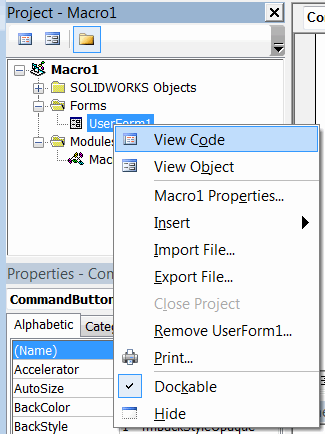

用户窗体允许定义自定义的图形用户界面（GUI），以收集用户输入、显示输出或与应用程序进行交互。

可以通过调用“插入用户窗体”命令来添加用户窗体。

{ width=350 }

默认情况下，窗体的名称将为*UserForm1*、*UserForm2*等，但建议为窗体提供有意义的名称。

## 添加控件

可以自定义窗体并将其他控件放置在窗体上。

{ width=450 }

1. 用户窗体设计布局
2. 包含控件的工具箱
3. 放置在窗体布局上的控件
4. 控件的属性

可以自定义控件的属性。

## 代码背后

窗体及其控件会公开不同的[事件](/docs/codestack/visual-basic/events/)，例如点击、选择、鼠标移动等。

事件处理程序在窗体的代码背后定义。

{ width=400 }

可以从下拉列表中选择可用的控件事件。

{ width=600 }

~~~vb
Private Sub CommandButton1_Click()
    MsgBox "CommandButton1 被点击了！"
End Sub
~~~

## 显示窗体

可以通过调用*Show*方法来显示窗体。此方法应该在等于窗体名称的变量上调用。请注意，不需要显式声明或实例化窗体变量（与类不同）。当窗体添加到项目中时，这将自动完成。

窗体可以以两种模式显示

### 模态

在此模式下，窗体在前台打开，父窗口在窗体关闭之前不可访问。

~~~vb
Sub main()

    UserForm1.Show

End Sub
~~~

### 非模态

以使父窗口可访问且不被阻塞的方式打开窗体。要以非模态模式打开窗体，需要将*vbModeless*参数传递给*Show*方法。

~~~vb
Sub main()

    UserForm1.Show vbModeless

End Sub
~~~