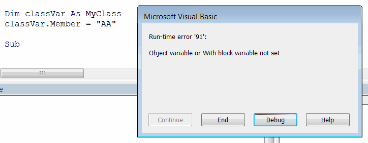

## Declaring Variables

In Visual Basic, variables can be declared explicitly or implicitly. To declare a variable explicitly, you need to use the *Dim* keyword or the *Public* keyword to declare the variable as a public class or module member (for more information, see the [Variable Scope](/docs/codestack/visual-basic/variables/scope) article).

The type of the variable can be declared using the *As* keyword.

```vb
Dim textVal As String
```

> If the type of the variable is not explicitly declared, it defaults to [Variant](/docs/codestack/visual-basic/variables/standard-types#variant).

```vb
Dim varVal 'implicitly declared as Variant
```

When a variable is implicitly declared, the *Dim* keyword is not used. In this case, the value of the variable is assigned directly.

```vb
implicitVal = 10 'implicitly declared and assigned variable
```

This approach is not recommended as it can introduce ambiguity and potential issues in the code.

> To enforce explicit variable declaration in Visual Basic, the *Option Explicit* statement needs to be used. In this case, if an implicit variable is found, a compilation error will occur.

{ width=300 }

### Declaring a Group of Variables of the Same Type

Variables can be declared as a group.

```vb
Dim textVar1, textVar2, textVar3 As String 'explicitly declare 3 variables as String type
```

This approach can make the code more readable and compact.

### Declaring a Group of Variables with Different Types

The short declaration can be used to explicitly declare the type using the declaration character for each variable.

```vb
Dim intVar%, doubleVar#, longVar& 'explicitly declare integer, double, and long variables using short declaration
```

Refer to the [Standard Types](/docs/codestack/visual-basic/variables/standard-types) article for a list of declaration characters.

> This is a traditional way of declaring variables. It is not recommended to use this approach for variable declaration.

## Assigning Values

To assign a value to a variable, the equal sign (=) symbol is used, with the variable name on the left and the value on the right.

```vb
Dim varName As String
varName = "VarValue"
```

The value of one variable can be copied to another variable.

```vb
Dim var1 As Integer
Dim var2 As Integer
var1 = 10
var2 = var1 'var2 now has the same value as var1, which is 10
```

The value of a variable can be assigned as the result of calling another function. For more information on functions, see the [Functions and Procedures](/docs/codestack/visual-basic/functions) article.

```vb
Dim funcRes As Double
funcRes = GetValueFunc()
```

## Declaring Constants

Constants allow defining values that will not change during the execution of a procedure. They are typically used to declare mathematical constants (e.g., PI, gravitational constant), conversion factors (e.g., hours to minutes, inches to meters), or any other program-specific values.

Constants are declared using the *Const* statement and assigned a value at the time of declaration.

```vb
Const G As Double = 9.8 'gravitational constant
```

Similar to variable declaration, the constant type can be explicitly defined (using the *As* keyword) or implicitly defined.

Once declared, the value of a constant cannot be changed. Otherwise, a compilation error will occur.

{ width=300 }

The following code example demonstrates different ways of declaring and assigning constants and variables.

```vb
Sub main()

    Dim i, j, k As Integer 'declare 3 variables of Integer type

    i = 10 'set value for declared variable
    l = 20 'set value for implicitly declared variable
    Debug.Print TypeName(l) 'Integer
    
    Dim intVar%, doubleVar#, longVar&
    Debug.Print TypeName(intVar%) 'Integer
    Debug.Print TypeName(doubleVar#) 'Double
    Debug.Print TypeName(longVar&) 'Long
    
    Const PI As Double = 3.14159265359 'declare and initialize a constant
    'PI = 0 'compilation error
    
    Dim res As Double
    res = Sqrt(16) 'returns 4 and assigns it to the res variable
    Debug.Print res
    
End Sub
```


## Assigning Reference Variables

Unlike value types, [reference types](/docs/codestack/visual-basic/variables/user-defined-types#class) have a few additional rules to follow when assigning values.

{ width=200 }

* The *new* keyword must be used to create a new instance of a reference type. Otherwise, a runtime error '91' will be displayed.

{ width=350 }

* The *Set* keyword must be used to assign the value, otherwise a runtime error '91' will be displayed.

{ width=350 }

Refer to the code below to correctly assign a reference type variable.

```vb
Sub main()

    Dim userType As MyUserType
    Set userType = New MyUserType
    Dim obj As Object
    
    'obj = userType 'runtime error when not using the Set keyword
    Set obj = userType 'assigns the pointer to the obj variable, pointing to the MyUserType object

End Sub
```


> Reference variables only hold a pointer to the actual value, so the Set keyword assigns the reference (rather than the actual value, as in value types) to the variable. This means that if a reference of one variable is assigned to another variable, they both reference the same data.

### Binding

Binding is the process of assigning an object to a variable. When using early binding, the specific object type is declared in advance, so binding can occur at compile time. Late binding is resolved at runtime, without knowing the specific object type in advance.

#### Early Binding

```vb
Dim objLate As Object 'example of late binding
Dim objEarly as MySpecificType 'example of early binding
```

Objects for early binding are typically initialized using the *new* keyword.

```vb
Dim objEarly as MySpecificType
Set objEarly = new MySpecificType
```

##### Advantages

* Performance. The compiler can perform optimizations required based on the type and size of the object at compile time.
* Maintainability. The code is clearer, more maintainable, and readable when a specific type is declared in advance.
* For early-bound objects, dynamic help and IntelliSense (code completion) features can be used.

#### Late Binding

While late-bound objects are typically initialized using the [CreateObject](https://msdn.microsoft.com/en-us/vba/language-reference-vba/articles/createobject-function) or [GetObject](https://msdn.microsoft.com/en-us/vba/language-reference-vba/articles/getobject-function) functions,

```vb
Dim xlApp As Object
Set xlApp = CreateObject("Excel.Application")
```

using the *new* keyword and CreateObject or GetObject in late binding is still acceptable in early binding.

##### Advantages

* No need to maintain third-party references, which can be an issue when the code is ported to another environment or another version of the third-party reference is released. See this [reference issue example](/docs/codestack/solidworks-api/troubleshooting/macros/missing-solidworks-type-library-references)